OBS: Para apresentar de tabelas e imagens fora do Markdown, vá para o Tools \> Global options \> R Markdown and unselect “Show output inline for all R Markdown documents”

# 1. Biblioteca e pacotes


```r
options(repos = c(CRAN = "https://cran.r-project.org"))  # For global mirror

# Baixar pacotes do CRAN para a biblioteca (Para descomentar, use Ctrl + Shift + C)
# install.packages("tidyverse")
# install.packages("skimr")
# install.packages("janitor")
# install.packages("esquisse")
# install.packages("ggthemes")
# install.packages("plotly")
# install.packages("gghighlight")
# install.packages("patchwork")
# install.packages("ggsci")

# Chamando os pacotes da biblioteca
library(tidyverse) #Metapacote 
```

```
## Warning: package 'tidyverse' was built under R version 4.3.2
```

```
## Warning: package 'ggplot2' was built under R version 4.3.3
```

```
## Warning: package 'tidyr' was built under R version 4.3.3
```

```
## Warning: package 'readr' was built under R version 4.3.2
```

```
## Warning: package 'purrr' was built under R version 4.3.2
```

```
## Warning: package 'dplyr' was built under R version 4.3.2
```

```
## Warning: package 'stringr' was built under R version 4.3.2
```

```
## Warning: package 'forcats' was built under R version 4.3.1
```

```
## Warning: package 'lubridate' was built under R version 4.3.2
```

```
## ── Attaching core tidyverse packages ──────────────────────── tidyverse 2.0.0 ──
## ✔ dplyr     1.1.4     ✔ readr     2.1.4
## ✔ forcats   1.0.0     ✔ stringr   1.5.1
## ✔ ggplot2   3.5.0     ✔ tibble    3.2.1
## ✔ lubridate 1.9.3     ✔ tidyr     1.3.1
## ✔ purrr     1.0.2     
## ── Conflicts ────────────────────────────────────────── tidyverse_conflicts() ──
## ✖ dplyr::filter() masks stats::filter()
## ✖ dplyr::lag()    masks stats::lag()
## ℹ Use the conflicted package (<http://conflicted.r-lib.org/>) to force all conflicts to become errors
```

```r
library(skimr) #Diagnóstico de tabela
```

```
## Warning: package 'skimr' was built under R version 4.3.3
```

```r
library(janitor) #Limpeza de tabelas
```

```
## Warning: package 'janitor' was built under R version 4.3.2
```

```
## 
## Attaching package: 'janitor'
## 
## The following objects are masked from 'package:stats':
## 
##     chisq.test, fisher.test
```

```r
library(esquisse) #Plotagem de gráficos prática
```

```
## Warning: package 'esquisse' was built under R version 4.3.2
```

```r
library(ggthemes) #Temas de ggplot
```

```
## Warning: package 'ggthemes' was built under R version 4.3.3
```

```r
library(plotly) #Gráficos interativos
```

```
## Warning: package 'plotly' was built under R version 4.3.2
```

```
## 
## Attaching package: 'plotly'
## 
## The following object is masked from 'package:ggplot2':
## 
##     last_plot
## 
## The following object is masked from 'package:stats':
## 
##     filter
## 
## The following object is masked from 'package:graphics':
## 
##     layout
```

```r
library(patchwork) #Unir gráficos
```

```
## Warning: package 'patchwork' was built under R version 4.3.2
```

```r
library(gghighlight) #Marcar pontos e linhas 
```

```
## Warning: package 'gghighlight' was built under R version 4.3.3
```

```r
library(ggsci) #Paleta de cores 
```

# 2. Operações básicas


```r
#Operações básicas -----

#Variáveis numéricas
x = 5
x
```

```
## [1] 5
```

```r
y = 7
y
```

```
## [1] 7
```

```r
z = y + x
z
```

```
## [1] 12
```

```r
multi = x * y
multi
```

```
## [1] 35
```


```r
# Variáveis textuais (characters, string)
a = "Olá"
a
```

```
## [1] "Olá"
```

```r
b = "Tudo bem?"
b
```

```
## [1] "Tudo bem?"
```


```r
# Variáveis Lógicas
t = TRUE
t
```

```
## [1] TRUE
```

```r
f = FALSE
f
```

```
## [1] FALSE
```


```r
# Comparações lógicas (booleanas)
a == b #Diferente
```

```
## [1] FALSE
```

```r
x < y # Menor
```

```
## [1] TRUE
```

```r
x > y # Maior
```

```
## [1] FALSE
```

```r
x <= 5 # menor ou igual
```

```
## [1] TRUE
```

```r
t == f #Igual
```

```
## [1] FALSE
```

```r
t != f #Diferente
```

```
## [1] TRUE
```

Se criarmos outras variáveis com nomes diferentes, mas com os mesmos valores, elas ainda continuarão dando o mesmo resultado


```r
# Se criarmos outras variáveis com nomes diferentes, mas com os mesmos valores, elas ainda continuarão dando o mesmo resultado
tt = TRUE
ff = FALSE
aa = "Olá"

t == tt #Igual
```

```
## [1] TRUE
```

```r
f == ff #Igual
```

```
## [1] TRUE
```

```r
aa == a #Igual
```

```
## [1] TRUE
```

## Vetores

Os vetores são uma **sequência unidimensional** que podem ser números, strings, valores lógicos, entre outros. Podemos criar vetores com a função c(), de "concatenar".


```r
# Vetores
i = c(7, 5, 9, 10) #Numérico
i
```

```
## [1]  7  5  9 10
```

```r
j = c("Olá", "Caneta", "Qualificacao") #String
j
```

```
## [1] "Olá"          "Caneta"       "Qualificacao"
```

```r
h = c(7, "olá", 78) #String
h
```

```
## [1] "7"   "olá" "78"
```

```r
# O que esta função faz? Use o "?" antes da função e rode.
?c()
```

```
## starting httpd help server ... done
```

## Dataframes e tibbles

Dataframes e tibbles são tabelas comuns e consistem de linhas e colunas de diferentes classes, como números, caracteres e fatores.

As **tibbles são diferentes dos dataframes** somente em sua apresentação no console e facilitam muito o trabalho com tabelas grandes e largas.

Além disso, a criação do dataframe e da tibble são diferentes visualmente. Veja como a tibble é mais semelhante à forma que imputamos dados no excel.

Para criar um dataframe, usamos a função **data.frame().**


```r
#Dataframes e tibbles -----

#Dataframe
data = data.frame(
  nome = c("Gabriela", "Júlia", "Beatriz", "Luiza"),
  altura = c(1.59, 1.60, 1.65, 1.73),
  idade = c(30, 25, 31, 32)
)
```

E para criar uma tibble, usamos a função **tribble().**


```r
#Tibble
tibble = tribble(
  ~nome, ~altura, ~idade,
  "Gabriela", 1.59,   30,
  "Júlia",   1.60,   25,
  "Beatriz",    1.65,  31,
  "Luiza",  1.73,   32 
  )
```

**É possível transformar quase todo objeto em uma tabela.**

Por exemplo, se pegarmos os vetores criados anteriormente e usarmos a função **as.data.frame(),** será criada uma coluna com o nome do vetor, seguida por linhas contendo os elementos do vetor.


```r
# Vetores em dataframe
as.data.frame(i) #dataframe com coluna numérica
```

```
##    i
## 1  7
## 2  5
## 3  9
## 4 10
```

```r
as.data.frame(j) #dataframe com coluna textual
```

```
##              j
## 1          Olá
## 2       Caneta
## 3 Qualificacao
```

```r
as.data.frame(h) #dataframe com coluna textual, mesmo com valores numéricos
```

```
##     h
## 1   7
## 2 olá
## 3  78
```

**Há diferentes formas de se visualizar uma tabela.**

A diferença de cada objeto está na visualização no console e no documento. **Teste estas linhas de código no documento e no console.**


```r
#Visualizando o dataframe -----
# Com print()
print(data) #No documento ou console
```

```
##       nome altura idade
## 1 Gabriela   1.59    30
## 2    Júlia   1.60    25
## 3  Beatriz   1.65    31
## 4    Luiza   1.73    32
```

```r
print(tibble)
```

```
## # A tibble: 4 × 3
##   nome     altura idade
##   <chr>     <dbl> <dbl>
## 1 Gabriela   1.59    30
## 2 Júlia      1.6     25
## 3 Beatriz    1.65    31
## 4 Luiza      1.73    32
```

```r
# Com nome do objeto
data
```

```
##       nome altura idade
## 1 Gabriela   1.59    30
## 2    Júlia   1.60    25
## 3  Beatriz   1.65    31
## 4    Luiza   1.73    32
```

```r
tibble 
```

```
## # A tibble: 4 × 3
##   nome     altura idade
##   <chr>     <dbl> <dbl>
## 1 Gabriela   1.59    30
## 2 Júlia      1.6     25
## 3 Beatriz    1.65    31
## 4 Luiza      1.73    32
```

```r
# Com glimpse(). #Descrição mais completa da tabela
glimpse(data) 
```

```
## Rows: 4
## Columns: 3
## $ nome   <chr> "Gabriela", "Júlia", "Beatriz", "Luiza"
## $ altura <dbl> 1.59, 1.60, 1.65, 1.73
## $ idade  <dbl> 30, 25, 31, 32
```

```r
glimpse(tibble)
```

```
## Rows: 4
## Columns: 3
## $ nome   <chr> "Gabriela", "Júlia", "Beatriz", "Luiza"
## $ altura <dbl> 1.59, 1.60, 1.65, 1.73
## $ idade  <dbl> 30, 25, 31, 32
```

```r
# Com view(). A tabela completa com mais funcionalidades (filtragem manual, pesquisa e ordenamento) abrirá em uma nova janela
view(data) 
view(tibble)

# Selecionando o nome do objeto e segurando Ctrl + Click.
data
```

```
##       nome altura idade
## 1 Gabriela   1.59    30
## 2    Júlia   1.60    25
## 3  Beatriz   1.65    31
## 4    Luiza   1.73    32
```

```r
tibble 
```

```
## # A tibble: 4 × 3
##   nome     altura idade
##   <chr>     <dbl> <dbl>
## 1 Gabriela   1.59    30
## 2 Júlia      1.6     25
## 3 Beatriz    1.65    31
## 4 Luiza      1.73    32
```

## Estatísticas gerais da tabela

O R possui uma função muito prática de análise estatística descritiva, a **summary()**.

No entanto, existem outros pacotes que realizam essas análises e até geram relatórios em HTML.

Um deles é o skimr, cuja função **skim()** gera três outputs, um semelhante ao summary, e outras duas tabelas com a quantidade de valores não disponíveis (NA), estatísticas descritivas, e um histograma.


```r
# Estatísticas gerais 
summary(tibble)
```

```
##      nome               altura          idade      
##  Length:4           Min.   :1.590   Min.   :25.00  
##  Class :character   1st Qu.:1.597   1st Qu.:28.75  
##  Mode  :character   Median :1.625   Median :30.50  
##                     Mean   :1.643   Mean   :29.50  
##                     3rd Qu.:1.670   3rd Qu.:31.25  
##                     Max.   :1.730   Max.   :32.00
```

```r
summary(data)
```

```
##      nome               altura          idade      
##  Length:4           Min.   :1.590   Min.   :25.00  
##  Class :character   1st Qu.:1.597   1st Qu.:28.75  
##  Mode  :character   Median :1.625   Median :30.50  
##                     Mean   :1.643   Mean   :29.50  
##                     3rd Qu.:1.670   3rd Qu.:31.25  
##                     Max.   :1.730   Max.   :32.00
```

```r
# Usando skim
skim(tibble)
```


Table: Data summary

|                         |       |
|:------------------------|:------|
|Name                     |tibble |
|Number of rows           |4      |
|Number of columns        |3      |
|_______________________  |       |
|Column type frequency:   |       |
|character                |1      |
|numeric                  |2      |
|________________________ |       |
|Group variables          |None   |


**Variable type: character**

|skim_variable | n_missing| complete_rate| min| max| empty| n_unique| whitespace|
|:-------------|---------:|-------------:|---:|---:|-----:|--------:|----------:|
|nome          |         0|             1|   5|   8|     0|        4|          0|


**Variable type: numeric**

|skim_variable | n_missing| complete_rate|  mean|   sd|    p0|   p25|   p50|   p75|  p100|hist  |
|:-------------|---------:|-------------:|-----:|----:|-----:|-----:|-----:|-----:|-----:|:-----|
|altura        |         0|             1|  1.64| 0.06|  1.59|  1.60|  1.62|  1.67|  1.73|▇▁▃▁▃ |
|idade         |         0|             1| 29.50| 3.11| 25.00| 28.75| 30.50| 31.25| 32.00|▃▁▁▃▇ |

```r
skim(data)
```


Table: Data summary

|                         |     |
|:------------------------|:----|
|Name                     |data |
|Number of rows           |4    |
|Number of columns        |3    |
|_______________________  |     |
|Column type frequency:   |     |
|character                |1    |
|numeric                  |2    |
|________________________ |     |
|Group variables          |None |


**Variable type: character**

|skim_variable | n_missing| complete_rate| min| max| empty| n_unique| whitespace|
|:-------------|---------:|-------------:|---:|---:|-----:|--------:|----------:|
|nome          |         0|             1|   5|   8|     0|        4|          0|


**Variable type: numeric**

|skim_variable | n_missing| complete_rate|  mean|   sd|    p0|   p25|   p50|   p75|  p100|hist  |
|:-------------|---------:|-------------:|-----:|----:|-----:|-----:|-----:|-----:|-----:|:-----|
|altura        |         0|             1|  1.64| 0.06|  1.59|  1.60|  1.62|  1.67|  1.73|▇▁▃▁▃ |
|idade         |         0|             1| 29.50| 3.11| 25.00| 28.75| 30.50| 31.25| 32.00|▃▁▁▃▇ |

## Pivotando tabelas: Long e Wide

As tabelas tidy possuem dois formatos, um largo (wide) e outro longo (long). Converter uma em outra é conhecido como **pivotagem**, e conhecer essas funções é importantíssimo para obter, manipular e explorar dados.

Para pivotar, utilizamos **pivot_longer() e pivot_wider()**. A pivotagem deve ser pensada com base na relação entre variáveis e seus valores.

Por exemplo, se tivermos uma tabela larga com 10 colunas com anos (de 1990 a 2000), podemos reduzi-las em uma só coluna chamada "anos", que facilitará a manipulação de dados. Isso alongará a tabela.

Mas, se quisermos deixá-la mais fácil de ser interpretada por humanos, podemos pivotá-la em uma tabela larga.


```r
# Trabalhando com dataframes -----
#Transformando outros formatos em dataframe

# Long table
data_long = pivot_longer(data, #Tabela 
             cols = c(altura, idade), #Colunas para alongar 
             values_to = "valor", # Estocar valores em uma nova coluna
             names_to = "variavel" # Estocar variáveis em uma nova coluna
             ) 
data_long
```

```
## # A tibble: 8 × 3
##   nome     variavel valor
##   <chr>    <chr>    <dbl>
## 1 Gabriela altura    1.59
## 2 Gabriela idade    30   
## 3 Júlia    altura    1.6 
## 4 Júlia    idade    25   
## 5 Beatriz  altura    1.65
## 6 Beatriz  idade    31   
## 7 Luiza    altura    1.73
## 8 Luiza    idade    32
```


```r
# Wide table
data_wide = pivot_wider(data_long, #Tabela
            names_from = variavel, #Dividir níveis de uma coluna em novas colunas
            values_from = valor)   #Estocar valores relacionados à coluna nome e novas variáveis) 
```

## Matrizes

As matrizes são estruturas tabelares cujos valores são **somente numéricos**. Para isso, é necessário converter a coluna de "nomes" (strings) em nomes de linhas (rownames) usando o column_to_rownames(), e então converter a tabela em matriz, com o as.matrix().

A diferença aqui é a apresentação da tabela. Enquanto dataframes e tibbles são facilmente lidas, as matrizes são mais complicadas nesse sentido.

**Caso você queira manipular a matriz com as funções do tidyverse**, é recomendável reconvertê-la em dataframe/tibble, manipular os dados, e depois converter novamente para matriz.

É importante saber manipular matrizes para computar análises estatísticas, como o Principal Components Analysis, por exemplo.


```r
#Matriz
matrix = as.matrix(data) #Transformar tabela em matriz
matrix #Os valores numéricos são strings
```

```
##      nome       altura idade
## [1,] "Gabriela" "1.59" "30" 
## [2,] "Júlia"    "1.60" "25" 
## [3,] "Beatriz"  "1.65" "31" 
## [4,] "Luiza"    "1.73" "32"
```

```r
data_matrix = column_to_rownames(data, "nome") #Converte coluna em rownames
matrix = as.matrix(data_matrix)
matrix #Agora, os valores são numéricos
```

```
##          altura idade
## Gabriela   1.59    30
## Júlia      1.60    25
## Beatriz    1.65    31
## Luiza      1.73    32
```

```r
# Reconverter para dataframe
matrix_dr = as.data.frame(matrix)

matrix_dr # Coluna "nome" continua como rownames e dificulta a manipulação.
```

```
##          altura idade
## Gabriela   1.59    30
## Júlia      1.60    25
## Beatriz    1.65    31
## Luiza      1.73    32
```

```r
matrix_dr = rownames_to_column(matrix_dr, "nome") #Converter rownames em nova coluna
matrix_dr
```

```
##       nome altura idade
## 1 Gabriela   1.59    30
## 2    Júlia   1.60    25
## 3  Beatriz   1.65    31
## 4    Luiza   1.73    32
```

## Listas

Listas são estruturas que podem conter um conjunto de elementos de diferentes classes, como **vetores, outras listas, dataframes, e matrizes**.

Elas são interessantes para **organizar os objetos necessários para uma análise**, e são muito comuns em análises de RNAseq, por exemplo.


```r
#Criando a lista
lista = list(a, b, f, h, j, multi, t, data, matrix, tibble)

#View(lista) #Visualizando a lista

#Acessando objetos diferentes da lista
lista[[1]] #Primeiro objeto
```

```
## [1] "Olá"
```

```r
lista[[8]] #Oitavo objeto
```

```
##       nome altura idade
## 1 Gabriela   1.59    30
## 2    Júlia   1.60    25
## 3  Beatriz   1.65    31
## 4    Luiza   1.73    32
```

```r
#Isolando o objeto
df_list = lista[[8]]
df_list
```

```
##       nome altura idade
## 1 Gabriela   1.59    30
## 2    Júlia   1.60    25
## 3  Beatriz   1.65    31
## 4    Luiza   1.73    32
```

## Manipulação de tabelas com o R base

O R possui funções e formas nativas de acessar e manipular tabelas. Essas operações, como as descritas abaixo, não são mais a melhor forma de trabalhar, pois são pouco intuitivas. Mas, **é importante conhecê-las**, pois, são utilizadas em alguns casos.


```r
# Acessando colunas do data frame
data$nome
```

```
## [1] "Gabriela" "Júlia"    "Beatriz"  "Luiza"
```

```r
data$idade
```

```
## [1] 30 25 31 32
```

```r
# Criando nova variável para não sobrescrever a tabela original para os próximos exemplos
data_2 = data

# Adicionando uma nova coluna ao data frame
data_2$peso = c(70, 
                65, 
                80, 
                20)
data_2
```

```
##       nome altura idade peso
## 1 Gabriela   1.59    30   70
## 2    Júlia   1.60    25   65
## 3  Beatriz   1.65    31   80
## 4    Luiza   1.73    32   20
```

```r
# Removendo uma coluna do data frame
data_2 = data_2[ , -4]

# Filtrando linhas do data frame. df[linha, coluna]
data_jovens = data_2[data_2$idade < 30, ]
data_jovens
```

```
##    nome altura idade
## 2 Júlia    1.6    25
```

```r
# Ordenando o data frame por uma coluna
data_ordenados <- data_2[order(data_2$idade), ]
data_ordenados
```

```
##       nome altura idade
## 2    Júlia   1.60    25
## 1 Gabriela   1.59    30
## 3  Beatriz   1.65    31
## 4    Luiza   1.73    32
```

# 3. Tidyverse

O tidyverse é um **metapacote**, um pacote com diversos pacotes dentro, que facilita muito o trabalho no R. As funções conversam entre si, são padronizadas e, mais importante, são muito **intuitivas**.

## Adicionando linhas e colunas

Para adicionar uma linha com valores, usamos o add_row(), e para adicionar uma coluna, o add_column. Bem intuitivo, né?

Para não alterarmos as tabelas originais, criamos uma nova variável chamada data_2 e tibble_2.


```r
#Adicionar linha
data_2 = add_row(data, 
               nome = "Rafaela", 
               idade = 50,
               altura = 1.85)

tibble_2 = add_row(tibble, 
                   nome = "Rafaela", 
                   idade = 50,
                   altura = 1.85)

data_2
```

```
##       nome altura idade
## 1 Gabriela   1.59    30
## 2    Júlia   1.60    25
## 3  Beatriz   1.65    31
## 4    Luiza   1.73    32
## 5  Rafaela   1.85    50
```

```r
tibble_2
```

```
## # A tibble: 5 × 3
##   nome     altura idade
##   <chr>     <dbl> <dbl>
## 1 Gabriela   1.59    30
## 2 Júlia      1.6     25
## 3 Beatriz    1.65    31
## 4 Luiza      1.73    32
## 5 Rafaela    1.85    50
```


```r
#Adicionar coluna
data_2 = add_column(data_2,
                    peso = c(50,
                             80,
                             40,
                             100,
                             70))

tibble_2 = add_column(tibble_2,
                      peso = c(50,
                               80,
                               40,
                               100,
                               70))

data_2
```

```
##       nome altura idade peso
## 1 Gabriela   1.59    30   50
## 2    Júlia   1.60    25   80
## 3  Beatriz   1.65    31   40
## 4    Luiza   1.73    32  100
## 5  Rafaela   1.85    50   70
```

```r
tibble_2
```

```
## # A tibble: 5 × 4
##   nome     altura idade  peso
##   <chr>     <dbl> <dbl> <dbl>
## 1 Gabriela   1.59    30    50
## 2 Júlia      1.6     25    80
## 3 Beatriz    1.65    31    40
## 4 Luiza      1.73    32   100
## 5 Rafaela    1.85    50    70
```

## filter(): Filtrando linhas e usando o pipe

Sempre que estivermos manipulando linhas, utilizamos o **verbo "filtrar"**. No tidyverse, mais especificamente no pacote dplyr, usamos a função filter() e estabelecemos argumentos lógicos para a filtragem.


```r
# Filtrando linhas ----
idade = filter(data, idade >= 30)
idade_nome = filter(idade, nome == "Júlia")
```

Mas, e se eu quiser filtrar usando mais operações?

Temos duas formas de fazer isso.

A primeira é usando "OU" e %in% c().


```r
# Filtrando mais de um valor usando | (OU) e "%in% c()"
data %>%                   #Tenho este objeto
  filter(nome == "Júlia" | # E então vou filtrar indivíduos que tenham o nome "Júlia" OU 
           nome == "Gabriela") #"Gabriela"
```

```
##       nome altura idade
## 1 Gabriela   1.59    30
## 2    Júlia   1.60    25
```

```r
data %>%  
  filter(nome %in% c(     # Filtrando os valores "Júlia" OU "Gabriela" dentro (%in%) da coluna "nome" 
    "Júlia", 
    "Gabriela")) 
```

```
##       nome altura idade
## 1 Gabriela   1.59    30
## 2    Júlia   1.60    25
```

E a segunda é usando o **pipe (%\>%),** que permite "costurar" operações e resultados. Dessa forma, não precisamos criar uma variável/objeto sempre que uma função for aplicada. Usaremos muito o pipe nos próximos códigos.

Abaixo, pegamos uma tabela, filtramos por idade e, então, filtramos somente linhas que não contêm um valor.


```r
# Usando o pipe "%>%" (lê-se "e então")
data %>%                   # Tenho este objeto 
  filter(idade >= 30) %>%  # E então vou filtrar os indivíduos com menos de 30 anos
  filter(nome != "Júlia")   # E então vou filtrar os indivíduos que não incluam a "Júlia"
```

```
##       nome altura idade
## 1 Gabriela   1.59    30
## 2  Beatriz   1.65    31
## 3    Luiza   1.73    32
```

## select(): Selecionando colunas

Da mesma forma que trabalhamos com linhas usando filter(), ao trabalhar com colunas, usamos o select().

A função select é muito versátil, e **além de selecionar colunas** que você quer trabalhar, podemos **reordená-las e renomeá-las**.

Mas, cuidado, pois ao renomeá-las, se esquecermos do "**everything()**", ficamos somente com a coluna renomeada.

Por isso, temos a função **rename()**, que evita que isso aconteça.


```r
# Selecionando colunas ----
# Selecionar colunas específicas
data_2 %>%
  select(nome, altura) 
```

```
##       nome altura
## 1 Gabriela   1.59
## 2    Júlia   1.60
## 3  Beatriz   1.65
## 4    Luiza   1.73
## 5  Rafaela   1.85
```

```r
# Selecionar da coluna nome (1) à coluna peso (3)
data_2 %>% 
  select(nome:peso) 
```

```
##       nome altura idade peso
## 1 Gabriela   1.59    30   50
## 2    Júlia   1.60    25   80
## 3  Beatriz   1.65    31   40
## 4    Luiza   1.73    32  100
## 5  Rafaela   1.85    50   70
```

```r
#Retirando coluna
data_2 %>% 
  select(-idade) 
```

```
##       nome altura peso
## 1 Gabriela   1.59   50
## 2    Júlia   1.60   80
## 3  Beatriz   1.65   40
## 4    Luiza   1.73  100
## 5  Rafaela   1.85   70
```

```r
data_2 %>%   
  select(!idade)
```

```
##       nome altura peso
## 1 Gabriela   1.59   50
## 2    Júlia   1.60   80
## 3  Beatriz   1.65   40
## 4    Luiza   1.73  100
## 5  Rafaela   1.85   70
```

```r
#Reordenando coluna
data_2 %>%   
  select(idade, everything())
```

```
##   idade     nome altura peso
## 1    30 Gabriela   1.59   50
## 2    25    Júlia   1.60   80
## 3    31  Beatriz   1.65   40
## 4    32    Luiza   1.73  100
## 5    50  Rafaela   1.85   70
```

```r
#Renomeando coluna
data_2 %>%   
  select(age = idade, everything())
```

```
##   age     nome altura peso
## 1  30 Gabriela   1.59   50
## 2  25    Júlia   1.60   80
## 3  31  Beatriz   1.65   40
## 4  32    Luiza   1.73  100
## 5  50  Rafaela   1.85   70
```

```r
#Renomeando coluna com rename
data_2 %>%   
  rename(age = idade) #Retirando coluna
```

```
##       nome altura age peso
## 1 Gabriela   1.59  30   50
## 2    Júlia   1.60  25   80
## 3  Beatriz   1.65  31   40
## 4    Luiza   1.73  32  100
## 5  Rafaela   1.85  50   70
```

## mutate(): Criando e realizando operações com novas variáveis

A função mutate() permite criar ou modificar **colunas** e imputar valores usando funções que se aplicarão a todas as linhas daquela coluna.


```r
# Criando novas variáveis
data_2 = data_2 %>%
  mutate(imc = peso / (altura^2)) #Para cada linha da tabela, pegaremos o valor do peso e dividiremos pela altura ao quadrado.

data_2 %>% 
  mutate(sexo = "feminino") #Como todas as linhas contêm nomes femininos, criaremos a coluna sexo com o valor "feminino"
```

```
##       nome altura idade peso      imc     sexo
## 1 Gabriela   1.59    30   50 19.77770 feminino
## 2    Júlia   1.60    25   80 31.25000 feminino
## 3  Beatriz   1.65    31   40 14.69238 feminino
## 4    Luiza   1.73    32  100 33.41241 feminino
## 5  Rafaela   1.85    50   70 20.45289 feminino
```

## summarize(): resumindo estatísticas

A função summarize (ou summarise) aplica a mesma lógica, mas a tabela gerada é muito menor, e se aplica à variável de interesse na tabela. Por exemplo, se quisermos obter a média (mean()), e a soma (sum()) das linhas de uma coluna, a summarize é capaz de fazer isso.


```r
# Resumindo dados
data_2 %>% 
  summarize(Media_idade = mean(idade))
```

```
##   Media_idade
## 1        33.6
```

```r
data_2 %>% 
  summarize(Soma_idade = sum(idade))
```

```
##   Soma_idade
## 1        168
```

## arrange(): Ordenando dados


```r
# Ordenando dados de forma crescente
data_2 %>% 
  arrange(idade)
```

```
##       nome altura idade peso      imc
## 1    Júlia   1.60    25   80 31.25000
## 2 Gabriela   1.59    30   50 19.77770
## 3  Beatriz   1.65    31   40 14.69238
## 4    Luiza   1.73    32  100 33.41241
## 5  Rafaela   1.85    50   70 20.45289
```

```r
# Ordenando de forma decrescente
#Método 1
data_2 %>% 
  arrange(desc(idade))
```

```
##       nome altura idade peso      imc
## 1  Rafaela   1.85    50   70 20.45289
## 2    Luiza   1.73    32  100 33.41241
## 3  Beatriz   1.65    31   40 14.69238
## 4 Gabriela   1.59    30   50 19.77770
## 5    Júlia   1.60    25   80 31.25000
```

```r
#Método 2
data_2 %>% 
  arrange(-idade)
```

```
##       nome altura idade peso      imc
## 1  Rafaela   1.85    50   70 20.45289
## 2    Luiza   1.73    32  100 33.41241
## 3  Beatriz   1.65    31   40 14.69238
## 4 Gabriela   1.59    30   50 19.77770
## 5    Júlia   1.60    25   80 31.25000
```

## Usando o pipe para fazer múltiplas operações de uma vez

Usando o pipe, podemos escrever e ler códigos em uma sequência lógica fácil.

Por exemplo, abaixo:

*pegamos a tabela **data_2**, **ordenamos** a altura na ordem crescente,*

***filtramos** somente as pessoas com idade acima de 30 e peso acima de 50 e **retiramos** os nomes.*

*Depois, **arredondamos** os valores do IMC para uma casa decimal (usando round()) e **criamos uma nova variável** chamada peso versus idade.*

*Por fim, **resumimos** os dados usando a média do peso e a média do imc.*


```r
# Múltiplas operações em uma caixa
data_2 %>% 
  arrange(altura) %>% 
  filter(idade >= 30,
         peso >= 50) %>% 
  select(-nome) %>% 
  mutate(imc = round(imc, 1),
         peso_x_idade = peso * idade) %>%
  summarise(mean_peso = mean(peso) %>% round(1),
            mean_imc = mean(imc) %>% round(1))
```

```
##   mean_peso mean_imc
## 1      73.3     24.6
```

# 4. Trabalhando com dados reais

## Importando e padronizando tabela


```r
#Pelo readr
cobertura_vacinal_unicef <- read_csv("cobertura_vacinal_unicef.csv") 
```

```
## Rows: 103066 Columns: 6
## ── Column specification ────────────────────────────────────────────────────────
## Delimiter: ","
## chr (4): country, unicef_region, iso3, vaccine
## dbl (2): year, cov
## 
## ℹ Use `spec()` to retrieve the full column specification for this data.
## ℹ Specify the column types or set `show_col_types = FALSE` to quiet this message.
```

```r
#Manual: File > Import Dataset > From text (readr)
cobertura_vacinal_unicef
```

```
## # A tibble: 103,066 × 6
##    country      year   cov unicef_region iso3  vaccine
##    <chr>       <dbl> <dbl> <chr>         <chr> <chr>  
##  1 Afghanistan  2022    88 ROSA          AFG   BCG    
##  2 Afghanistan  2021    84 ROSA          AFG   BCG    
##  3 Afghanistan  2020    87 ROSA          AFG   BCG    
##  4 Afghanistan  2019    86 ROSA          AFG   BCG    
##  5 Afghanistan  2018    89 ROSA          AFG   BCG    
##  6 Afghanistan  2017    84 ROSA          AFG   BCG    
##  7 Afghanistan  2016    78 ROSA          AFG   BCG    
##  8 Afghanistan  2015    76 ROSA          AFG   BCG    
##  9 Afghanistan  2014    74 ROSA          AFG   BCG    
## 10 Afghanistan  2013    72 ROSA          AFG   BCG    
## # ℹ 103,056 more rows
```

```r
data_long = cobertura_vacinal_unicef 
```

## Explorando dados

### Visualizando tabelas


```r
# Explorando dados -----

# Tabela completa
view(data_long) 

# Descrição geral
glimpse(data_long)
```

```
## Rows: 103,066
## Columns: 6
## $ country       <chr> "Afghanistan", "Afghanistan", "Afghanistan", "Afghanista…
## $ year          <dbl> 2022, 2021, 2020, 2019, 2018, 2017, 2016, 2015, 2014, 20…
## $ cov           <dbl> 88, 84, 87, 86, 89, 84, 78, 76, 74, 72, 78, 71, 68, 64, …
## $ unicef_region <chr> "ROSA", "ROSA", "ROSA", "ROSA", "ROSA", "ROSA", "ROSA", …
## $ iso3          <chr> "AFG", "AFG", "AFG", "AFG", "AFG", "AFG", "AFG", "AFG", …
## $ vaccine       <chr> "BCG", "BCG", "BCG", "BCG", "BCG", "BCG", "BCG", "BCG", …
```

```r
# Primeiras 10 linhas
head(data_long, 10)
```

```
## # A tibble: 10 × 6
##    country      year   cov unicef_region iso3  vaccine
##    <chr>       <dbl> <dbl> <chr>         <chr> <chr>  
##  1 Afghanistan  2022    88 ROSA          AFG   BCG    
##  2 Afghanistan  2021    84 ROSA          AFG   BCG    
##  3 Afghanistan  2020    87 ROSA          AFG   BCG    
##  4 Afghanistan  2019    86 ROSA          AFG   BCG    
##  5 Afghanistan  2018    89 ROSA          AFG   BCG    
##  6 Afghanistan  2017    84 ROSA          AFG   BCG    
##  7 Afghanistan  2016    78 ROSA          AFG   BCG    
##  8 Afghanistan  2015    76 ROSA          AFG   BCG    
##  9 Afghanistan  2014    74 ROSA          AFG   BCG    
## 10 Afghanistan  2013    72 ROSA          AFG   BCG
```

```r
# Últimas 10 linhas
tail(data_long, 10)
```

```
## # A tibble: 10 × 6
##    country  year   cov unicef_region iso3  vaccine
##    <chr>   <dbl> <dbl> <chr>         <chr> <chr>  
##  1 WCAR     2022    28 WCAR          <NA>  HEPBB  
##  2 WCAR     2022    69 WCAR          <NA>  HIB3   
##  3 WCAR     2022    70 WCAR          <NA>  IPV1   
##  4 WCAR     2022    64 WCAR          <NA>  MCV1   
##  5 WCAR     2022    32 WCAR          <NA>  MCV2   
##  6 WCAR     2022    64 WCAR          <NA>  PCV3   
##  7 WCAR     2022    68 WCAR          <NA>  POL3   
##  8 WCAR     2022    20 WCAR          <NA>  RCV1   
##  9 WCAR     2022    44 WCAR          <NA>  ROTAC  
## 10 WCAR     2022    62 WCAR          <NA>  YFV
```

```r
#Summary statistics
summary(data_long)
```

```
##    country               year           cov        unicef_region     
##  Length:103066      Min.   :1980   Min.   : 0.00   Length:103066     
##  Class :character   1st Qu.:1990   1st Qu.:75.00   Class :character  
##  Mode  :character   Median :2001   Median :90.00   Mode  :character  
##                     Mean   :2001   Mean   :81.46                     
##                     3rd Qu.:2012   3rd Qu.:97.00                     
##                     Max.   :2022   Max.   :99.00                     
##                                    NA's   :39349                     
##      iso3             vaccine         
##  Length:103066      Length:103066     
##  Class :character   Class :character  
##  Mode  :character   Mode  :character  
##                                       
##                                       
##                                       
## 
```


```r
#Níveis de colunas
unique(data_long$unicef_region)
```

```
## [1] "ROSA"          "ECAR"          "MENA"          "ESAR"         
## [5] "LACR"          "Non-programme" "WCAR"          "EAPR"         
## [9] "Global"
```

```r
unique(data_long$country)
```

```
##   [1] "Afghanistan"                          
##   [2] "Albania"                              
##   [3] "Algeria"                              
##   [4] "Angola"                               
##   [5] "Argentina"                            
##   [6] "Armenia"                              
##   [7] "Austria"                              
##   [8] "Azerbaijan"                           
##   [9] "Bangladesh"                           
##  [10] "Belarus"                              
##  [11] "Belize"                               
##  [12] "Benin"                                
##  [13] "Bhutan"                               
##  [14] "Bolivia (Plurinational State of)"     
##  [15] "Bosnia and Herzegovina"               
##  [16] "Botswana"                             
##  [17] "Brazil"                               
##  [18] "Brunei Darussalam"                    
##  [19] "Bulgaria"                             
##  [20] "Burkina Faso"                         
##  [21] "Burundi"                              
##  [22] "Cabo Verde"                           
##  [23] "Cambodia"                             
##  [24] "Cameroon"                             
##  [25] "Central African Republic"             
##  [26] "Chad"                                 
##  [27] "Chile"                                
##  [28] "China"                                
##  [29] "Colombia"                             
##  [30] "Comoros"                              
##  [31] "Congo"                                
##  [32] "Cook Islands"                         
##  [33] "Costa Rica"                           
##  [34] "Cote d'Ivoire"                        
##  [35] "Croatia"                              
##  [36] "Cuba"                                 
##  [37] "Czechia"                              
##  [38] "Democratic People's Republic of Korea"
##  [39] "Democratic Republic of the Congo"     
##  [40] "Djibouti"                             
##  [41] "Dominica"                             
##  [42] "Dominican Republic"                   
##  [43] "Ecuador"                              
##  [44] "Egypt"                                
##  [45] "El Salvador"                          
##  [46] "Equatorial Guinea"                    
##  [47] "Eritrea"                              
##  [48] "Estonia"                              
##  [49] "Eswatini"                             
##  [50] "Ethiopia"                             
##  [51] "Fiji"                                 
##  [52] "Finland"                              
##  [53] "France"                               
##  [54] "Gabon"                                
##  [55] "Gambia"                               
##  [56] "Georgia"                              
##  [57] "Ghana"                                
##  [58] "Greece"                               
##  [59] "Guatemala"                            
##  [60] "Guinea"                               
##  [61] "Guinea-Bissau"                        
##  [62] "Guyana"                               
##  [63] "Haiti"                                
##  [64] "Honduras"                             
##  [65] "Hungary"                              
##  [66] "India"                                
##  [67] "Indonesia"                            
##  [68] "Iran (Islamic Republic of)"           
##  [69] "Iraq"                                 
##  [70] "Ireland"                              
##  [71] "Israel"                               
##  [72] "Jamaica"                              
##  [73] "Japan"                                
##  [74] "Jordan"                               
##  [75] "Kazakhstan"                           
##  [76] "Kenya"                                
##  [77] "Kiribati"                             
##  [78] "Kuwait"                               
##  [79] "Kyrgyzstan"                           
##  [80] "Lao People's Democratic Republic"     
##  [81] "Latvia"                               
##  [82] "Lesotho"                              
##  [83] "Liberia"                              
##  [84] "Libya"                                
##  [85] "Lithuania"                            
##  [86] "Madagascar"                           
##  [87] "Malawi"                               
##  [88] "Malaysia"                             
##  [89] "Maldives"                             
##  [90] "Mali"                                 
##  [91] "Malta"                                
##  [92] "Marshall Islands"                     
##  [93] "Mauritania"                           
##  [94] "Mauritius"                            
##  [95] "Mexico"                               
##  [96] "Micronesia (Federated States of)"     
##  [97] "Monaco"                               
##  [98] "Mongolia"                             
##  [99] "Montenegro"                           
## [100] "Morocco"                              
## [101] "Mozambique"                           
## [102] "Myanmar"                              
## [103] "Namibia"                              
## [104] "Nauru"                                
## [105] "Nepal"                                
## [106] "Nicaragua"                            
## [107] "Niger"                                
## [108] "Nigeria"                              
## [109] "Niue"                                 
## [110] "North Macedonia"                      
## [111] "Oman"                                 
## [112] "Pakistan"                             
## [113] "Panama"                               
## [114] "Papua New Guinea"                     
## [115] "Paraguay"                             
## [116] "Peru"                                 
## [117] "Philippines"                          
## [118] "Poland"                               
## [119] "Portugal"                             
## [120] "Qatar"                                
## [121] "Republic of Korea"                    
## [122] "Republic of Moldova"                  
## [123] "Romania"                              
## [124] "Russian Federation"                   
## [125] "Rwanda"                               
## [126] "Saint Kitts and Nevis"                
## [127] "Saint Lucia"                          
## [128] "Saint Vincent and the Grenadines"     
## [129] "Samoa"                                
## [130] "Sao Tome and Principe"                
## [131] "Saudi Arabia"                         
## [132] "Senegal"                              
## [133] "Serbia"                               
## [134] "Seychelles"                           
## [135] "Sierra Leone"                         
## [136] "Singapore"                            
## [137] "Slovakia"                             
## [138] "Slovenia"                             
## [139] "Solomon Islands"                      
## [140] "Somalia"                              
## [141] "South Africa"                         
## [142] "South Sudan"                          
## [143] "Sri Lanka"                            
## [144] "State of Palestine"                   
## [145] "Sudan"                                
## [146] "Sweden"                               
## [147] "Syrian Arab Republic"                 
## [148] "Tajikistan"                           
## [149] "Thailand"                             
## [150] "Timor-Leste"                          
## [151] "Togo"                                 
## [152] "Tonga"                                
## [153] "Tunisia"                              
## [154] "Turkiye"                              
## [155] "Turkmenistan"                         
## [156] "Tuvalu"                               
## [157] "Uganda"                               
## [158] "Ukraine"                              
## [159] "United Arab Emirates"                 
## [160] "United Republic of Tanzania"          
## [161] "Uruguay"                              
## [162] "Uzbekistan"                           
## [163] "Vanuatu"                              
## [164] "Venezuela (Bolivarian Republic of)"   
## [165] "Viet Nam"                             
## [166] "Yemen"                                
## [167] "Zambia"                               
## [168] "Zimbabwe"                             
## [169] "Andorra"                              
## [170] "Antigua and Barbuda"                  
## [171] "Australia"                            
## [172] "Bahamas"                              
## [173] "Bahrain"                              
## [174] "Barbados"                             
## [175] "Belgium"                              
## [176] "Canada"                               
## [177] "Cyprus"                               
## [178] "Denmark"                              
## [179] "Germany"                              
## [180] "Grenada"                              
## [181] "Iceland"                              
## [182] "Italy"                                
## [183] "Lebanon"                              
## [184] "Luxembourg"                           
## [185] "Netherlands (Kingdom of the)"         
## [186] "New Zealand"                          
## [187] "Norway"                               
## [188] "Palau"                                
## [189] "San Marino"                           
## [190] "Spain"                                
## [191] "Suriname"                             
## [192] "Switzerland"                          
## [193] "Trinidad and Tobago"                  
## [194] "United Kingdom"                       
## [195] "United States"                        
## [196] "Global"                               
## [197] "EAPR"                                 
## [198] "ECAR"                                 
## [199] "ESAR"                                 
## [200] "LACR"                                 
## [201] "MENA"                                 
## [202] "Non-programme"                        
## [203] "ROSA"                                 
## [204] "WCAR"
```

```r
unique(data_long$vaccine)
```

```
##  [1] "BCG"   "DTP1"  "DTP3"  "HEPB3" "HEPBB" "HIB3"  "IPV1"  "MCV1"  "MCV2" 
## [10] "PCV3"  "POL3"  "RCV1"  "ROTAC" "YFV"
```

```r
#Contar linhas por coluna
data_long %>% count(country) 
```

```
## # A tibble: 204 × 2
##    country                 n
##    <chr>               <int>
##  1 Afghanistan           516
##  2 Albania               559
##  3 Algeria               516
##  4 Andorra               473
##  5 Angola                559
##  6 Antigua and Barbuda   430
##  7 Argentina             602
##  8 Armenia               559
##  9 Australia             473
## 10 Austria               473
## # ℹ 194 more rows
```

```r
data_long %>% count(vaccine) 
```

```
## # A tibble: 14 × 2
##    vaccine     n
##    <chr>   <int>
##  1 BCG      7611
##  2 DTP1     8772
##  3 DTP3     8772
##  4 HEPB3    8555
##  5 HEPBB    4808
##  6 HIB3     8639
##  7 IPV1     8457
##  8 MCV1     8772
##  9 MCV2     8248
## 10 PCV3     6800
## 11 POL3     8772
## 12 RCV1     7869
## 13 ROTAC    5270
## 14 YFV      1721
```

```r
data_long %>% count(unicef_region) 
```

```
## # A tibble: 9 × 2
##   unicef_region     n
##   <chr>         <int>
## 1 EAPR          15551
## 2 ECAR          11337
## 3 ESAR          12008
## 4 Global          441
## 5 LACR          17727
## 6 MENA          10761
## 7 Non-programme 17916
## 8 ROSA           4371
## 9 WCAR          12954
```

```r
#Tabela de frequências
table(data_long$country)
```

```
## 
##                           Afghanistan                               Albania 
##                                   516                                   559 
##                               Algeria                               Andorra 
##                                   516                                   473 
##                                Angola                   Antigua and Barbuda 
##                                   559                                   430 
##                             Argentina                               Armenia 
##                                   602                                   559 
##                             Australia                               Austria 
##                                   473                                   473 
##                            Azerbaijan                               Bahamas 
##                                   516                                   473 
##                               Bahrain                            Bangladesh 
##                                   516                                   473 
##                              Barbados                               Belarus 
##                                   430                                   473 
##                               Belgium                                Belize 
##                                   473                                   473 
##                                 Benin                                Bhutan 
##                                   559                                   516 
##      Bolivia (Plurinational State of)                Bosnia and Herzegovina 
##                                   559                                   430 
##                              Botswana                                Brazil 
##                                   559                                   602 
##                     Brunei Darussalam                              Bulgaria 
##                                   473                                   559 
##                          Burkina Faso                               Burundi 
##                                   602                                   516 
##                            Cabo Verde                              Cambodia 
##                                   473                                   516 
##                              Cameroon                                Canada 
##                                   559                                   473 
##              Central African Republic                                  Chad 
##                                   430                                   430 
##                                 Chile                                 China 
##                                   516                                   430 
##                              Colombia                               Comoros 
##                                   602                                   430 
##                                 Congo                          Cook Islands 
##                                   559                                   473 
##                            Costa Rica                         Cote d'Ivoire 
##                                   559                                   602 
##                               Croatia                                  Cuba 
##                                   516                                   473 
##                                Cyprus                               Czechia 
##                                   430                                   430 
## Democratic People's Republic of Korea      Democratic Republic of the Congo 
##                                   430                                   473 
##                               Denmark                              Djibouti 
##                                   387                                   516 
##                              Dominica                    Dominican Republic 
##                                   473                                   559 
##                                  EAPR                                  ECAR 
##                                   415                                   415 
##                               Ecuador                                 Egypt 
##                                   602                                   473 
##                           El Salvador                     Equatorial Guinea 
##                                   559                                   430 
##                               Eritrea                                  ESAR 
##                                   516                                   441 
##                               Estonia                              Eswatini 
##                                   473                                   516 
##                              Ethiopia                                  Fiji 
##                                   473                                   559 
##                               Finland                                France 
##                                   473                                   473 
##                                 Gabon                                Gambia 
##                                   387                                   602 
##                               Georgia                               Germany 
##                                   559                                   473 
##                                 Ghana                                Global 
##                                   559                                   441 
##                                Greece                               Grenada 
##                                   516                                   430 
##                             Guatemala                                Guinea 
##                                   559                                   430 
##                         Guinea-Bissau                                Guyana 
##                                   516                                   602 
##                                 Haiti                              Honduras 
##                                   516                                   559 
##                               Hungary                               Iceland 
##                                   430                                   387 
##                                 India                             Indonesia 
##                                   559                                   516 
##            Iran (Islamic Republic of)                                  Iraq 
##                                   473                                   559 
##                               Ireland                                Israel 
##                                   473                                   559 
##                                 Italy                               Jamaica 
##                                   473                                   430 
##                                 Japan                                Jordan 
##                                   516                                   473 
##                            Kazakhstan                                 Kenya 
##                                   516                                   559 
##                              Kiribati                                Kuwait 
##                                   559                                   559 
##                            Kyrgyzstan                                  LACR 
##                                   559                                   441 
##      Lao People's Democratic Republic                                Latvia 
##                                   516                                   559 
##                               Lebanon                               Lesotho 
##                                   473                                   516 
##                               Liberia                                 Libya 
##                                   516                                   516 
##                             Lithuania                            Luxembourg 
##                                   559                                   473 
##                            Madagascar                                Malawi 
##                                   473                                   516 
##                              Malaysia                              Maldives 
##                                   516                                   473 
##                                  Mali                                 Malta 
##                                   516                                   473 
##                      Marshall Islands                            Mauritania 
##                                   559                                   473 
##                             Mauritius                                  MENA 
##                                   516                                   441 
##                                Mexico      Micronesia (Federated States of) 
##                                   559                                   559 
##                                Monaco                              Mongolia 
##                                   430                                   516 
##                            Montenegro                               Morocco 
##                                   430                                   559 
##                            Mozambique                               Myanmar 
##                                   516                                   559 
##                               Namibia                                 Nauru 
##                                   559                                   559 
##                                 Nepal          Netherlands (Kingdom of the) 
##                                   516                                   430 
##                           New Zealand                             Nicaragua 
##                                   473                                   516 
##                                 Niger                               Nigeria 
##                                   516                                   559 
##                                  Niue                         Non-programme 
##                                   559                                   415 
##                       North Macedonia                                Norway 
##                                   559                                   473 
##                                  Oman                              Pakistan 
##                                   516                                   473 
##                                 Palau                                Panama 
##                                   516                                   602 
##                      Papua New Guinea                              Paraguay 
##                                   516                                   559 
##                                  Peru                           Philippines 
##                                   602                                   559 
##                                Poland                              Portugal 
##                                   516                                   516 
##                                 Qatar                     Republic of Korea 
##                                   559                                   516 
##                   Republic of Moldova                               Romania 
##                                   559                                   516 
##                                  ROSA                    Russian Federation 
##                                   415                                   473 
##                                Rwanda                 Saint Kitts and Nevis 
##                                   516                                   473 
##                           Saint Lucia      Saint Vincent and the Grenadines 
##                                   473                                   473 
##                                 Samoa                            San Marino 
##                                   559                                   430 
##                 Sao Tome and Principe                          Saudi Arabia 
##                                   602                                   559 
##                               Senegal                                Serbia 
##                                   602                                   516 
##                            Seychelles                          Sierra Leone 
##                                   516                                   559 
##                             Singapore                              Slovakia 
##                                   516                                   473 
##                              Slovenia                       Solomon Islands 
##                                   473                                   559 
##                               Somalia                          South Africa 
##                                   387                                   473 
##                           South Sudan                                 Spain 
##                                   344                                   430 
##                             Sri Lanka                    State of Palestine 
##                                   430                                   559 
##                                 Sudan                              Suriname 
##                                   473                                   473 
##                                Sweden                           Switzerland 
##                                   516                                   430 
##                  Syrian Arab Republic                            Tajikistan 
##                                   430                                   516 
##                              Thailand                           Timor-Leste 
##                                   516                                   516 
##                                  Togo                                 Tonga 
##                                   559                                   516 
##                   Trinidad and Tobago                               Tunisia 
##                                   473                                   516 
##                               Turkiye                          Turkmenistan 
##                                   516                                   559 
##                                Tuvalu                                Uganda 
##                                   559                                   559 
##                               Ukraine                  United Arab Emirates 
##                                   473                                   559 
##                        United Kingdom           United Republic of Tanzania 
##                                   473                                   516 
##                         United States                               Uruguay 
##                                   516                                   473 
##                            Uzbekistan                               Vanuatu 
##                                   559                                   516 
##    Venezuela (Bolivarian Republic of)                              Viet Nam 
##                                   602                                   473 
##                                  WCAR                                 Yemen 
##                                   441                                   516 
##                                Zambia                              Zimbabwe 
##                                   516                                   516
```

```r
tabyl(data_long, country)
```

```
##                                country   n     percent
##                            Afghanistan 516 0.005006501
##                                Albania 559 0.005423709
##                                Algeria 516 0.005006501
##                                Andorra 473 0.004589292
##                                 Angola 559 0.005423709
##                    Antigua and Barbuda 430 0.004172084
##                              Argentina 602 0.005840917
##                                Armenia 559 0.005423709
##                              Australia 473 0.004589292
##                                Austria 473 0.004589292
##                             Azerbaijan 516 0.005006501
##                                Bahamas 473 0.004589292
##                                Bahrain 516 0.005006501
##                             Bangladesh 473 0.004589292
##                               Barbados 430 0.004172084
##                                Belarus 473 0.004589292
##                                Belgium 473 0.004589292
##                                 Belize 473 0.004589292
##                                  Benin 559 0.005423709
##                                 Bhutan 516 0.005006501
##       Bolivia (Plurinational State of) 559 0.005423709
##                 Bosnia and Herzegovina 430 0.004172084
##                               Botswana 559 0.005423709
##                                 Brazil 602 0.005840917
##                      Brunei Darussalam 473 0.004589292
##                               Bulgaria 559 0.005423709
##                           Burkina Faso 602 0.005840917
##                                Burundi 516 0.005006501
##                             Cabo Verde 473 0.004589292
##                               Cambodia 516 0.005006501
##                               Cameroon 559 0.005423709
##                                 Canada 473 0.004589292
##               Central African Republic 430 0.004172084
##                                   Chad 430 0.004172084
##                                  Chile 516 0.005006501
##                                  China 430 0.004172084
##                               Colombia 602 0.005840917
##                                Comoros 430 0.004172084
##                                  Congo 559 0.005423709
##                           Cook Islands 473 0.004589292
##                             Costa Rica 559 0.005423709
##                          Cote d'Ivoire 602 0.005840917
##                                Croatia 516 0.005006501
##                                   Cuba 473 0.004589292
##                                 Cyprus 430 0.004172084
##                                Czechia 430 0.004172084
##  Democratic People's Republic of Korea 430 0.004172084
##       Democratic Republic of the Congo 473 0.004589292
##                                Denmark 387 0.003754876
##                               Djibouti 516 0.005006501
##                               Dominica 473 0.004589292
##                     Dominican Republic 559 0.005423709
##                                   EAPR 415 0.004026546
##                                   ECAR 415 0.004026546
##                                   ESAR 441 0.004278812
##                                Ecuador 602 0.005840917
##                                  Egypt 473 0.004589292
##                            El Salvador 559 0.005423709
##                      Equatorial Guinea 430 0.004172084
##                                Eritrea 516 0.005006501
##                                Estonia 473 0.004589292
##                               Eswatini 516 0.005006501
##                               Ethiopia 473 0.004589292
##                                   Fiji 559 0.005423709
##                                Finland 473 0.004589292
##                                 France 473 0.004589292
##                                  Gabon 387 0.003754876
##                                 Gambia 602 0.005840917
##                                Georgia 559 0.005423709
##                                Germany 473 0.004589292
##                                  Ghana 559 0.005423709
##                                 Global 441 0.004278812
##                                 Greece 516 0.005006501
##                                Grenada 430 0.004172084
##                              Guatemala 559 0.005423709
##                                 Guinea 430 0.004172084
##                          Guinea-Bissau 516 0.005006501
##                                 Guyana 602 0.005840917
##                                  Haiti 516 0.005006501
##                               Honduras 559 0.005423709
##                                Hungary 430 0.004172084
##                                Iceland 387 0.003754876
##                                  India 559 0.005423709
##                              Indonesia 516 0.005006501
##             Iran (Islamic Republic of) 473 0.004589292
##                                   Iraq 559 0.005423709
##                                Ireland 473 0.004589292
##                                 Israel 559 0.005423709
##                                  Italy 473 0.004589292
##                                Jamaica 430 0.004172084
##                                  Japan 516 0.005006501
##                                 Jordan 473 0.004589292
##                             Kazakhstan 516 0.005006501
##                                  Kenya 559 0.005423709
##                               Kiribati 559 0.005423709
##                                 Kuwait 559 0.005423709
##                             Kyrgyzstan 559 0.005423709
##                                   LACR 441 0.004278812
##       Lao People's Democratic Republic 516 0.005006501
##                                 Latvia 559 0.005423709
##                                Lebanon 473 0.004589292
##                                Lesotho 516 0.005006501
##                                Liberia 516 0.005006501
##                                  Libya 516 0.005006501
##                              Lithuania 559 0.005423709
##                             Luxembourg 473 0.004589292
##                                   MENA 441 0.004278812
##                             Madagascar 473 0.004589292
##                                 Malawi 516 0.005006501
##                               Malaysia 516 0.005006501
##                               Maldives 473 0.004589292
##                                   Mali 516 0.005006501
##                                  Malta 473 0.004589292
##                       Marshall Islands 559 0.005423709
##                             Mauritania 473 0.004589292
##                              Mauritius 516 0.005006501
##                                 Mexico 559 0.005423709
##       Micronesia (Federated States of) 559 0.005423709
##                                 Monaco 430 0.004172084
##                               Mongolia 516 0.005006501
##                             Montenegro 430 0.004172084
##                                Morocco 559 0.005423709
##                             Mozambique 516 0.005006501
##                                Myanmar 559 0.005423709
##                                Namibia 559 0.005423709
##                                  Nauru 559 0.005423709
##                                  Nepal 516 0.005006501
##           Netherlands (Kingdom of the) 430 0.004172084
##                            New Zealand 473 0.004589292
##                              Nicaragua 516 0.005006501
##                                  Niger 516 0.005006501
##                                Nigeria 559 0.005423709
##                                   Niue 559 0.005423709
##                          Non-programme 415 0.004026546
##                        North Macedonia 559 0.005423709
##                                 Norway 473 0.004589292
##                                   Oman 516 0.005006501
##                               Pakistan 473 0.004589292
##                                  Palau 516 0.005006501
##                                 Panama 602 0.005840917
##                       Papua New Guinea 516 0.005006501
##                               Paraguay 559 0.005423709
##                                   Peru 602 0.005840917
##                            Philippines 559 0.005423709
##                                 Poland 516 0.005006501
##                               Portugal 516 0.005006501
##                                  Qatar 559 0.005423709
##                                   ROSA 415 0.004026546
##                      Republic of Korea 516 0.005006501
##                    Republic of Moldova 559 0.005423709
##                                Romania 516 0.005006501
##                     Russian Federation 473 0.004589292
##                                 Rwanda 516 0.005006501
##                  Saint Kitts and Nevis 473 0.004589292
##                            Saint Lucia 473 0.004589292
##       Saint Vincent and the Grenadines 473 0.004589292
##                                  Samoa 559 0.005423709
##                             San Marino 430 0.004172084
##                  Sao Tome and Principe 602 0.005840917
##                           Saudi Arabia 559 0.005423709
##                                Senegal 602 0.005840917
##                                 Serbia 516 0.005006501
##                             Seychelles 516 0.005006501
##                           Sierra Leone 559 0.005423709
##                              Singapore 516 0.005006501
##                               Slovakia 473 0.004589292
##                               Slovenia 473 0.004589292
##                        Solomon Islands 559 0.005423709
##                                Somalia 387 0.003754876
##                           South Africa 473 0.004589292
##                            South Sudan 344 0.003337667
##                                  Spain 430 0.004172084
##                              Sri Lanka 430 0.004172084
##                     State of Palestine 559 0.005423709
##                                  Sudan 473 0.004589292
##                               Suriname 473 0.004589292
##                                 Sweden 516 0.005006501
##                            Switzerland 430 0.004172084
##                   Syrian Arab Republic 430 0.004172084
##                             Tajikistan 516 0.005006501
##                               Thailand 516 0.005006501
##                            Timor-Leste 516 0.005006501
##                                   Togo 559 0.005423709
##                                  Tonga 516 0.005006501
##                    Trinidad and Tobago 473 0.004589292
##                                Tunisia 516 0.005006501
##                                Turkiye 516 0.005006501
##                           Turkmenistan 559 0.005423709
##                                 Tuvalu 559 0.005423709
##                                 Uganda 559 0.005423709
##                                Ukraine 473 0.004589292
##                   United Arab Emirates 559 0.005423709
##                         United Kingdom 473 0.004589292
##            United Republic of Tanzania 516 0.005006501
##                          United States 516 0.005006501
##                                Uruguay 473 0.004589292
##                             Uzbekistan 559 0.005423709
##                                Vanuatu 516 0.005006501
##     Venezuela (Bolivarian Republic of) 602 0.005840917
##                               Viet Nam 473 0.004589292
##                                   WCAR 441 0.004278812
##                                  Yemen 516 0.005006501
##                                 Zambia 516 0.005006501
##                               Zimbabwe 516 0.005006501
```

### Dados faltantes


```r
# Dados faltantes ----
skim(data_long) # Por que são faltantes? Precisamos deles?
```


Table: Data summary

|                         |          |
|:------------------------|:---------|
|Name                     |data_long |
|Number of rows           |103066    |
|Number of columns        |6         |
|_______________________  |          |
|Column type frequency:   |          |
|character                |4         |
|numeric                  |2         |
|________________________ |          |
|Group variables          |None      |


**Variable type: character**

|skim_variable | n_missing| complete_rate| min| max| empty| n_unique| whitespace|
|:-------------|---------:|-------------:|---:|---:|-----:|--------:|----------:|
|country       |         0|          1.00|   4|  37|     0|      204|          0|
|unicef_region |         0|          1.00|   4|  13|     0|        9|          0|
|iso3          |      3865|          0.96|   3|   3|     0|      195|          0|
|vaccine       |         0|          1.00|   3|   5|     0|       14|          0|


**Variable type: numeric**

|skim_variable | n_missing| complete_rate|    mean|    sd|   p0|  p25|  p50|  p75| p100|hist  |
|:-------------|---------:|-------------:|-------:|-----:|----:|----:|----:|----:|----:|:-----|
|year          |         0|          1.00| 2001.12| 12.41| 1980| 1990| 2001| 2012| 2022|▇▇▇▇▇ |
|cov           |     39349|          0.62|   81.46| 22.10|    0|   75|   90|   97|   99|▁▁▁▂▇ |

```r
# Como são essas linhas?
data_long %>% 
  filter(!complete.cases(.)) %>% 
  view()
```

### Padronizando tabela

Para trabalharmos de forma fácil com uma tabela, precisamos padronizá-la.

Isso significa que **trocaremos e reordenaremos os nomes das colunas** para fazerem mais sentido, completaremos os valores NA quando for possível (e fizer sentido), e explicitaremos algumas coisas, como o nome das doenças contra as quais as vacinas protegem, e daremos o nome completo de cada região, pois somente temos os códigos delas.

**No caso dos valores NA**, sabemos que certas vacinas não estavam disponíveis para todos os países ao mesmo tempo. Por isso, deixaremos como NA e não trocaremos por 0. Valores faltantes são diferentes de 0, por mais que em muitos casos possam ser trocados.

Dessa forma, utilizaremos o **if_else().** Nele, estabelecemos que, se a coluna name for igual à region, então o type será "region", caso contrário, será "country". Completaremos o mesmo com a coluna de abreviação

Além disso, na tabela original, temos dados para todos os países e continentes. Ou seja, temos uma linha chamada "Brasil" e outra chamada "Latin America", por exemplo. Sabemos que o último não é um país, então **criaremos uma coluna chamada type** usando o **if_else()** para diferenciar quando quisermos trabalhar com cada tipo.

Para dar os nomes completos das regiões e criar uma coluna das doenças relacionadas às vacinas, usamos o **case_when()**, que é um if_else() que aceita mais relações.

Assim, *quando algo for igual a algo, chame ele de algo, se algo 2 for igual a algo 2, chame ele de algo 2, ... e se isso tudo for mentira, então deixe como está.*


```r
# Padronizando a tabela ----

data_long_standardized = data_long %>% 
  select(name = country, 
         country_abrev = iso3, 
         year, 
         vaccine, 
         coverage = cov, 
         region = unicef_region) %>% 
  
  
  
  mutate(
         # Anotando dados
         year = as.integer(year), #Aqui, converteremos year em número inteiro, para evitar que seja lido com decimais.
         type = if_else(name == region, # Se o nome for igual à região,
                        "region",       # então ele é uma região,
                        "country"),     # caso contrário, é um país.
         
         country_abrev = if_else(name == region, # Se o nome for igual à região,
                        name,       # então ele é uma região,
                        country_abrev),     # caso contrário, é um país.
         
         region = if_else(is.na(region), 
                          name, 
                          region),
         
         # Vacinas por doenças
         diseases = case_when(vaccine == "BCG" ~ "Tuberculosis",
                              vaccine == "DTP1" ~ "Difteria, Tetanus, Pertussis",
                              vaccine == "DT3" ~ "Difteria, Tetanus, Pertussis",
                              vaccine == "HEPB3" ~ "Hepatitis B",
                              vaccine == "HEPBB" ~ "Hepatitis B",
                              vaccine == "HIB3" ~ "Haemophilus influenzae B",
                              vaccine == "IPV1" ~ "Poliomielitis",
                              vaccine == "MCV1" ~ "Measles",
                              vaccine == "MCV2" ~ "Measles",
                              vaccine == "PCV3" ~ "Pneumococcus",
                              vaccine == "POL3" ~ "Poliomielitis",
                              vaccine == "RCV1" ~ "Rotavirus",
                              vaccine == "ROTAC" ~ "Rotavirus",
                              vaccine == "YFV" ~ "Yellow fever",
                              TRUE ~ vaccine
                              ),
         
         
         # Abreviação para nome completo
         region_complete = case_when(region == "EAPR" ~ "East Asia and Pacific", 
                              region == "ECAR" ~ "Europe and Central Asia",
                              region == "MENA" ~ "Middle East and North Africa",
                              region == "ESAR" ~ "Eastern and Southern Africa",
                              region == "LACR" ~ "Latin America and Caribbean",
                              region == "Non-programme" ~ "Non-programme",
                              region == "ROSA" ~ "South Asia",
                              region == "WCAR" ~ "West and Central Africa",
                              TRUE ~ region
  ))

#Salvar tabela
data_long_standardized %>% 
  saveRDS(file = "cobertura_vacinal_unicef_padronizada.rds")

#Tabela larga
data_wide = data_long_standardized %>% 
   pivot_wider(names_from = year, 
               values_from = coverage)
```

### Unindo tabelas


```r
#Tabela com vacinação
data_long_standardized = readRDS(file = "cobertura_vacinal_unicef_padronizada.rds")
data_long_standardized
```

```
## # A tibble: 103,066 × 9
##    name        country_abrev  year vaccine coverage region type    diseases    
##    <chr>       <chr>         <int> <chr>      <dbl> <chr>  <chr>   <chr>       
##  1 Afghanistan AFG            2022 BCG           88 ROSA   country Tuberculosis
##  2 Afghanistan AFG            2021 BCG           84 ROSA   country Tuberculosis
##  3 Afghanistan AFG            2020 BCG           87 ROSA   country Tuberculosis
##  4 Afghanistan AFG            2019 BCG           86 ROSA   country Tuberculosis
##  5 Afghanistan AFG            2018 BCG           89 ROSA   country Tuberculosis
##  6 Afghanistan AFG            2017 BCG           84 ROSA   country Tuberculosis
##  7 Afghanistan AFG            2016 BCG           78 ROSA   country Tuberculosis
##  8 Afghanistan AFG            2015 BCG           76 ROSA   country Tuberculosis
##  9 Afghanistan AFG            2014 BCG           74 ROSA   country Tuberculosis
## 10 Afghanistan AFG            2013 BCG           72 ROSA   country Tuberculosis
## # ℹ 103,056 more rows
## # ℹ 1 more variable: region_complete <chr>
```

```r
#Tabela com dados gerais de paises
paises_anotados = readRDS(file = "paises_anotados.rds")
paises_anotados
```

```
## # A tibble: 204 × 3
## # Groups:   name [204]
##    name                   continent region_complete             
##    <chr>                  <chr>     <chr>                       
##  1 Afghanistan            Asia      South Asia                  
##  2 Albania                Europe    Europe and Central Asia     
##  3 Algeria                Africa    Middle East and North Africa
##  4 Angola                 Africa    Eastern and Southern Africa 
##  5 Argentina              Americas  Latin America and Caribbean 
##  6 Austria                Europe    Non-programme               
##  7 Bangladesh             Asia      South Asia                  
##  8 Benin                  Africa    West and Central Africa     
##  9 Bosnia and Herzegovina Europe    Europe and Central Asia     
## 10 Botswana               Africa    Eastern and Southern Africa 
## # ℹ 194 more rows
```

```r
#Unindo tabelas
data_long_annotated = data_long_standardized %>% 
  inner_join(paises_anotados, by = "name")

glimpse(data_long_annotated) #Colunas duplicadas
```

```
## Rows: 103,066
## Columns: 11
## $ name              <chr> "Afghanistan", "Afghanistan", "Afghanistan", "Afghan…
## $ country_abrev     <chr> "AFG", "AFG", "AFG", "AFG", "AFG", "AFG", "AFG", "AF…
## $ year              <int> 2022, 2021, 2020, 2019, 2018, 2017, 2016, 2015, 2014…
## $ vaccine           <chr> "BCG", "BCG", "BCG", "BCG", "BCG", "BCG", "BCG", "BC…
## $ coverage          <dbl> 88, 84, 87, 86, 89, 84, 78, 76, 74, 72, 78, 71, 68, …
## $ region            <chr> "ROSA", "ROSA", "ROSA", "ROSA", "ROSA", "ROSA", "ROS…
## $ type              <chr> "country", "country", "country", "country", "country…
## $ diseases          <chr> "Tuberculosis", "Tuberculosis", "Tuberculosis", "Tub…
## $ region_complete.x <chr> "South Asia", "South Asia", "South Asia", "South Asi…
## $ continent         <chr> "Asia", "Asia", "Asia", "Asia", "Asia", "Asia", "Asi…
## $ region_complete.y <chr> "South Asia", "South Asia", "South Asia", "South Asi…
```

```r
data_long_annotated = data_long_standardized %>% 
  inner_join(paises_anotados %>% 
               select(-region_complete), by = "name")

glimpse(data_long_annotated)
```

```
## Rows: 103,066
## Columns: 10
## $ name            <chr> "Afghanistan", "Afghanistan", "Afghanistan", "Afghanis…
## $ country_abrev   <chr> "AFG", "AFG", "AFG", "AFG", "AFG", "AFG", "AFG", "AFG"…
## $ year            <int> 2022, 2021, 2020, 2019, 2018, 2017, 2016, 2015, 2014, …
## $ vaccine         <chr> "BCG", "BCG", "BCG", "BCG", "BCG", "BCG", "BCG", "BCG"…
## $ coverage        <dbl> 88, 84, 87, 86, 89, 84, 78, 76, 74, 72, 78, 71, 68, 64…
## $ region          <chr> "ROSA", "ROSA", "ROSA", "ROSA", "ROSA", "ROSA", "ROSA"…
## $ type            <chr> "country", "country", "country", "country", "country",…
## $ diseases        <chr> "Tuberculosis", "Tuberculosis", "Tuberculosis", "Tuber…
## $ region_complete <chr> "South Asia", "South Asia", "South Asia", "South Asia"…
## $ continent       <chr> "Asia", "Asia", "Asia", "Asia", "Asia", "Asia", "Asia"…
```


```r
#Tabela com mortes por doenças imunopreníveis, por país, ano, sexo e idade
Deaths_infectious_diseases = readRDS(file = "Deaths_infectious_diseases.rds")
glimpse(Deaths_infectious_diseases) # mais de 2 milhões de linhas
```

```
## Rows: 2,719,521
## Columns: 12
## $ who_region_name                         <chr> "Europe", "Europe", "Europe", …
## $ who_region_code                         <chr> "EU", "EU", "EU", "EU", "EU", …
## $ name                                    <chr> "Albania", "Albania", "Albania…
## $ country_abrev                           <chr> "ALB", "ALB", "ALB", "ALB", "A…
## $ sex                                     <chr> "All", "All", "All", "All", "A…
## $ year                                    <dbl> 1987, 1987, 1987, 1987, 1987, …
## $ age                                     <chr> "[All]", "[0]", "[1-4]", "[5-9…
## $ total_deaths                            <dbl> 69, 21, 14, 4, 0, 3, 5, 6, 2, …
## $ perc_deaths                             <dbl> 0.39824541, 0.85400569, 1.1336…
## $ death_rate_100thousand                  <dbl> 2.2431000, 26.0545906, 4.89510…
## $ death_rate_100thousand_age_standardized <dbl> 2.050773, NA, NA, NA, NA, NA, …
## $ death_disease                           <chr> "Hepatitis B", "Hepatitis B", …
```

```r
#Reduzir tabela
Deaths_infectious_diseases_filtered = Deaths_infectious_diseases %>% 
  filter(age == "[All]",
         sex == "All") %>%  # 904 mil linhas
  select(name, year, total_deaths:death_disease) 

#Quais colunas são iguais e têm nomes diferentes?
glimpse(data_long_standardized)
```

```
## Rows: 103,066
## Columns: 9
## $ name            <chr> "Afghanistan", "Afghanistan", "Afghanistan", "Afghanis…
## $ country_abrev   <chr> "AFG", "AFG", "AFG", "AFG", "AFG", "AFG", "AFG", "AFG"…
## $ year            <int> 2022, 2021, 2020, 2019, 2018, 2017, 2016, 2015, 2014, …
## $ vaccine         <chr> "BCG", "BCG", "BCG", "BCG", "BCG", "BCG", "BCG", "BCG"…
## $ coverage        <dbl> 88, 84, 87, 86, 89, 84, 78, 76, 74, 72, 78, 71, 68, 64…
## $ region          <chr> "ROSA", "ROSA", "ROSA", "ROSA", "ROSA", "ROSA", "ROSA"…
## $ type            <chr> "country", "country", "country", "country", "country",…
## $ diseases        <chr> "Tuberculosis", "Tuberculosis", "Tuberculosis", "Tuber…
## $ region_complete <chr> "South Asia", "South Asia", "South Asia", "South Asia"…
```

```r
glimpse(Deaths_infectious_diseases_filtered)
```

```
## Rows: 43,076
## Columns: 7
## $ name                                    <chr> "Albania", "Albania", "Albania…
## $ year                                    <dbl> 1987, 1988, 1989, 1992, 1993, …
## $ total_deaths                            <dbl> 69, 58, 50, 24, 27, 19, 17, 6,…
## $ perc_deaths                             <dbl> 0.39824541, 0.33578417, 0.2751…
## $ death_rate_100thousand                  <dbl> 2.24310003, 1.84825213, 1.5711…
## $ death_rate_100thousand_age_standardized <dbl> 2.05077307, 1.74589545, 1.4595…
## $ death_disease                           <chr> "Hepatitis B", "Hepatitis B", …
```

```r
#Unir tabelas
data_long_annotated = data_long_annotated %>% 
    rename(disease_vac = diseases) %>% 
  left_join(Deaths_infectious_diseases_filtered,
             #by = "name") #Unir por uma coluna
             
             by = join_by(name, #Unir por mais colunas
                          year,
                          disease_vac == death_disease
                          ))

glimpse(data_long_annotated)
```

```
## Rows: 103,066
## Columns: 14
## $ name                                    <chr> "Afghanistan", "Afghanistan", …
## $ country_abrev                           <chr> "AFG", "AFG", "AFG", "AFG", "A…
## $ year                                    <dbl> 2022, 2021, 2020, 2019, 2018, …
## $ vaccine                                 <chr> "BCG", "BCG", "BCG", "BCG", "B…
## $ coverage                                <dbl> 88, 84, 87, 86, 89, 84, 78, 76…
## $ region                                  <chr> "ROSA", "ROSA", "ROSA", "ROSA"…
## $ type                                    <chr> "country", "country", "country…
## $ disease_vac                             <chr> "Tuberculosis", "Tuberculosis"…
## $ region_complete                         <chr> "South Asia", "South Asia", "S…
## $ continent                               <chr> "Asia", "Asia", "Asia", "Asia"…
## $ total_deaths                            <dbl> NA, NA, NA, NA, NA, NA, NA, NA…
## $ perc_deaths                             <dbl> NA, NA, NA, NA, NA, NA, NA, NA…
## $ death_rate_100thousand                  <dbl> NA, NA, NA, NA, NA, NA, NA, NA…
## $ death_rate_100thousand_age_standardized <dbl> NA, NA, NA, NA, NA, NA, NA, NA…
```

**Organizar colunas**


```r
#Organizar colunas
data_long_annotated = data_long_annotated %>% 
  select(type, name, country_abrev, continent, region, region_complete, year, everything())

#Salvar
data_long_annotated %>% 
  saveRDS(file = "cobertura_vacinal_anotada.rds")
```

### Estatísticas descritivas

Abaixo, queremos obter o resumo dos dados de cada país na região da América latina. Como a tabela tem linhas com dados faltantes, algumas operações podem confundir os resultados. Por isso, usamos a função drop_na().

Além disso, queremos filtrar somente os dados dos países latinoamericanos entre os anos 2000 e 2023. Para isso, usamos o between() dentro da função filter(), e especificamos que queremos o type == "country", pois também temos dados da região como um todo.

Como não queremos trabalhar com os nomes completos das regiões, podemos ser menos específicos. Por exemplo, se sabemos que existe a região "Latin America and Caribbean Region (LACR)", podemos somente usar uma função que pega um pedaço do nome completo e nos retorna aquela linha. Isso é feito com o str_detect().

Para calcularmos as estatísticas gerais com summarize, precisamos agrupar os dados com group_by. Isso porque temos dados da cobertura vacinal por país em 23 anos e para mais de uma vacina. Dessa forma, agruparemos por país (name) e vacina (vaccine). Ao final, vamos desagrupar esses dados.

**Por país**


```r
# Estatísticas de cada país em um continente
# Média, mediana, mínimo e máximo de uma variável numérica

latin_2000_2023 = data_long_annotated %>% 
  
  #Missing values: Aqui, é importante retirá-los para não repetir linhas
  
  drop_na(coverage) %>% 
   
  filter(between(year, 2000, 2023),
         str_detect(region_complete, "Latin"),
         type == "country") %>% 
  
  #Agrupar por vacina e país
  group_by(vaccine, name) %>% 
  
  #Resumir estatísticas
  summarise(
    mean = mean(coverage),
    median = median(coverage),
    max = max(coverage),
    min = min(coverage),
    sd = sd(coverage),
    var = var(coverage)
  ) %>% 
  
  #Desagrupar
  ungroup()
```

```
## `summarise()` has grouped output by 'vaccine'. You can override using the
## `.groups` argument.
```

```r
latin_2000_2023
```

```
## # A tibble: 402 × 8
##    vaccine name                              mean median   max   min    sd   var
##    <chr>   <chr>                            <dbl>  <dbl> <dbl> <dbl> <dbl> <dbl>
##  1 BCG     Argentina                         94.1     99    99    75  7.32 53.6 
##  2 BCG     Belize                            95.5     98    99    76  5.55 30.8 
##  3 BCG     Bolivia (Plurinational State of)  90.4     92    99    76  6.67 44.5 
##  4 BCG     Brazil                            95.1     99    99    69  8.46 71.6 
##  5 BCG     Chile                             96.1     96    99    91  2.28  5.21
##  6 BCG     Colombia                          89.8     89    97    84  3.29 10.8 
##  7 BCG     Costa Rica                        95.2     96    99    88  3.86 14.9 
##  8 BCG     Cuba                              99       99    99    99  0     0   
##  9 BCG     Dominica                          97.2     98    99    89  2.81  7.88
## 10 BCG     Dominican Republic                96.5     98    99    85  3.65 13.4 
## # ℹ 392 more rows
```

**Por continente** Aqui, faremos o mesmo, mas para cada continente.


```r
# Cobertura vacinal: Estatísticas de cada continente
continentes_vac = data_long_annotated %>% 
  drop_na(coverage,
          continent) %>% 
  filter(between(year, 2000, 2023),
         type == "country") %>% 
  group_by(vaccine, continent) %>% 
  summarise(
    mean = mean(coverage),
    median = median(coverage),
    max = max(coverage),
    min = min(coverage),
    sd = sd(coverage),
    var = var(coverage)
  ) %>% 
  ungroup()
```

```
## `summarise()` has grouped output by 'vaccine'. You can override using the
## `.groups` argument.
```

```r
#Visualizar
continentes_vac
```

```
## # A tibble: 79 × 8
##    vaccine continent  mean median   max   min    sd    var
##    <chr>   <chr>     <dbl>  <dbl> <dbl> <dbl> <dbl>  <dbl>
##  1 BCG     Africa     85.4     90    99    26 14.5  211.  
##  2 BCG     Americas   93.6     96    99    28  7.36  54.2 
##  3 BCG     Asia       91.7     96    99    29 10.8  117.  
##  4 BCG     Europe     86.7     97    99    16 23.6  557.  
##  5 BCG     Other      92.3     96    99     0 10.4  109.  
##  6 DTP1    Africa     85.3     91    99    35 14.1  198.  
##  7 DTP1    Americas   94.3     96    99    73  5.50  30.2 
##  8 DTP1    Asia       92.4     96    99    45  8.95  80.0 
##  9 DTP1    Europe     97.2     98    99    84  2.34   5.47
## 10 DTP1    Oceania    94.8     95    98    90  2.50   6.25
## # ℹ 69 more rows
```

### Mortes cumulativas

**Por continente**


```r
# Mortes cumulativas
# Estatísticas de cada continente
continentes_mortes = data_long_annotated %>% 
  
  drop_na(total_deaths,
          continent) %>%
  
  filter(between(year, 2000, 2023),
         type == "country") %>% 
  
  group_by(disease_vac, continent) %>%
  
  summarise(
    cumulativo = sum(total_deaths),
    mean = mean(total_deaths),
    median = median(total_deaths),
    max = max(total_deaths),
    min = min(total_deaths),
    sd = sd(total_deaths),
    var = var(total_deaths)
  ) %>% 
  
  #Aqui, queremos os países com maior número de mortes
  arrange(disease_vac, - cumulativo) %>% 
  ungroup()
```

```
## `summarise()` has grouped output by 'disease_vac'. You can override using the
## `.groups` argument.
```

```r
continentes_mortes
```

```
## # A tibble: 17 × 9
##    disease_vac  continent cumulativo     mean median   max   min      sd     var
##    <chr>        <chr>          <dbl>    <dbl>  <dbl> <dbl> <dbl>   <dbl>   <dbl>
##  1 Hepatitis B  Africa        210404  2.57e+3    392  7771     0 2.89e+3 8.37e+6
##  2 Hepatitis B  Other          87412  7.10e+1      4  2262     0 2.21e+2 4.90e+4
##  3 Hepatitis B  Americas       70991  1.08e+2     33   942     0 2.05e+2 4.21e+4
##  4 Hepatitis B  Asia           69672  1.93e+2     20  1352     0 3.11e+2 9.65e+4
##  5 Hepatitis B  Europe         36195  6.60e+1     27  1948     0 1.42e+2 2.03e+4
##  6 Hepatitis B  Oceania          767  1.97e+1     13    55     3 1.36e+1 1.86e+2
##  7 Measles      Asia           16976  4.16e+1      0  1787     0 2.27e+2 5.13e+4
##  8 Measles      Africa          1860  1.5 e+1      7   206     0 2.85e+1 8.13e+2
##  9 Measles      Other            538  3.63e-1      0    21     0 1.62e+0 2.63e+0
## 10 Measles      Europe           526  5.36e-1      0    14     0 1.58e+0 2.49e+0
## 11 Measles      Americas         236  3.07e-1      0    15     0 1.58e+0 2.50e+0
## 12 Measles      Oceania            8  1.03e-1      0     1     0 3.05e-1 9.32e-2
## 13 Tuberculosis Africa       1052032  1.70e+4    478 77589     6 2.71e+4 7.33e+8
## 14 Tuberculosis Other         800245  1.31e+3     67 32220     0 4.30e+3 1.85e+7
## 15 Tuberculosis Asia          601739  3.24e+3    555 28507     6 6.84e+3 4.68e+7
## 16 Tuberculosis Americas      290414  8.35e+2    306  6000     4 1.30e+3 1.69e+6
## 17 Tuberculosis Europe         83333  2.51e+2     75  2387     1 4.10e+2 1.68e+5
```

**Por país**


```r
# Mortes cumulativas
# Estatísticas de cada continente
paises_mortes = data_long_annotated %>% 
  drop_na(total_deaths,
          name) %>% 
  filter(between(year, 2000, 2023),
         type == "country") %>% 
  group_by(disease_vac, name) %>% 
  summarise(
    cumulativo = sum(total_deaths),
    mean = mean(total_deaths),
    median = median(total_deaths),
    max = max(total_deaths),
    min = min(total_deaths),
    sd = sd(total_deaths),
    var = var(total_deaths)
  ) %>% 
  arrange(disease_vac, desc(cumulativo)) %>% 
  ungroup()
```

```
## `summarise()` has grouped output by 'disease_vac'. You can override using the
## `.groups` argument.
```

```r
paises_mortes
```

```
## # A tibble: 296 × 9
##    disease_vac name            cumulativo  mean median   max   min     sd    var
##    <chr>       <chr>                <dbl> <dbl>  <dbl> <dbl> <dbl>  <dbl>  <dbl>
##  1 Hepatitis B Egypt               204890 5122.  5602.  7771  1563 2070.  4.28e6
##  2 Hepatitis B Brazil               33536  798.   781    942   693   68.2 4.65e3
##  3 Hepatitis B Russian Federa…      26997 1350.  1254.  2262   778  471.  2.22e5
##  4 Hepatitis B Republic of Ko…      26368  599.   572    869   349  173.  2.98e4
##  5 Hepatitis B Philippines          23446  782.   743   1037   632  115.  1.32e4
##  6 Hepatitis B Japan                19331  879.   844   1352   507  284.  8.06e4
##  7 Hepatitis B Mexico               17108  389.   372    586   230  103.  1.07e4
##  8 Hepatitis B Thailand             16792  442.   366    983   179  243.  5.89e4
##  9 Hepatitis B Italy                10577  504.   338   1948   236  482.  2.32e5
## 10 Hepatitis B Iran (Islamic …       6886  689.   610    870   547  133.  1.78e4
## # ℹ 286 more rows
```

# 5. Visualização

## Vacinação

### Gráfico de pontos simples

**Por continente**


```r
#Gráfico de pontos simples
continentes_pontos_vac = continentes_vac %>% #Dataframe
  filter(vaccine %in% "MCV1") %>%
  mutate(continent = fct_reorder(continent, median)) %>% 
  ggplot() + #Chamando a função. Aqui se usa "+" em vez de "%>%" 
  
  #Mapeando os eixos
  aes(x = median,
      y = continent,
      color = continent) +
  
  #Geometrias
  geom_point() +
  
  geom_label(aes(x = median, 
                y = continent, 
                label = median)) +
  
  #Tema
  theme_light() +
  
  #Labels
  labs(title = "Cobertura vacinal",
       x = "Mediana (Cobertura vacinal %)",
       y = "Continentes") 

continentes_pontos_vac
```

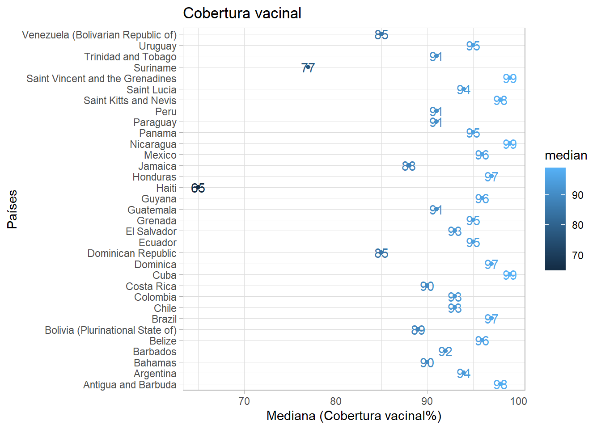<!-- -->

**Por país**


```r
#Gráfico de pontos simples
pontos = latin_2000_2023 %>% #Dataframe
  filter(vaccine %in% "MCV1") %>%
  ggplot() + #Chamando a função. Aqui se usa "+" em vez de "%>%" 
  
  #Mapeando os eixos
  aes(x = median,
      y = name,
      color = median) +
  
  #Geometrias
  geom_point() +
  
  geom_text(aes(x = median, #Use geom_label para visualizar melhor
                y = name, 
                label = median)) +
  
  #Tema
  theme_light() +
  
  #Labels
  labs(title = "Cobertura vacinal",
       x = "Mediana (Cobertura vacinal%)",
       y = "Países")

pontos
```

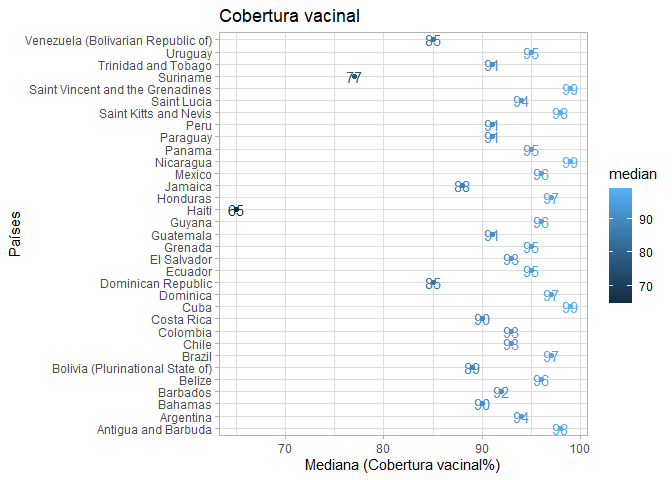<!-- -->

### Gráfico de barras

**Por continente**


```r
#Gráfico de barras simples
continente_barras_vac = continentes_vac %>% #Dataframe
  filter(vaccine %in% "MCV1") %>%
  mutate(continent = fct_reorder(continent, median)) %>% 
  ggplot() + #Chamando a função. Aqui se usa "+" em vez de "%>%" 
  
  #Mapeando os eixos
  aes(x = median,
      y = continent,
      fill = continent) +
  
  #Geometrias
  geom_col() +
  
  geom_text(aes(x = median, 
                y = continent, 
                label = median)) +
  
  #Tema
  theme_light() +
  
  #Labels
  labs(title = "Cobertura vacinal",
       x = "Mediana (Cobertura vacinal %)",
       y = "Continentes") 

continente_barras_vac
```

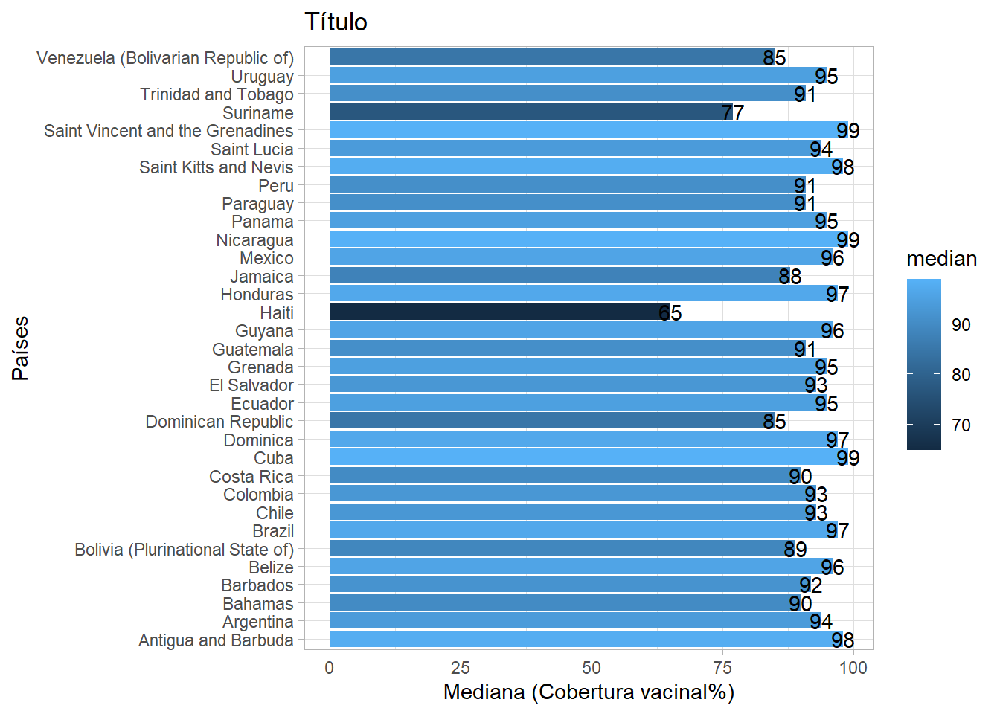<!-- -->

**Por país**


```r
#Gráfico de barras simples
pais_barras_vac = latin_2000_2023 %>% #Dataframe
  filter(vaccine %in% "MCV1") %>%
  ggplot() + #Chamando a função. Aqui se usa "+" em vez de "%>%" 
  
  #Mapeando os eixos
  aes(x = median,
      y = name,
      fill = median) +
  
  #Geometrias
  geom_col() +
  
  geom_text(aes(x = median, 
                y = name, 
                label = median)) +
  
  #Tema
  theme_light() +
  
  #Labels
  labs(title = "Título",
       x = "Mediana (Cobertura vacinal%)",
       y = "Países")

pais_barras_vac
```

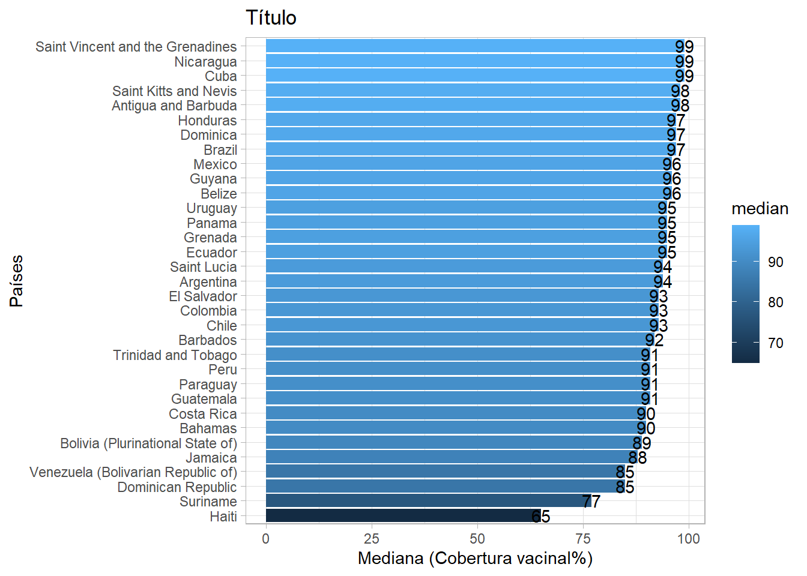<!-- -->

## Mortes

**Por continente**


```r
#Gráfico de pontos simples
barras_mortes = continentes_mortes %>% #Dataframe
  filter(disease_vac == "Measles") %>% 
  mutate(continent = fct_reorder(continent, cumulativo)) %>% 
  ggplot() + #Chamando a função. Aqui se usa "+" em vez de "%>%" 
  
  #Mapeando os eixos
  aes(x = cumulativo,
      y = continent,
      fill = continent) +
  
  #Geometrias
  geom_col() +
  
  geom_label(aes(x = cumulativo, 
                y = continent, 
                label = cumulativo),
            hjust = -0.2) +
  
  #Tema
  theme_light() +
  
  #Labels
  labs(title = "Mortes cumulativas por Sarampo, de 2000 a 2023",
       x = "Mortes",
       y = "Continentes") +
  
  #Eixo x
  xlim(0, 21000) #Aumentar limites 
  
barras_mortes 
```

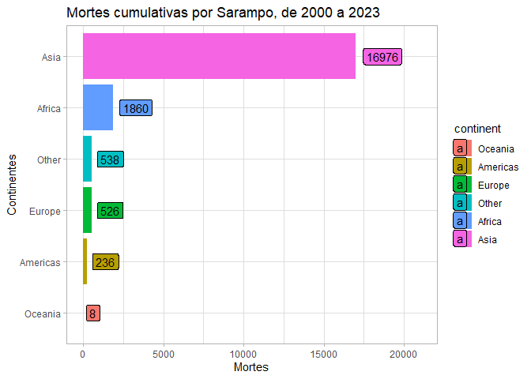<!-- -->


```r
#Gráfico de pontos simples
paises_barras_mortes = paises_mortes %>% #Dataframe
  filter(disease_vac == "Measles") %>% 
  mutate(name = fct_reorder(name, cumulativo)) %>% 
  slice_max(order_by = cumulativo, n = 10) %>% 
  ggplot() + #Chamando a função. Aqui se usa "+" em vez de "%>%" 
  
  #Mapeando os eixos
  aes(x = cumulativo,
      y = name,
      fill = name) +
  
  #Geometrias
  geom_col() +
  
  geom_label(aes(x = cumulativo, 
                y = name, 
                label = cumulativo),
            hjust = -0.2) +
  
  #Tema
  theme_light() +
  
  #Labels
  labs(title = "Mortes cumulativas por Sarampo, de 2000 a 2023",
       x = "Mortes",
       y = "Continentes") +
  
  #Eixo x
  xlim(0, 21000) #Aumentar limites 
  
paises_barras_mortes
```

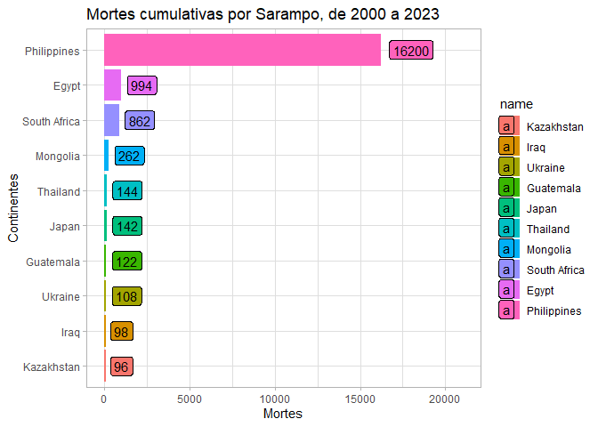<!-- -->

## Visualização rápida com o Esquisse


```r
#Visualização rápida
# latin_2000_2023 %>% 
#   esquisser() 
```

## Melhorando o gráfico


```r
# Melhorando o gráfico -----

plot = 
  
  # Manipular tabela
  latin_2000_2023 %>%
  filter(vaccine %in% "MCV1") %>%
  mutate(name = fct_reorder(name, median)) %>% 
 
  #Criar base do gráfico
  ggplot() +
  aes(x = median, y = name, colour = median) + #Aesthetics (mapping)
  
  #Geometria
  geom_point(shape = "circle", 
             size = 1) +
  #Highlight (add sempre após geom_)
  gghighlight(median >= 95,
              label_key = name,
              label_params = list(size = 3),
              unhighlighted_params = list(colour = "red")) +
  
  #Labels
  geom_text(aes(x = median, 
                y = name, 
                label = median),
              hjust = -0.5,
              size = 3,
              color = "black") +
  
  #Marcações
  #Linhas
  geom_vline(xintercept = 95,
             colour = "black",
             size =0.2,
             linetype = 2) +
  
  #Tema, aparência
  theme_light() + 
  
  # Labels, titulo, subtitulo, titulo dos eixos
    
  labs(title = "Vacinação em países da América Latina",
     subtitle = "Sarampo, MCV1, Dose 1, entre 2000 e 2023",
     y = "Países",
     x = "Mediana (Cobertura %)",
     tag = "Figure A.",
     colour = "Cobertura vacinal",
     caption = "Fonte: Feito pela UPVacina") +
  
  # Aparência especifica
  theme(
    
    #Texto geral
    text = element_text(family = "sans",  #sans, mono, serif
                        color = "black"), 
    
    #Título, subtítulo e tag
    plot.title = element_text(size = 12, 
                              face = "bold", 
                              hjust = 0,
                              vjust = 0.5),
    plot.subtitle = element_text(size = 10),
    plot.tag.position = "topleft",
    plot.tag = element_text(vjust = 5,
                            size = 12, 
                            face = "bold"),
    
    #Legenda
    legend.title = element_text(face = "bold"),
    legend.text = element_text(size = 10),
    
    #Eixos
    axis.title.x = element_text(size = 10,
                                angle = 0,
                                color = "black"),
    axis.text.x = element_text(color = "black",
                               size = 8,
                               angle = 0),
    axis.text.y = element_text(size = 8,
                               color = "black"),
    
    #Margens do gráfico
    plot.margin = unit(c(0.5, #Top
                         1, #Right
                         0.5, #Bottom
                         0), #Left 
                       "cm") #Unidade) 
  ) 
```

```
## Warning: Using `size` aesthetic for lines was deprecated in ggplot2 3.4.0.
## ℹ Please use `linewidth` instead.
## This warning is displayed once every 8 hours.
## Call `lifecycle::last_lifecycle_warnings()` to see where this warning was
## generated.
```

```r
  #Escala de cores
  # scale_colour_manual(low = "#DC0000B2", 
  #                       high = "#4DBBD5B2",
  #                       breaks = c(90, 100)) +
  # scale_colour_steps(low = "#DC0000B2", 
  #                       high = "#4DBBD5B2")


#Visualizar
plot
```

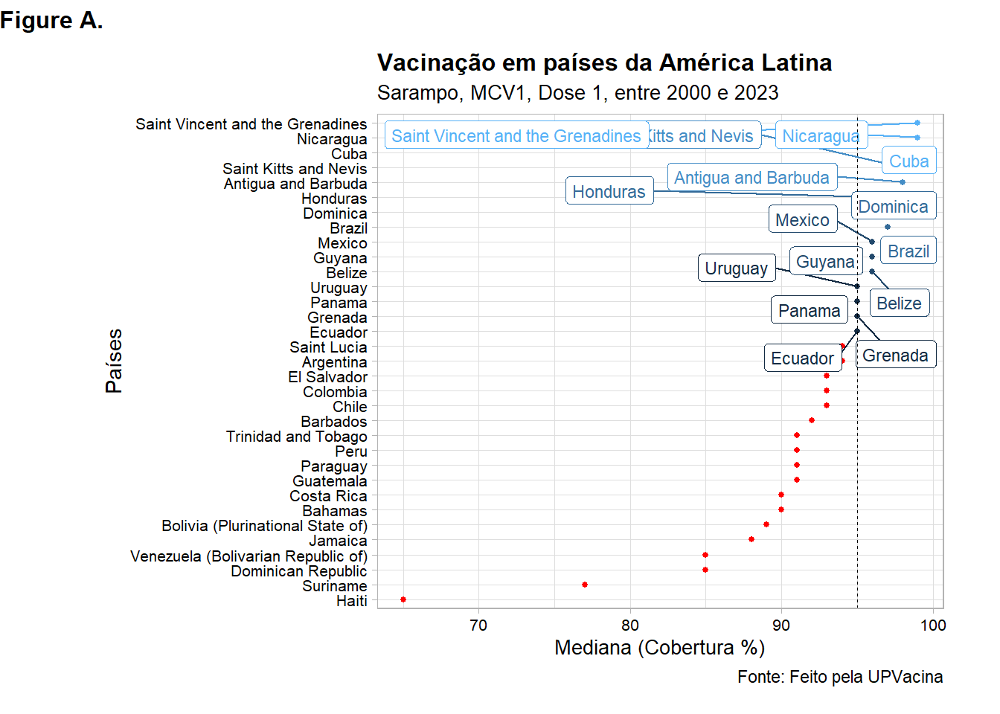<!-- -->

```r
#Salvar
ggsave(plot, file = "Sarampo_LatinAmerica_2000_2023.png", width = 10, height = 5)
```

## Gráfico interativo


```r
plot %>% 
  ggplotly() 
```

```
## Warning in geom2trace.default(dots[[1L]][[5L]], dots[[2L]][[1L]], dots[[3L]][[1L]]): geom_GeomLabelRepel() has yet to be implemented in plotly.
##   If you'd like to see this geom implemented,
##   Please open an issue with your example code at
##   https://github.com/ropensci/plotly/issues

## Warning in geom2trace.default(dots[[1L]][[5L]], dots[[2L]][[1L]], dots[[3L]][[1L]]): geom_GeomLabelRepel() has yet to be implemented in plotly.
##   If you'd like to see this geom implemented,
##   Please open an issue with your example code at
##   https://github.com/ropensci/plotly/issues

## Warning in geom2trace.default(dots[[1L]][[5L]], dots[[2L]][[1L]], dots[[3L]][[1L]]): geom_GeomLabelRepel() has yet to be implemented in plotly.
##   If you'd like to see this geom implemented,
##   Please open an issue with your example code at
##   https://github.com/ropensci/plotly/issues

## Warning in geom2trace.default(dots[[1L]][[5L]], dots[[2L]][[1L]], dots[[3L]][[1L]]): geom_GeomLabelRepel() has yet to be implemented in plotly.
##   If you'd like to see this geom implemented,
##   Please open an issue with your example code at
##   https://github.com/ropensci/plotly/issues

## Warning in geom2trace.default(dots[[1L]][[5L]], dots[[2L]][[1L]], dots[[3L]][[1L]]): geom_GeomLabelRepel() has yet to be implemented in plotly.
##   If you'd like to see this geom implemented,
##   Please open an issue with your example code at
##   https://github.com/ropensci/plotly/issues
```

```{=html}
<div class="plotly html-widget html-fill-item" id="htmlwidget-71424ba3d89f112f1819" style="width:672px;height:480px;"></div>
<script type="application/json" data-for="htmlwidget-71424ba3d89f112f1819">{"x":{"data":[{"x":[98,94,90,92,96,89,97,93,93,90,99,97,85,95,93,95,91,96,65,97,88,96,99,95,91,91,98,94,99,77,91,95,85],"y":[29,17,7,13,23,6,26,14,15,8,31,27,3,19,16,20,9,24,1,28,5,25,32,21,10,11,30,18,33,2,12,22,4],"text":["highlight..........1: 98<br />highlight..........2: Antigua and Barbuda<br />highlight..........3: red<br />highlight..........group: 29","highlight..........1: 94<br />highlight..........2: Argentina<br />highlight..........3: red<br />highlight..........group: 17","highlight..........1: 90<br />highlight..........2: Bahamas<br />highlight..........3: red<br />highlight..........group: 7","highlight..........1: 92<br />highlight..........2: Barbados<br />highlight..........3: red<br />highlight..........group: 13","highlight..........1: 96<br />highlight..........2: Belize<br />highlight..........3: red<br />highlight..........group: 23","highlight..........1: 89<br />highlight..........2: Bolivia (Plurinational State of)<br />highlight..........3: red<br />highlight..........group: 6","highlight..........1: 97<br />highlight..........2: Brazil<br />highlight..........3: red<br />highlight..........group: 26","highlight..........1: 93<br />highlight..........2: Chile<br />highlight..........3: red<br />highlight..........group: 14","highlight..........1: 93<br />highlight..........2: Colombia<br />highlight..........3: red<br />highlight..........group: 15","highlight..........1: 90<br />highlight..........2: Costa Rica<br />highlight..........3: red<br />highlight..........group: 8","highlight..........1: 99<br />highlight..........2: Cuba<br />highlight..........3: red<br />highlight..........group: 31","highlight..........1: 97<br />highlight..........2: Dominica<br />highlight..........3: red<br />highlight..........group: 27","highlight..........1: 85<br />highlight..........2: Dominican Republic<br />highlight..........3: red<br />highlight..........group: 3","highlight..........1: 95<br />highlight..........2: Ecuador<br />highlight..........3: red<br />highlight..........group: 19","highlight..........1: 93<br />highlight..........2: El Salvador<br />highlight..........3: red<br />highlight..........group: 16","highlight..........1: 95<br />highlight..........2: Grenada<br />highlight..........3: red<br />highlight..........group: 20","highlight..........1: 91<br />highlight..........2: Guatemala<br />highlight..........3: red<br />highlight..........group: 9","highlight..........1: 96<br />highlight..........2: Guyana<br />highlight..........3: red<br />highlight..........group: 24","highlight..........1: 65<br />highlight..........2: Haiti<br />highlight..........3: red<br />highlight..........group: 1","highlight..........1: 97<br />highlight..........2: Honduras<br />highlight..........3: red<br />highlight..........group: 28","highlight..........1: 88<br />highlight..........2: Jamaica<br />highlight..........3: red<br />highlight..........group: 5","highlight..........1: 96<br />highlight..........2: Mexico<br />highlight..........3: red<br />highlight..........group: 25","highlight..........1: 99<br />highlight..........2: Nicaragua<br />highlight..........3: red<br />highlight..........group: 32","highlight..........1: 95<br />highlight..........2: Panama<br />highlight..........3: red<br />highlight..........group: 21","highlight..........1: 91<br />highlight..........2: Paraguay<br />highlight..........3: red<br />highlight..........group: 10","highlight..........1: 91<br />highlight..........2: Peru<br />highlight..........3: red<br />highlight..........group: 11","highlight..........1: 98<br />highlight..........2: Saint Kitts and Nevis<br />highlight..........3: red<br />highlight..........group: 30","highlight..........1: 94<br />highlight..........2: Saint Lucia<br />highlight..........3: red<br />highlight..........group: 18","highlight..........1: 99<br />highlight..........2: Saint Vincent and the Grenadines<br />highlight..........3: red<br />highlight..........group: 33","highlight..........1: 77<br />highlight..........2: Suriname<br />highlight..........3: red<br />highlight..........group: 2","highlight..........1: 91<br />highlight..........2: Trinidad and Tobago<br />highlight..........3: red<br />highlight..........group: 12","highlight..........1: 95<br />highlight..........2: Uruguay<br />highlight..........3: red<br />highlight..........group: 22","highlight..........1: 85<br />highlight..........2: Venezuela (Bolivarian Republic of)<br />highlight..........3: red<br />highlight..........group: 4"],"type":"scatter","mode":"markers","marker":{"autocolorscale":false,"color":"rgba(255,0,0,1)","opacity":1,"size":3.7795275590551185,"symbol":"circle","line":{"width":1.8897637795275593,"color":"rgba(255,0,0,1)"}},"hoveron":"points","showlegend":false,"xaxis":"x","yaxis":"y","hoverinfo":"text","frame":null},{"x":[95,95,95,95],"y":[19,20,21,22],"text":["median: 95<br />name: Ecuador<br />median: 95","median: 95<br />name: Grenada<br />median: 95","median: 95<br />name: Panama<br />median: 95","median: 95<br />name: Uruguay<br />median: 95"],"type":"scatter","mode":"markers","marker":{"autocolorscale":false,"color":"rgba(19,43,67,1)","opacity":1,"size":3.7795275590551185,"symbol":"circle","line":{"width":1.8897637795275593,"color":"rgba(19,43,67,1)"}},"hoveron":"points","showlegend":false,"xaxis":"x","yaxis":"y","hoverinfo":"text","frame":null},{"x":[96,96,96],"y":[23,24,25],"text":["median: 96<br />name: Belize<br />median: 96","median: 96<br />name: Guyana<br />median: 96","median: 96<br />name: Mexico<br />median: 96"],"type":"scatter","mode":"markers","marker":{"autocolorscale":false,"color":"rgba(34,73,108,1)","opacity":1,"size":3.7795275590551185,"symbol":"circle","line":{"width":1.8897637795275593,"color":"rgba(34,73,108,1)"}},"hoveron":"points","showlegend":false,"xaxis":"x","yaxis":"y","hoverinfo":"text","frame":null},{"x":[97,97,97],"y":[26,27,28],"text":["median: 97<br />name: Brazil<br />median: 97","median: 97<br />name: Dominica<br />median: 97","median: 97<br />name: Honduras<br />median: 97"],"type":"scatter","mode":"markers","marker":{"autocolorscale":false,"color":"rgba(51,106,152,1)","opacity":1,"size":3.7795275590551185,"symbol":"circle","line":{"width":1.8897637795275593,"color":"rgba(51,106,152,1)"}},"hoveron":"points","showlegend":false,"xaxis":"x","yaxis":"y","hoverinfo":"text","frame":null},{"x":[98,98],"y":[29,30],"text":["median: 98<br />name: Antigua and Barbuda<br />median: 98","median: 98<br />name: Saint Kitts and Nevis<br />median: 98"],"type":"scatter","mode":"markers","marker":{"autocolorscale":false,"color":"rgba(68,141,198,1)","opacity":1,"size":3.7795275590551185,"symbol":"circle","line":{"width":1.8897637795275593,"color":"rgba(68,141,198,1)"}},"hoveron":"points","showlegend":false,"xaxis":"x","yaxis":"y","hoverinfo":"text","frame":null},{"x":[99,99,99],"y":[31,32,33],"text":["median: 99<br />name: Cuba<br />median: 99","median: 99<br />name: Nicaragua<br />median: 99","median: 99<br />name: Saint Vincent and the Grenadines<br />median: 99"],"type":"scatter","mode":"markers","marker":{"autocolorscale":false,"color":"rgba(86,177,247,1)","opacity":1,"size":3.7795275590551185,"symbol":"circle","line":{"width":1.8897637795275593,"color":"rgba(86,177,247,1)"}},"hoveron":"points","showlegend":false,"xaxis":"x","yaxis":"y","hoverinfo":"text","frame":null},{"showlegend":false,"xaxis":"x","yaxis":"y","hoverinfo":"text","mode":"","frame":null},{"x":[98,96,97,99,97,95,95,96,97,96,99,95,98,99,95],"y":[29,23,26,31,27,19,20,24,28,25,32,21,30,33,22],"text":[98,96,97,99,97,95,95,96,97,96,99,95,98,99,95],"hovertext":["median: 98<br />name: Antigua and Barbuda<br />median: black<br />median: 98","median: 96<br />name: Belize<br />median: black<br />median: 96","median: 97<br />name: Brazil<br />median: black<br />median: 97","median: 99<br />name: Cuba<br />median: black<br />median: 99","median: 97<br />name: Dominica<br />median: black<br />median: 97","median: 95<br />name: Ecuador<br />median: black<br />median: 95","median: 95<br />name: Grenada<br />median: black<br />median: 95","median: 96<br />name: Guyana<br />median: black<br />median: 96","median: 97<br />name: Honduras<br />median: black<br />median: 97","median: 96<br />name: Mexico<br />median: black<br />median: 96","median: 99<br />name: Nicaragua<br />median: black<br />median: 99","median: 95<br />name: Panama<br />median: black<br />median: 95","median: 98<br />name: Saint Kitts and Nevis<br />median: black<br />median: 98","median: 99<br />name: Saint Vincent and the Grenadines<br />median: black<br />median: 99","median: 95<br />name: Uruguay<br />median: black<br />median: 95"],"textfont":{"size":11.338582677165356,"color":"rgba(0,0,0,1)"},"type":"scatter","mode":"text","hoveron":"points","showlegend":false,"xaxis":"x","yaxis":"y","hoverinfo":"text","frame":null},{"x":[95,95],"y":[0.40000000000000002,33.600000000000001],"text":"xintercept: 95","type":"scatter","mode":"lines","line":{"width":0.75590551181102372,"color":"rgba(0,0,0,1)","dash":"dash"},"hoveron":"points","showlegend":false,"xaxis":"x","yaxis":"y","hoverinfo":"text","frame":null}],"layout":{"margin":{"t":50.837861954677827,"r":37.795275590551171,"b":46.460942070908629,"l":198.92071398920712},"plot_bgcolor":"rgba(255,255,255,1)","paper_bgcolor":"rgba(255,255,255,1)","font":{"color":"rgba(0,0,0,1)","family":"sans","size":14.611872146118724},"title":{"text":"<b> Vacinação em países da América Latina <\/b>","font":{"color":"rgba(0,0,0,1)","family":"sans","size":15.940224159402243},"x":0,"xref":"paper"},"xaxis":{"domain":[0,1],"automargin":true,"type":"linear","autorange":false,"range":[63.299999999999997,100.7],"tickmode":"array","ticktext":["70","80","90","100"],"tickvals":[70,80,90,100],"categoryorder":"array","categoryarray":["70","80","90","100"],"nticks":null,"ticks":"outside","tickcolor":"rgba(179,179,179,1)","ticklen":3.6529680365296811,"tickwidth":0.33208800332088001,"showticklabels":true,"tickfont":{"color":"rgba(0,0,0,1)","family":"sans","size":10.62681610626816},"tickangle":-0,"showline":false,"linecolor":null,"linewidth":0,"showgrid":true,"gridcolor":"rgba(222,222,222,1)","gridwidth":0.33208800332088001,"zeroline":false,"anchor":"y","title":{"text":"Mediana (Cobertura %)","font":{"color":"rgba(0,0,0,1)","family":"sans","size":13.283520132835198}},"hoverformat":".2f"},"yaxis":{"domain":[0,1],"automargin":true,"type":"linear","autorange":false,"range":[0.40000000000000002,33.600000000000001],"tickmode":"array","ticktext":["Haiti","Suriname","Dominican Republic","Venezuela (Bolivarian Republic of)","Jamaica","Bolivia (Plurinational State of)","Bahamas","Costa Rica","Guatemala","Paraguay","Peru","Trinidad and Tobago","Barbados","Chile","Colombia","El Salvador","Argentina","Saint Lucia","Ecuador","Grenada","Panama","Uruguay","Belize","Guyana","Mexico","Brazil","Dominica","Honduras","Antigua and Barbuda","Saint Kitts and Nevis","Cuba","Nicaragua","Saint Vincent and the Grenadines"],"tickvals":[1,2,3,4,5,6,7,8,9,10,11,12,13,14,15,16,17,18,19,20,21,22,23,24,25,26,27,28,29,30,31,32,33],"categoryorder":"array","categoryarray":["Haiti","Suriname","Dominican Republic","Venezuela (Bolivarian Republic of)","Jamaica","Bolivia (Plurinational State of)","Bahamas","Costa Rica","Guatemala","Paraguay","Peru","Trinidad and Tobago","Barbados","Chile","Colombia","El Salvador","Argentina","Saint Lucia","Ecuador","Grenada","Panama","Uruguay","Belize","Guyana","Mexico","Brazil","Dominica","Honduras","Antigua and Barbuda","Saint Kitts and Nevis","Cuba","Nicaragua","Saint Vincent and the Grenadines"],"nticks":null,"ticks":"outside","tickcolor":"rgba(179,179,179,1)","ticklen":3.6529680365296811,"tickwidth":0.33208800332088001,"showticklabels":true,"tickfont":{"color":"rgba(0,0,0,1)","family":"sans","size":10.62681610626816},"tickangle":-0,"showline":false,"linecolor":null,"linewidth":0,"showgrid":true,"gridcolor":"rgba(222,222,222,1)","gridwidth":0.33208800332088001,"zeroline":false,"anchor":"x","title":{"text":"Países","font":{"color":"rgba(0,0,0,1)","family":"sans","size":14.611872146118724}},"hoverformat":".2f"},"shapes":[{"type":"rect","fillcolor":"transparent","line":{"color":"rgba(179,179,179,1)","width":0.66417600664176002,"linetype":"solid"},"yref":"paper","xref":"paper","x0":0,"x1":1,"y0":0,"y1":1}],"showlegend":false,"legend":{"bgcolor":"rgba(255,255,255,1)","bordercolor":"transparent","borderwidth":1.8897637795275593,"font":{"color":"rgba(0,0,0,1)","family":"sans","size":13.283520132835198},"title":{"text":"","font":{"color":"rgba(0,0,0,1)","family":"sans","size":14.611872146118724}}},"hovermode":"closest","barmode":"relative"},"config":{"doubleClick":"reset","modeBarButtonsToAdd":["hoverclosest","hovercompare"],"showSendToCloud":false},"source":"A","attrs":{"464146673e1":{"x":{},"y":{},"colour":{},"type":"scatter"},"4647d2a2056":{"x":{},"y":{},"colour":{}},"4641728795f":{"x":{},"y":{},"colour":{},"label":{}},"4647a4634d":{"x":{},"y":{},"colour":{},"label":{}},"464d5426e4":{"xintercept":{}}},"cur_data":"464146673e1","visdat":{"464146673e1":["function (y) ","x"],"4647d2a2056":["function (y) ","x"],"4641728795f":["function (y) ","x"],"4647a4634d":["function (y) ","x"],"464d5426e4":["function (y) ","x"]},"highlight":{"on":"plotly_click","persistent":false,"dynamic":false,"selectize":false,"opacityDim":0.20000000000000001,"selected":{"opacity":1},"debounce":0},"shinyEvents":["plotly_hover","plotly_click","plotly_selected","plotly_relayout","plotly_brushed","plotly_brushing","plotly_clickannotation","plotly_doubleclick","plotly_deselect","plotly_afterplot","plotly_sunburstclick"],"base_url":"https://plot.ly"},"evals":[],"jsHooks":[]}</script>
```

## Unindo gráficos


```r
#Unindo gráficos -----

vaccination = data_long_annotated %>% 
  filter(name == "Brazil",
         vaccine == "MCV1") %>% 
    ggplot() +
  geom_line(mapping = aes(
    x = year,
    y = coverage),
    colour = "#4DBBD5B2",
    linewidth = 2) +
    geom_text(aes(x = year, 
                  y = coverage, 
                  label = coverage),
            vjust = -0.5,
            size = 2) +
    theme_minimal() +
  labs(title = "Cobertura vacinal contra o sarampo, Brasil",
       x = "Ano",
       y = "Cobertura vacinal (%)") +
   ylim(0, 110)

vaccination
```

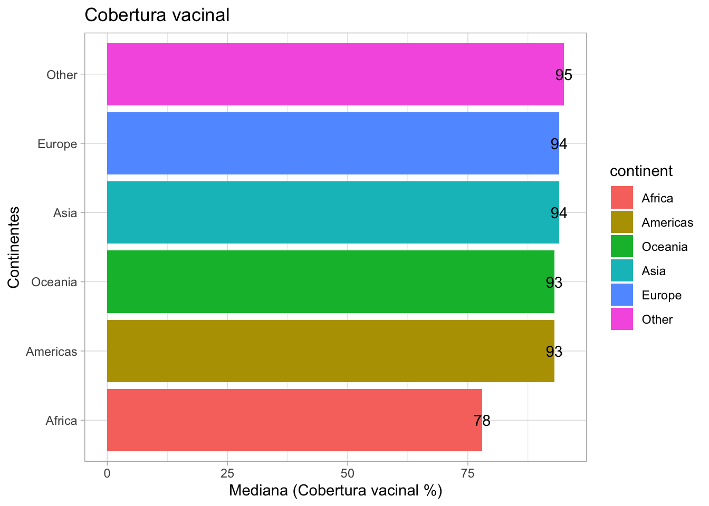<!-- -->


```r
#Mortes
deaths = data_long_annotated %>% 
  filter(name == "Brazil",
         vaccine == "MCV1") %>% 
    ggplot() +
  aes(x = year, y = total_deaths) +
  geom_col(fill = "#DC0000B2") +
  geom_text(aes(label = total_deaths),
            vjust = -0.5,
            size = 2) +
  theme_minimal() +
  theme(text = element_text(size = 10)) +
    labs(title = "Mortes por sarampo, Brasil",
       x = "Ano",
       y = "Mortes") +
   ylim(0, 3400)

deaths
```

```
## Warning: Removed 2 rows containing missing values or values outside the scale range
## (`geom_col()`).
```

```
## Warning: Removed 2 rows containing missing values or values outside the scale range
## (`geom_text()`).
```

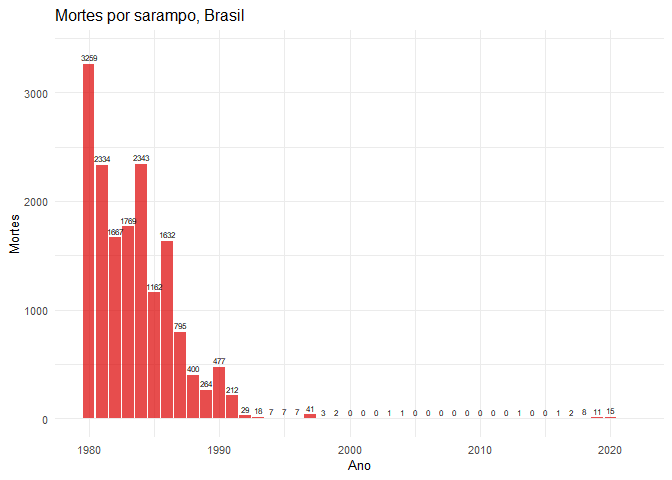<!-- -->

### Unindo gráficos em uma imagem


```r
#Unir gráficos
(vaccination / deaths) 
```

```
## Warning: Removed 2 rows containing missing values or values outside the scale range
## (`geom_col()`).
```

```
## Warning: Removed 2 rows containing missing values or values outside the scale range
## (`geom_text()`).
```

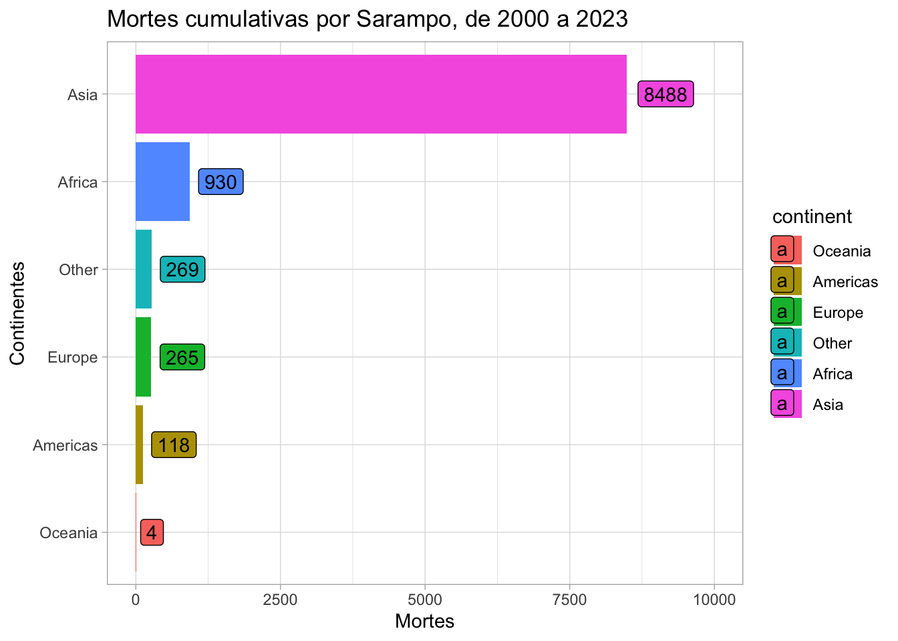<!-- -->

```r
(vaccination + deaths) 
```

```
## Warning: Removed 2 rows containing missing values or values outside the scale range
## (`geom_col()`).
## Removed 2 rows containing missing values or values outside the scale range
## (`geom_text()`).
```

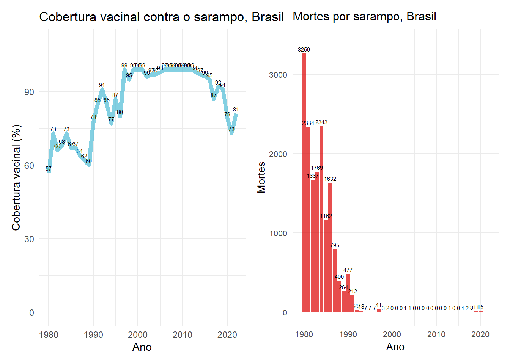<!-- -->

```r
#Salvar
(vaccination / deaths) %>% 
  ggsave(file = "Sarampo_Brasil_1980_2023.png", width = 10, height = 5)
```

```
## Warning: Removed 2 rows containing missing values or values outside the scale range
## (`geom_col()`).
## Removed 2 rows containing missing values or values outside the scale range
## (`geom_text()`).
```

### Boxplots


```r
#Boxplot simples por ano
boxplot_years = data_long_annotated %>% 
  filter(type == "country",
         vaccine == "MCV1",
         year %in% c(1990, 2000, 2010, 2019)) %>% 
  
  
 ggplot() +
  aes(x = "", 
      y = coverage, 
      fill = continent) +
  geom_boxplot() +
  scale_fill_brewer(palette = "Set2", direction = 1) +
  theme_bw() + 
  theme(axis.text.x = element_text(angle = 45,
                                   vjust = 1,
                                   hjust = 1),
        plot.margin = unit(c(1, 1, 1, 1), "cm"),
        legend.position = "right") +
  facet_wrap(vars(year), ncol = 4) +
  labs(title = "Cobertura vacinal contra o sarampo",
       subtitle = "Primeira dose (MCV1)",
      x = "Região UNICEF",
       y = "Cobertura vacinal (%)",
       fill = "Região UNICEF")

#Visualizar
boxplot_years 
```

```
## Warning: Removed 37 rows containing non-finite outside the scale range
## (`stat_boxplot()`).
```

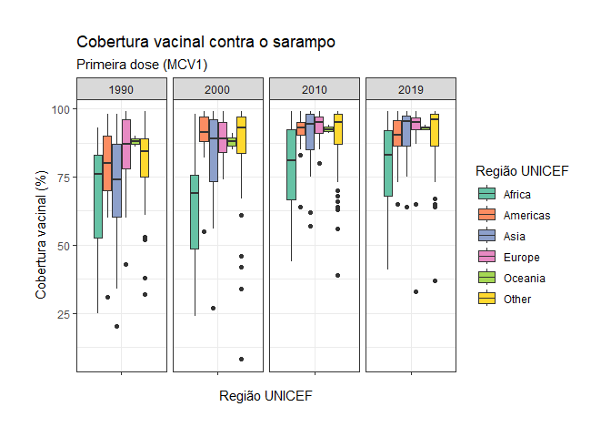<!-- -->

## Paleta de cores científica


```r
# Cores
#Mudando a paleta
library(ggsci)
library(scales)
```

```
## Warning: package 'scales' was built under R version 4.3.2
```

```
## 
## Attaching package: 'scales'
```

```
## The following object is masked from 'package:purrr':
## 
##     discard
```

```
## The following object is masked from 'package:readr':
## 
##     col_factor
```

```r
vignette("ggsci") 

nrc = pal_npg("nrc", #Especificar paleta
              alpha = 0.7)(8) #Gerar 10 cores com transparencia = 70%

nrc %>% 
  show_col()
```

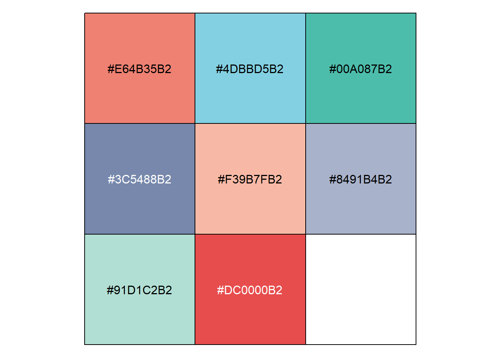<!-- -->

```r
boxplot_years + scale_fill_npg()
```

```
## Scale for fill is already present.
## Adding another scale for fill, which will replace the existing scale.
```

```
## Warning: Removed 37 rows containing non-finite outside the scale range
## (`stat_boxplot()`).
```

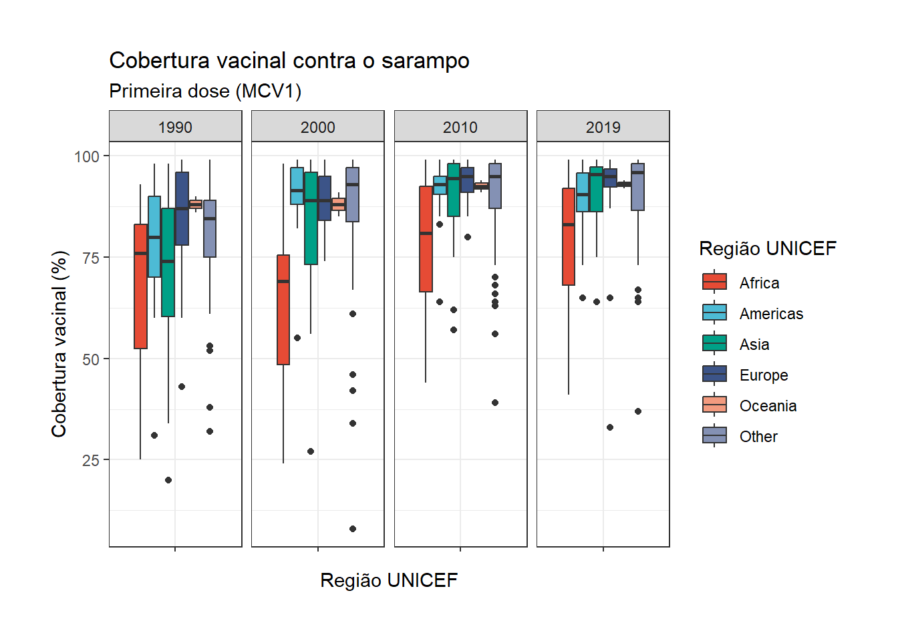<!-- -->


```r
#Boxplot simples de ano
boxplot_regions = data_long_annotated %>% 
  filter(type == "country",
         vaccine == "MCV1",
         year %in% c(1990, 2000, 2010, 2020)) %>% 
  mutate(year = as.factor(year)) %>% 
 ggplot() +
  aes(x = year, y = coverage, fill = year) +
  geom_boxplot() +
  geom_jitter(aes(label = name),
              alpha = 0.2,
              na.rm = T) +
  scale_fill_brewer(palette = "Set2", direction = 1) +
  scale_color_distiller(palette = "Set2", direction = 1) +
  theme_minimal() +
  facet_wrap(vars(continent)) +
  scale_fill_npg()
```

```
## Warning in geom_jitter(aes(label = name), alpha = 0.2, na.rm = T): Ignoring
## unknown aesthetics: label
```

```
## Scale for fill is already present.
## Adding another scale for fill, which will replace the existing scale.
```

```r
boxplot_regions
```

```
## Warning: Removed 37 rows containing non-finite outside the scale range
## (`stat_boxplot()`).
```

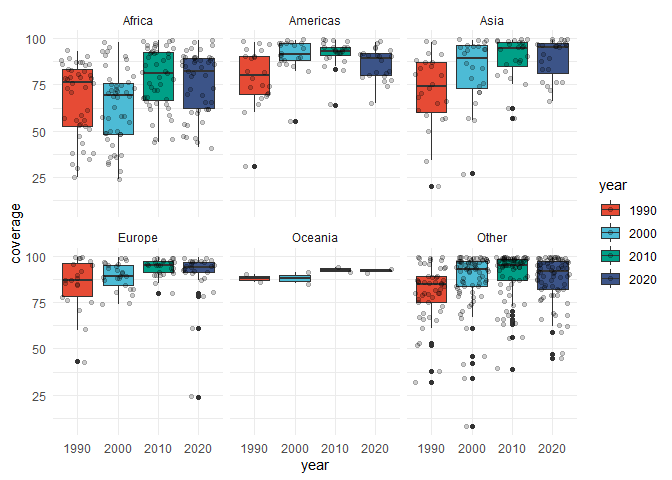<!-- -->


```r
# Gráfico interativo
boxplot_regions %>%  
  ggplotly()
```

```
## Warning: Removed 37 rows containing non-finite outside the scale range
## (`stat_boxplot()`).
```

```{=html}
<div class="plotly html-widget html-fill-item" id="htmlwidget-1edf0de8695e483e4b3a" style="width:672px;height:480px;"></div>
<script type="application/json" data-for="htmlwidget-1edf0de8695e483e4b3a">{"x":{"data":[{"x":[1,1,1,1,1,1,1,1,1,1,1,1,1,1,1,1,1,1,1,1,1,1,1,1,1,1,1,1,1,1,1,1,1,1,1,1,1,1,1,1,1,1,1,1,1,1,1],"y":[79,null,38,43,86,79,89,30,88,86,null,73,83,87,51,61,47,85,78,54,80,76,79,87,null,74,56,35,38,57,59,76,71,25,93,81,83,52,56,null,38,32,53,79,87,90,82],"hoverinfo":"y","type":"box","fillcolor":"rgba(230,75,53,1)","marker":{"opacity":null,"outliercolor":"rgba(0,0,0,1)","line":{"width":1.8897637795275593,"color":"rgba(0,0,0,1)"},"size":5.6692913385826778},"line":{"color":"rgba(51,51,51,1)","width":1.8897637795275593},"name":"1990","legendgroup":"1990","showlegend":true,"xaxis":"x","yaxis":"y","frame":null},{"x":[1,1,1,1,1,1,1,1,1,1,1,1,1,1,1,1,1,1,1,1,1,1],"y":[70,73,89,70,90,90,69,78,74,31,64,97,93,68,97,82,75,60,90,98,94,82],"hoverinfo":"y","type":"box","fillcolor":"rgba(230,75,53,1)","marker":{"opacity":null,"outliercolor":"rgba(0,0,0,1)","line":{"width":1.8897637795275593,"color":"rgba(0,0,0,1)"},"size":5.6692913385826778},"line":{"color":"rgba(51,51,51,1)","width":1.8897637795275593},"name":"1990","legendgroup":"1990","showlegend":false,"xaxis":"x2","yaxis":"y","frame":null},{"x":[1,1,1,1,1,1,1,1,1,1,1,1,1,1,1,1,1,1,1,1,1,1,1,1],"y":[87,80,56,75,20,57,80,66,65,68,87,58,98,88,92,84,61,70,85,50,98,34,91,73],"hoverinfo":"y","type":"box","fillcolor":"rgba(230,75,53,1)","marker":{"opacity":null,"outliercolor":"rgba(0,0,0,1)","line":{"width":1.8897637795275593,"color":"rgba(0,0,0,1)"},"size":5.6692913385826778},"line":{"color":"rgba(51,51,51,1)","width":1.8897637795275593},"name":"1990","legendgroup":"1990","showlegend":false,"xaxis":"x3","yaxis":"y","frame":null},{"x":[1,1,1,1,1,1,1,1,1,1,1,1,1,1,1,1,1,1,1,1,1,1,1,1,1,1],"y":[99,99,null,null,87,95,43,99,null,85,87,60,84,76,null,97,99,78,90,75,96,88,92,85,71,null],"hoverinfo":"y","type":"box","fillcolor":"rgba(230,75,53,1)","marker":{"opacity":null,"outliercolor":"rgba(0,0,0,1)","line":{"width":1.8897637795275593,"color":"rgba(0,0,0,1)"},"size":5.6692913385826778},"line":{"color":"rgba(51,51,51,1)","width":1.8897637795275593},"name":"1990","legendgroup":"1990","showlegend":false,"xaxis":"x","yaxis":"y2","frame":null},{"x":[1,1],"y":[90,86],"hoverinfo":"y","type":"box","fillcolor":"rgba(230,75,53,1)","marker":{"opacity":null,"outliercolor":"rgba(0,0,0,1)","line":{"width":1.8897637795275593,"color":"rgba(0,0,0,1)"},"size":5.6692913385826778},"line":{"color":"rgba(51,51,51,1)","width":1.8897637795275593},"name":"1990","legendgroup":"1990","showlegend":false,"xaxis":"x2","yaxis":"y2","frame":null},{"x":[1,1,1,1,1,1,1,1,1,1,1,1,1,1,1,1,1,1,1,1,1,1,1,1,1,1,1,1,1,1,1,1,1,1,1,1,1,1,1,1,1,1,1,1,1,1,1,1,1,1,1,1,1,1,1,1,1,1,1,1,1,1,1,1,1,1,1,1,1,1,1,1,1,1],"y":[99,77,81,86,87,null,89,53,null,80,null,null,96,88,75,99,null,null,93,73,99,32,88,86,75,94,69,null,85,null,99,82,93,null,80,65,85,96,null,98,78,86,79,null,null,80,67,98,61,null,null,52,38,null,87,86,70,null,79,85,95,null,84,80,66,null,null,null,null,null,null,null,67,89],"hoverinfo":"y","type":"box","fillcolor":"rgba(230,75,53,1)","marker":{"opacity":null,"outliercolor":"rgba(0,0,0,1)","line":{"width":1.8897637795275593,"color":"rgba(0,0,0,1)"},"size":5.6692913385826778},"line":{"color":"rgba(51,51,51,1)","width":1.8897637795275593},"name":"1990","legendgroup":"1990","showlegend":false,"xaxis":"x3","yaxis":"y2","frame":null},{"x":[2,2,2,2,2,2,2,2,2,2,2,2,2,2,2,2,2,2,2,2,2,2,2,2,2,2,2,2,2,2,2,2,2,2,2,2,2,2,2,2,2,2,2,2,2,2,2],"y":[49,89,93,32,58,49,58,57,46,33,37,36,42,74,69,28,95,69,98,93,78,48,70,24,76,55,72,37,68,70,75,57,50,71,84,50,48,90,80,91,72,74,63,85,71,36,73],"hoverinfo":"y","type":"box","fillcolor":"rgba(77,187,213,1)","marker":{"opacity":null,"outliercolor":"rgba(0,0,0,1)","line":{"width":1.8897637795275593,"color":"rgba(0,0,0,1)"},"size":5.6692913385826778},"line":{"color":"rgba(51,51,51,1)","width":1.8897637795275593},"name":"2000","legendgroup":"2000","showlegend":true,"xaxis":"x","yaxis":"y","frame":null},{"x":[2,2,2,2,2,2,2,2,2,2,2,2,2,2,2,2,2,2,2,2,2,2],"y":[91,82,94,97,97,90,85,98,88,96,99,92,86,97,97,96,86,99,91,89,55,88],"hoverinfo":"y","type":"box","fillcolor":"rgba(77,187,213,1)","marker":{"opacity":null,"outliercolor":"rgba(0,0,0,1)","line":{"width":1.8897637795275593,"color":"rgba(0,0,0,1)"},"size":5.6692913385826778},"line":{"color":"rgba(51,51,51,1)","width":1.8897637795275593},"name":"2000","legendgroup":"2000","showlegend":false,"xaxis":"x2","yaxis":"y","frame":null},{"x":[2,2,2,2,2,2,2,2,2,2,2,2,2,2,2,2,2,2,2,2,2,2,2,2],"y":[84,99,56,78,86,94,65,96,94,94,99,92,99,74,95,84,96,27,76,96,57,71,71,98],"hoverinfo":"y","type":"box","fillcolor":"rgba(77,187,213,1)","marker":{"opacity":null,"outliercolor":"rgba(0,0,0,1)","line":{"width":1.8897637795275593,"color":"rgba(0,0,0,1)"},"size":5.6692913385826778},"line":{"color":"rgba(51,51,51,1)","width":1.8897637795275593},"name":"2000","legendgroup":"2000","showlegend":false,"xaxis":"x3","yaxis":"y","frame":null},{"x":[2,2,2,2,2,2,2,2,2,2,2,2,2,2,2,2,2,2,2,2,2,2,2,2,2,2],"y":[88,95,91,74,82,99,97,null,91,84,75,87,93,94,82,88,89,89,79,99,89,80,92,98,96,95],"hoverinfo":"y","type":"box","fillcolor":"rgba(77,187,213,1)","marker":{"opacity":null,"outliercolor":"rgba(0,0,0,1)","line":{"width":1.8897637795275593,"color":"rgba(0,0,0,1)"},"size":5.6692913385826778},"line":{"color":"rgba(51,51,51,1)","width":1.8897637795275593},"name":"2000","legendgroup":"2000","showlegend":false,"xaxis":"x","yaxis":"y2","frame":null},{"x":[2,2],"y":[91,85],"hoverinfo":"y","type":"box","fillcolor":"rgba(77,187,213,1)","marker":{"opacity":null,"outliercolor":"rgba(0,0,0,1)","line":{"width":1.8897637795275593,"color":"rgba(0,0,0,1)"},"size":5.6692913385826778},"line":{"color":"rgba(51,51,51,1)","width":1.8897637795275593},"name":"2000","legendgroup":"2000","showlegend":false,"xaxis":"x2","yaxis":"y2","frame":null},{"x":[2,2,2,2,2,2,2,2,2,2,2,2,2,2,2,2,2,2,2,2,2,2,2,2,2,2,2,2,2,2,2,2,2,2,2,2,2,2,2,2,2,2,2,2,2,2,2,2,2,2,2,2,2,2,2,2,2,2,2,2,2,2,2,2,2,2,2,2,2,2,2,2,2,2],"y":[99,98,95,94,86,97,93,78,80,94,null,74,99,85,89,97,67,96,99,96,86,95,97,88,78,98,97,84,88,97,99,94,96,70,95,8,98,97,81,97,93,99,46,93,98,83,91,99,81,73,84,99,34,86,93,93,92,91,96,61,99,76,78,42,84,87,92,92,null,97,84,69,99,99],"hoverinfo":"y","type":"box","fillcolor":"rgba(77,187,213,1)","marker":{"opacity":null,"outliercolor":"rgba(0,0,0,1)","line":{"width":1.8897637795275593,"color":"rgba(0,0,0,1)"},"size":5.6692913385826778},"line":{"color":"rgba(51,51,51,1)","width":1.8897637795275593},"name":"2000","legendgroup":"2000","showlegend":false,"xaxis":"x3","yaxis":"y2","frame":null},{"x":[3,3,3,3,3,3,3,3,3,3,3,3,3,3,3,3,3,3,3,3,3,3,3,3,3,3,3,3,3,3,3,3,3,3,3,3,3,3,3,3,3,3,3,3,3,3,3],"y":[82,58,56,62,64,88,78,98,72,73,92,98,66,90,93,68,75,92,95,46,79,96,97,92,81,90,67,67,96,46,64,68,44,95,92,62,76,96,85,72,99,86,65,82,95,93,53],"hoverinfo":"y","type":"box","fillcolor":"rgba(0,160,135,1)","marker":{"opacity":null,"outliercolor":"rgba(0,0,0,1)","line":{"width":1.8897637795275593,"color":"rgba(0,0,0,1)"},"size":5.6692913385826778},"line":{"color":"rgba(51,51,51,1)","width":1.8897637795275593},"name":"2010","legendgroup":"2010","showlegend":true,"xaxis":"x","yaxis":"y","frame":null},{"x":[3,3,3,3,3,3,3,3,3,3,3,3,3,3,3,3,3,3,3,3,3,3],"y":[94,97,85,92,64,89,93,98,95,83,90,99,93,92,99,95,95,92,93,95,88,99],"hoverinfo":"y","type":"box","fillcolor":"rgba(0,160,135,1)","marker":{"opacity":null,"outliercolor":"rgba(0,0,0,1)","line":{"width":1.8897637795275593,"color":"rgba(0,0,0,1)"},"size":5.6692913385826778},"line":{"color":"rgba(51,51,51,1)","width":1.8897637795275593},"name":"2010","legendgroup":"2010","showlegend":false,"xaxis":"x2","yaxis":"y","frame":null},{"x":[3,3,3,3,3,3,3,3,3,3,3,3,3,3,3,3,3,3,3,3,3,3,3,3],"y":[98,98,82,98,99,80,88,75,88,94,98,78,99,99,86,90,95,99,95,62,97,87,57,96],"hoverinfo":"y","type":"box","fillcolor":"rgba(0,160,135,1)","marker":{"opacity":null,"outliercolor":"rgba(0,0,0,1)","line":{"width":1.8897637795275593,"color":"rgba(0,0,0,1)"},"size":5.6692913385826778},"line":{"color":"rgba(51,51,51,1)","width":1.8897637795275593},"name":"2010","legendgroup":"2010","showlegend":false,"xaxis":"x3","yaxis":"y","frame":null},{"x":[3,3,3,3,3,3,3,3,3,3,3,3,3,3,3,3,3,3,3,3,3,3,3,3,3,3],"y":[95,96,99,96,93,95,98,93,90,99,89,90,91,97,92,80,97,97,95,85,95,91,99,89,98,95],"hoverinfo":"y","type":"box","fillcolor":"rgba(0,160,135,1)","marker":{"opacity":null,"outliercolor":"rgba(0,0,0,1)","line":{"width":1.8897637795275593,"color":"rgba(0,0,0,1)"},"size":5.6692913385826778},"line":{"color":"rgba(51,51,51,1)","width":1.8897637795275593},"name":"2010","legendgroup":"2010","showlegend":false,"xaxis":"x","yaxis":"y2","frame":null},{"x":[3,3],"y":[94,91],"hoverinfo":"y","type":"box","fillcolor":"rgba(0,160,135,1)","marker":{"opacity":null,"outliercolor":"rgba(0,0,0,1)","line":{"width":1.8897637795275593,"color":"rgba(0,0,0,1)"},"size":5.6692913385826778},"line":{"color":"rgba(51,51,51,1)","width":1.8897637795275593},"name":"2010","legendgroup":"2010","showlegend":false,"xaxis":"x2","yaxis":"y2","frame":null},{"x":[3,3,3,3,3,3,3,3,3,3,3,3,3,3,3,3,3,3,3,3,3,3,3,3,3,3,3,3,3,3,3,3,3,3,3,3,3,3,3,3,3,3,3,3,3,3,3,3,3,3,3,3,3,3,3,3,3,3,3,3,3,3,3,3,3,3,3,3,3,3,3,3,3,3],"y":[74,80,85,98,99,88,94,73,95,99,95,39,99,null,98,96,95,98,98,89,97,98,92,99,56,94,97,99,99,66,99,98,99,98,96,89,99,99,66,56,88,99,95,99,99,99,87,94,87,95,64,98,98,97,70,96,94,94,99,82,97,97,68,75,63,95,99,85,93,98,97,79,96,94],"hoverinfo":"y","type":"box","fillcolor":"rgba(0,160,135,1)","marker":{"opacity":null,"outliercolor":"rgba(0,0,0,1)","line":{"width":1.8897637795275593,"color":"rgba(0,0,0,1)"},"size":5.6692913385826778},"line":{"color":"rgba(51,51,51,1)","width":1.8897637795275593},"name":"2010","legendgroup":"2010","showlegend":false,"xaxis":"x3","yaxis":"y2","frame":null},{"x":[4,4,4,4,4,4,4,4,4,4,4,4,4,4,4,4,4,4,4,4,4,4,4,4,4,4,4,4,4,4,4,4,4,4,4,4,4,4,4,4,4,4,4,4,4,4,4],"y":[62,53,86,99,66,94,60,44,62,87,79,55,47,73,89,90,85,84,90,98,93,80,46,90,69,94,88,82,72,70,60,81,53,88,87,41,90,86,90,88,61,47,62,89,65,88,96],"hoverinfo":"y","type":"box","fillcolor":"rgba(60,84,136,1)","marker":{"opacity":null,"outliercolor":"rgba(0,0,0,1)","line":{"width":1.8897637795275593,"color":"rgba(0,0,0,1)"},"size":5.6692913385826778},"line":{"color":"rgba(51,51,51,1)","width":1.8897637795275593},"name":"2020","legendgroup":"2020","showlegend":true,"xaxis":"x","yaxis":"y","frame":null},{"x":[4,4,4,4,4,4,4,4,4,4,4,4,4,4,4,4,4,4,4,4,4,4],"y":[82,91,98,91,88,90,91,93,80,95,82,65,74,81,79,77,90,80,95,77,97,92],"hoverinfo":"y","type":"box","fillcolor":"rgba(60,84,136,1)","marker":{"opacity":null,"outliercolor":"rgba(0,0,0,1)","line":{"width":1.8897637795275593,"color":"rgba(0,0,0,1)"},"size":5.6692913385826778},"line":{"color":"rgba(51,51,51,1)","width":1.8897637795275593},"name":"2020","legendgroup":"2020","showlegend":false,"xaxis":"x2","yaxis":"y","frame":null},{"x":[4,4,4,4,4,4,4,4,4,4,4,4,4,4,4,4,4,4,4,4,4,4,4,4],"y":[66,95,76,96,74,95,99,72,99,76,99,96,97,89,96,99,87,76,98,83,97,91,97,83],"hoverinfo":"y","type":"box","fillcolor":"rgba(60,84,136,1)","marker":{"opacity":null,"outliercolor":"rgba(0,0,0,1)","line":{"width":1.8897637795275593,"color":"rgba(0,0,0,1)"},"size":5.6692913385826778},"line":{"color":"rgba(51,51,51,1)","width":1.8897637795275593},"name":"2020","legendgroup":"2020","showlegend":false,"xaxis":"x3","yaxis":"y","frame":null},{"x":[4,4,4,4,4,4,4,4,4,4,4,4,4,4,4,4,4,4,4,4,4,4,4,4,4,4],"y":[99,78,91,96,24,87,97,97,92,97,91,94,92,80,88,94,94,97,61,95,93,95,97,91,99,96],"hoverinfo":"y","type":"box","fillcolor":"rgba(60,84,136,1)","marker":{"opacity":null,"outliercolor":"rgba(0,0,0,1)","line":{"width":1.8897637795275593,"color":"rgba(0,0,0,1)"},"size":5.6692913385826778},"line":{"color":"rgba(51,51,51,1)","width":1.8897637795275593},"name":"2020","legendgroup":"2020","showlegend":false,"xaxis":"x","yaxis":"y2","frame":null},{"x":[4,4],"y":[93,91],"hoverinfo":"y","type":"box","fillcolor":"rgba(60,84,136,1)","marker":{"opacity":null,"outliercolor":"rgba(0,0,0,1)","line":{"width":1.8897637795275593,"color":"rgba(0,0,0,1)"},"size":5.6692913385826778},"line":{"color":"rgba(51,51,51,1)","width":1.8897637795275593},"name":"2020","legendgroup":"2020","showlegend":false,"xaxis":"x2","yaxis":"y2","frame":null},{"x":[4,4,4,4,4,4,4,4,4,4,4,4,4,4,4,4,4,4,4,4,4,4,4,4,4,4,4,4,4,4,4,4,4,4,4,4,4,4,4,4,4,4,4,4,4,4,4,4,4,4,4,4,4,4,4,4,4,4,4,4,4,4,4,4,4,4,4,4,4,4,4,4,4,4],"y":[90,74,95,99,92,83,94,81,99,87,99,79,95,96,99,94,93,68,98,90,92,76,97,96,98,82,82,89,99,84,82,66,95,68,91,89,93,63,99,84,99,86,98,99,91,69,87,78,99,79,93,45,98,97,89,99,98,98,93,76,98,97,97,99,59,85,47,79,95,89,94,62,90,88],"hoverinfo":"y","type":"box","fillcolor":"rgba(60,84,136,1)","marker":{"opacity":null,"outliercolor":"rgba(0,0,0,1)","line":{"width":1.8897637795275593,"color":"rgba(0,0,0,1)"},"size":5.6692913385826778},"line":{"color":"rgba(51,51,51,1)","width":1.8897637795275593},"name":"2020","legendgroup":"2020","showlegend":false,"xaxis":"x3","yaxis":"y2","frame":null},{"x":[1.0351003097370266,0.69962472990155211,1.3118377128615974,0.61057357117533684,1.0726336136460304,1.3435802035033704,1.004558883421123,0.82438003588467834,1.2262580752372743,0.74444738030433655,1.1318665860220789,1.0198146339505911,0.60056512169539933,0.71878314502537255,0.65004069544374943,0.90043560899794106,0.84412772059440611,1.117804574407637,1.1186090705916285,1.3266914743930101,0.98261037953197961,0.65665798336267467,0.69750269968062639,0.9003924051299691,0.65925575233995914,0.88393105883151291,0.63338796868920322,1.2497998408973219,1.0121492478996514,1.0821857796981931,1.0631672434508801,0.68717662226408716,0.84877754747867584,0.61656306944787498,1.3853223489597442,0.96557495556771755,0.61171560790389767,1.3043180834501982,0.64709209948778157,1.2933464335277676,1.3378823224455119,0.98683280162513254,1.2501112047582865,0.98181082252413032,0.79209258928894999,0.6124810794368386,1.3839195486158133],"y":[83.198845389299095,37.801637936383486,79.107779519073659,86.921986406669021,79.201522599719468,74.352620705962181,56.069180101342496,82.020096256025141,32.203604744933543,87.359419632144267,55.74309663865715,85.134096418507397,85.919270962290469,87.948765661194926,null,37.779515247605744,75.658022919110948,86.227644245699054,60.786099295504393,34.802953421324489,52.665350401401518,77.619546571746469,80.103144435584539,null,89.348686025850469,47.059792966395619,80.814193561673164,43.004490754939617,38.18000717815012,75.790205431170762,79.122504564560955,59.283179508894683,null,24.954355807788669,53.80048670563847,82.601589192636311,71.273044348880646,51.294057459011675,null,30.133819590881465,79.151307221129542,57.090614539571106,73.166377132013437,92.881813186593348,51.885607146658003,89.642674571089444,86.904053703695539],"text":["year: 1990<br />coverage: 83<br />year: 1990<br />name: Algeria","year: 1990<br />coverage: 38<br />year: 1990<br />name: Angola","year: 1990<br />coverage: 79<br />year: 1990<br />name: Benin","year: 1990<br />coverage: 87<br />year: 1990<br />name: Botswana","year: 1990<br />coverage: 79<br />year: 1990<br />name: Burkina Faso","year: 1990<br />coverage: 74<br />year: 1990<br />name: Burundi","year: 1990<br />coverage: 56<br />year: 1990<br />name: Cameroon","year: 1990<br />coverage: 82<br />year: 1990<br />name: Central African Republic","year: 1990<br />coverage: 32<br />year: 1990<br />name: Chad","year: 1990<br />coverage: 87<br />year: 1990<br />name: Comoros","year: 1990<br />coverage: 56<br />year: 1990<br />name: Cote d'Ivoire","year: 1990<br />coverage: 85<br />year: 1990<br />name: Djibouti","year: 1990<br />coverage: 86<br />year: 1990<br />name: Egypt","year: 1990<br />coverage: 88<br />year: 1990<br />name: Equatorial Guinea","year: 1990<br />coverage: NA<br />year: 1990<br />name: Eritrea","year: 1990<br />coverage: 38<br />year: 1990<br />name: Ethiopia","year: 1990<br />coverage: 76<br />year: 1990<br />name: Gabon","year: 1990<br />coverage: 86<br />year: 1990<br />name: Gambia","year: 1990<br />coverage: 61<br />year: 1990<br />name: Ghana","year: 1990<br />coverage: 35<br />year: 1990<br />name: Guinea","year: 1990<br />coverage: 53<br />year: 1990<br />name: Guinea-Bissau","year: 1990<br />coverage: 78<br />year: 1990<br />name: Kenya","year: 1990<br />coverage: 80<br />year: 1990<br />name: Lesotho","year: 1990<br />coverage: NA<br />year: 1990<br />name: Liberia","year: 1990<br />coverage: 89<br />year: 1990<br />name: Libya","year: 1990<br />coverage: 47<br />year: 1990<br />name: Madagascar","year: 1990<br />coverage: 81<br />year: 1990<br />name: Malawi","year: 1990<br />coverage: 43<br />year: 1990<br />name: Mali","year: 1990<br />coverage: 38<br />year: 1990<br />name: Mauritania","year: 1990<br />coverage: 76<br />year: 1990<br />name: Mauritius","year: 1990<br />coverage: 79<br />year: 1990<br />name: Morocco","year: 1990<br />coverage: 59<br />year: 1990<br />name: Mozambique","year: 1990<br />coverage: NA<br />year: 1990<br />name: Namibia","year: 1990<br />coverage: 25<br />year: 1990<br />name: Niger","year: 1990<br />coverage: 54<br />year: 1990<br />name: Nigeria","year: 1990<br />coverage: 83<br />year: 1990<br />name: Rwanda","year: 1990<br />coverage: 71<br />year: 1990<br />name: Sao Tome and Principe","year: 1990<br />coverage: 51<br />year: 1990<br />name: Senegal","year: 1990<br />coverage: NA<br />year: 1990<br />name: Sierra Leone","year: 1990<br />coverage: 30<br />year: 1990<br />name: Somalia","year: 1990<br />coverage: 79<br />year: 1990<br />name: South Africa","year: 1990<br />coverage: 57<br />year: 1990<br />name: Sudan","year: 1990<br />coverage: 73<br />year: 1990<br />name: Togo","year: 1990<br />coverage: 93<br />year: 1990<br />name: Tunisia","year: 1990<br />coverage: 52<br />year: 1990<br />name: Uganda","year: 1990<br />coverage: 90<br />year: 1990<br />name: Zambia","year: 1990<br />coverage: 87<br />year: 1990<br />name: Zimbabwe"],"type":"scatter","mode":"markers","marker":{"autocolorscale":false,"color":"rgba(230,75,53,1)","opacity":0.20000000000000001,"size":5.6692913385826778,"symbol":"circle","line":{"width":1.8897637795275593,"color":"rgba(0,0,0,1)"}},"hoveron":"points","name":"1990","legendgroup":"1990","showlegend":false,"xaxis":"x","yaxis":"y","hoverinfo":"text","frame":null},{"x":[1.0589476505294442,1.3852023640647531,0.94849111866205926,0.95758627709001298,1.0237614622339606,0.7517155693843961,0.70194257218390699,1.247422250919044,1.3533451328054071,1.1100211473181845,1.031495651975274,0.60147832389920941,1.1547499692067504,0.71804134678095577,0.64065305124968286,0.60240187477320428,1.0296079548075796,0.64459766484796999,1.1827719513326884,0.95325987022370096,0.84033452756702898,1.32465693783015],"y":[92.822084681317207,77.66266807522625,89.099657580256462,96.606984325870869,81.740130803175276,90.076756226271385,94.399654955230659,69.623907685838645,60.250742724724113,98.083078484982252,67.912957039847967,30.784059234522282,89.996067727729681,74.258701009862122,75.020796739868814,81.751919119060034,73.349872399121523,69.30798198450357,64.391555278748271,70.095782002992934,90.349394643493,97.191185827367008],"text":["year: 1990<br />coverage: 93<br />year: 1990<br />name: Argentina","year: 1990<br />coverage: 78<br />year: 1990<br />name: Brazil","year: 1990<br />coverage: 89<br />year: 1990<br />name: Canada","year: 1990<br />coverage: 97<br />year: 1990<br />name: Chile","year: 1990<br />coverage: 82<br />year: 1990<br />name: Colombia","year: 1990<br />coverage: 90<br />year: 1990<br />name: Costa Rica","year: 1990<br />coverage: 94<br />year: 1990<br />name: Cuba","year: 1990<br />coverage: 70<br />year: 1990<br />name: Dominican Republic","year: 1990<br />coverage: 60<br />year: 1990<br />name: Ecuador","year: 1990<br />coverage: 98<br />year: 1990<br />name: El Salvador","year: 1990<br />coverage: 68<br />year: 1990<br />name: Guatemala","year: 1990<br />coverage: 31<br />year: 1990<br />name: Haiti","year: 1990<br />coverage: 90<br />year: 1990<br />name: Honduras","year: 1990<br />coverage: 74<br />year: 1990<br />name: Jamaica","year: 1990<br />coverage: 75<br />year: 1990<br />name: Mexico","year: 1990<br />coverage: 82<br />year: 1990<br />name: Nicaragua","year: 1990<br />coverage: 73<br />year: 1990<br />name: Panama","year: 1990<br />coverage: 69<br />year: 1990<br />name: Paraguay","year: 1990<br />coverage: 64<br />year: 1990<br />name: Peru","year: 1990<br />coverage: 70<br />year: 1990<br />name: Trinidad and Tobago","year: 1990<br />coverage: 90<br />year: 1990<br />name: United States","year: 1990<br />coverage: 97<br />year: 1990<br />name: Uruguay"],"type":"scatter","mode":"markers","marker":{"autocolorscale":false,"color":"rgba(230,75,53,1)","opacity":0.20000000000000001,"size":5.6692913385826778,"symbol":"circle","line":{"width":1.8897637795275593,"color":"rgba(0,0,0,1)"}},"hoveron":"points","name":"1990","legendgroup":"1990","showlegend":false,"xaxis":"x2","yaxis":"y","hoverinfo":"text","frame":null},{"x":[1.1156373551115393,1.3600255804136396,1.0815488088876009,1.2326323784887792,1.1799095710739493,1.0877184277400374,1.0219841245561838,0.81905341558158395,0.79011934287846086,1.3947544302791357,0.8308392165228724,1.3510698953643443,1.2883237432688475,0.80731802135705943,1.1484062291681767,0.62873766347765914,1.3082929076626897,1.1706338979303836,1.2010691499337556,1.1388552561402321,1.1867151569575072,0.7693199744448066,1.0434532027691603,0.62986067496240139],"y":[20.321936060860754,87.003795224800712,65.062568213231856,33.757538243569435,98.399396971985695,55.761363628134134,57.81954793781042,74.605702654272321,90.695538093894726,73.255078854225573,87.079719643667346,66.263643848150963,61.289753159135579,69.960411047749218,92.205138753168285,68.056921235471961,56.815623466856778,97.719237026199693,49.91690365392715,84.624869835749266,88.161954822577542,84.362650431320077,80.059988821670416,80.341682978533214],"text":["year: 1990<br />coverage: 20<br />year: 1990<br />name: Afghanistan","year: 1990<br />coverage: 87<br />year: 1990<br />name: Bahrain","year: 1990<br />coverage: 65<br />year: 1990<br />name: Bangladesh","year: 1990<br />coverage: 34<br />year: 1990<br />name: Cambodia","year: 1990<br />coverage: 98<br />year: 1990<br />name: China","year: 1990<br />coverage: 56<br />year: 1990<br />name: India","year: 1990<br />coverage: 58<br />year: 1990<br />name: Indonesia","year: 1990<br />coverage: 75<br />year: 1990<br />name: Iraq","year: 1990<br />coverage: 91<br />year: 1990<br />name: Israel","year: 1990<br />coverage: 73<br />year: 1990<br />name: Japan","year: 1990<br />coverage: 87<br />year: 1990<br />name: Jordan","year: 1990<br />coverage: 66<br />year: 1990<br />name: Kuwait","year: 1990<br />coverage: 61<br />year: 1990<br />name: Lebanon","year: 1990<br />coverage: 70<br />year: 1990<br />name: Malaysia","year: 1990<br />coverage: 92<br />year: 1990<br />name: Mongolia","year: 1990<br />coverage: 68<br />year: 1990<br />name: Myanmar","year: 1990<br />coverage: 57<br />year: 1990<br />name: Nepal","year: 1990<br />coverage: 98<br />year: 1990<br />name: Oman","year: 1990<br />coverage: 50<br />year: 1990<br />name: Pakistan","year: 1990<br />coverage: 85<br />year: 1990<br />name: Philippines","year: 1990<br />coverage: 88<br />year: 1990<br />name: Saudi Arabia","year: 1990<br />coverage: 84<br />year: 1990<br />name: Singapore","year: 1990<br />coverage: 80<br />year: 1990<br />name: Sri Lanka","year: 1990<br />coverage: 80<br />year: 1990<br />name: Thailand"],"type":"scatter","mode":"markers","marker":{"autocolorscale":false,"color":"rgba(230,75,53,1)","opacity":0.20000000000000001,"size":5.6692913385826778,"symbol":"circle","line":{"width":1.8897637795275593,"color":"rgba(0,0,0,1)"}},"hoveron":"points","name":"1990","legendgroup":"1990","showlegend":false,"xaxis":"x3","yaxis":"y","hoverinfo":"text","frame":null},{"x":[1.1722836796194316,0.94733255784958603,0.64332123696804044,1.2207450753077866,0.97917985823005438,1.3406831054016948,1.2038339827209712,1.1586530927568675,0.97304435316473248,1.2165058458223941,1.1631852425634861,0.93089437112212181,0.8655912464484572,1.1490795509889722,0.64924155231565228,1.1364574531093239,1.3899593533948065,0.99180325884372,0.90573774836957455,1.186852751672268,0.89302304144948719,0.91555084511637685,0.85061987787485127,0.97373372651636603,0.90123691167682407,0.84574058149009945],"y":[88.234396402351564,60.355913023650643,84.832693756744263,null,98.94534715674817,null,83.839872377552098,97.001914700120693,71.299701242335146,74.776564828865233,76.078087257966402,99.038802251219749,99.210619599930936,78.28502222001552,43.246059836819768,null,86.964948962628839,94.948077812977132,85.280258398875588,92.134280357509851,null,null,98.62051499988884,96.135052459128204,90.138237508013844,86.63421883713454],"text":["year: 1990<br />coverage: 88<br />year: 1990<br />name: Albania","year: 1990<br />coverage: 60<br />year: 1990<br />name: Austria","year: 1990<br />coverage: 85<br />year: 1990<br />name: Belgium","year: 1990<br />coverage: NA<br />year: 1990<br />name: Bosnia and Herzegovina","year: 1990<br />coverage: 99<br />year: 1990<br />name: Bulgaria","year: 1990<br />coverage: NA<br />year: 1990<br />name: Croatia","year: 1990<br />coverage: 84<br />year: 1990<br />name: Denmark","year: 1990<br />coverage: 97<br />year: 1990<br />name: Finland","year: 1990<br />coverage: 71<br />year: 1990<br />name: France","year: 1990<br />coverage: 75<br />year: 1990<br />name: Germany","year: 1990<br />coverage: 76<br />year: 1990<br />name: Greece","year: 1990<br />coverage: 99<br />year: 1990<br />name: Hungary","year: 1990<br />coverage: 99<br />year: 1990<br />name: Iceland","year: 1990<br />coverage: 78<br />year: 1990<br />name: Ireland","year: 1990<br />coverage: 43<br />year: 1990<br />name: Italy","year: 1990<br />coverage: NA<br />year: 1990<br />name: Montenegro","year: 1990<br />coverage: 87<br />year: 1990<br />name: Norway","year: 1990<br />coverage: 95<br />year: 1990<br />name: Poland","year: 1990<br />coverage: 85<br />year: 1990<br />name: Portugal","year: 1990<br />coverage: 92<br />year: 1990<br />name: Romania","year: 1990<br />coverage: NA<br />year: 1990<br />name: Serbia","year: 1990<br />coverage: NA<br />year: 1990<br />name: Slovenia","year: 1990<br />coverage: 99<br />year: 1990<br />name: Spain","year: 1990<br />coverage: 96<br />year: 1990<br />name: Sweden","year: 1990<br />coverage: 90<br />year: 1990<br />name: Switzerland","year: 1990<br />coverage: 87<br />year: 1990<br />name: United Kingdom"],"type":"scatter","mode":"markers","marker":{"autocolorscale":false,"color":"rgba(230,75,53,1)","opacity":0.20000000000000001,"size":5.6692913385826778,"symbol":"circle","line":{"width":1.8897637795275593,"color":"rgba(0,0,0,1)"}},"hoveron":"points","name":"1990","legendgroup":"1990","showlegend":false,"xaxis":"x","yaxis":"y2","hoverinfo":"text","frame":null},{"x":[0.75205256100744011,0.95304396059364083],"y":[86.290027203783396,89.824151863716537],"text":["year: 1990<br />coverage: 86<br />year: 1990<br />name: Australia","year: 1990<br />coverage: 90<br />year: 1990<br />name: New Zealand"],"type":"scatter","mode":"markers","marker":{"autocolorscale":false,"color":"rgba(230,75,53,1)","opacity":0.20000000000000001,"size":5.6692913385826778,"symbol":"circle","line":{"width":1.8897637795275593,"color":"rgba(0,0,0,1)"}},"hoveron":"points","name":"1990","legendgroup":"1990","showlegend":false,"xaxis":"x2","yaxis":"y2","hoverinfo":"text","frame":null},{"x":[0.84052837006747727,1.3184859978035093,1.0214270828291774,1.3929529136046768,1.1118230067193509,0.70606816522777072,1.2904132725670934,1.3428039399906995,1.1749294277280569,1.0661899952217937,0.72372017987072468,0.99546913579106333,0.78064829427748916,0.81645329836755987,1.2794103853404524,0.7854301549494267,0.78017023876309399,0.96858082339167595,0.9512853872030973,0.91771152969449754,1.2120806252583862,0.99836414139717822,0.76013944000005718,0.74508342482149603,0.76193569265305994,0.98336261771619315,0.86872500460594893,1.1299209715798497,1.1711314957588912,1.3857999227941038,0.67248370926827183,1.3706122267991305,1.2525512075051666,0.9161439435556531,1.1895424023270607,0.71839044392108908,0.75716113857924938,0.67223327606916428,1.3814270621165634,1.0868840539827942,0.62702681608498101,0.73096258454024787,0.70646860897541042,0.62049917764961715,1.1931102136150002,1.368137324973941,1.239575375802815,1.0483802612870932,1.3607322696596384,1.3728795332834125,0.67975654900074001,0.88478059526532893,1.2527172109112144,0.82591858822852371,0.92710247561335568,0.7511985639110208,1.1878661945462228,0.83859142586588864,1.2769082661718132,1.0945266535505653,0.95374775324016814,1.130089553631842,0.88049684874713419,1.0406545393168927,1.3199899075552821,0.63033015504479406,1.2889246506616474,1.1082564007490874,1.2310854855924847,0.81113485656678674,0.94444151334464554,0.61819812376052141,1.034088882803917,1.32723353151232],"y":[null,89.328853183612225,null,null,86.261973339878026,86.656284257397061,null,85.607800504565233,92.948612272366887,52.662345888093114,99.388794481195504,78.601322543434804,75.295414330624041,67.0076305994764,77.197769183665514,null,97.763583940081304,37.773167591914536,88.053154458664352,null,84.679528649151322,84.341777703911063,null,84.639578325860199,73.138326368480918,85.088170379959053,null,75.181104263849562,null,31.794640054740011,null,null,79.905748804099858,95.845180861838159,80.204646147415048,51.836165247485042,80.74641727954149,99.022531428560612,null,94.023649625107652,98.927322669513529,null,98.170489333756265,66.64619712699205,79.063476326316589,93.194765905104575,null,null,99.206807097047573,82.080796126648778,95.779659343324596,89.174389277026052,null,85.720868300646544,null,69.967797220684588,null,null,64.859216648153961,87.048029316775498,null,null,86.303488580137497,77.755854513309899,null,94.987356546707446,null,80.178062501549718,80.387466768920419,null,66.365200961381191,60.772170038148758,88.191129823774105,68.731192673183983],"text":["year: 1990<br />coverage: NA<br />year: 1990<br />name: Andorra","year: 1990<br />coverage: 89<br />year: 1990<br />name: Antigua and Barbuda","year: 1990<br />coverage: NA<br />year: 1990<br />name: Armenia","year: 1990<br />coverage: NA<br />year: 1990<br />name: Azerbaijan","year: 1990<br />coverage: 86<br />year: 1990<br />name: Bahamas","year: 1990<br />coverage: 87<br />year: 1990<br />name: Barbados","year: 1990<br />coverage: NA<br />year: 1990<br />name: Belarus","year: 1990<br />coverage: 86<br />year: 1990<br />name: Belize","year: 1990<br />coverage: 93<br />year: 1990<br />name: Bhutan","year: 1990<br />coverage: 53<br />year: 1990<br />name: Bolivia (Plurinational State of)","year: 1990<br />coverage: 99<br />year: 1990<br />name: Brunei Darussalam","year: 1990<br />coverage: 79<br />year: 1990<br />name: Cabo Verde","year: 1990<br />coverage: 75<br />year: 1990<br />name: Congo","year: 1990<br />coverage: 67<br />year: 1990<br />name: Cook Islands","year: 1990<br />coverage: 77<br />year: 1990<br />name: Cyprus","year: 1990<br />coverage: NA<br />year: 1990<br />name: Czechia","year: 1990<br />coverage: 98<br />year: 1990<br />name: Democratic People's Republic of Korea","year: 1990<br />coverage: 38<br />year: 1990<br />name: Democratic Republic of the Congo","year: 1990<br />coverage: 88<br />year: 1990<br />name: Dominica","year: 1990<br />coverage: NA<br />year: 1990<br />name: Estonia","year: 1990<br />coverage: 85<br />year: 1990<br />name: Eswatini","year: 1990<br />coverage: 84<br />year: 1990<br />name: Fiji","year: 1990<br />coverage: NA<br />year: 1990<br />name: Georgia","year: 1990<br />coverage: 85<br />year: 1990<br />name: Grenada","year: 1990<br />coverage: 73<br />year: 1990<br />name: Guyana","year: 1990<br />coverage: 85<br />year: 1990<br />name: Iran (Islamic Republic of)","year: 1990<br />coverage: NA<br />year: 1990<br />name: Kazakhstan","year: 1990<br />coverage: 75<br />year: 1990<br />name: Kiribati","year: 1990<br />coverage: NA<br />year: 1990<br />name: Kyrgyzstan","year: 1990<br />coverage: 32<br />year: 1990<br />name: Lao People's Democratic Republic","year: 1990<br />coverage: NA<br />year: 1990<br />name: Latvia","year: 1990<br />coverage: NA<br />year: 1990<br />name: Lithuania","year: 1990<br />coverage: 80<br />year: 1990<br />name: Luxembourg","year: 1990<br />coverage: 96<br />year: 1990<br />name: Maldives","year: 1990<br />coverage: 80<br />year: 1990<br />name: Malta","year: 1990<br />coverage: 52<br />year: 1990<br />name: Marshall Islands","year: 1990<br />coverage: 81<br />year: 1990<br />name: Micronesia (Federated States of)","year: 1990<br />coverage: 99<br />year: 1990<br />name: Monaco","year: 1990<br />coverage: NA<br />year: 1990<br />name: Nauru","year: 1990<br />coverage: 94<br />year: 1990<br />name: Netherlands (Kingdom of the)","year: 1990<br />coverage: 99<br />year: 1990<br />name: Niue","year: 1990<br />coverage: NA<br />year: 1990<br />name: North Macedonia","year: 1990<br />coverage: 98<br />year: 1990<br />name: Palau","year: 1990<br />coverage: 67<br />year: 1990<br />name: Papua New Guinea","year: 1990<br />coverage: 79<br />year: 1990<br />name: Qatar","year: 1990<br />coverage: 93<br />year: 1990<br />name: Republic of Korea","year: 1990<br />coverage: NA<br />year: 1990<br />name: Republic of Moldova","year: 1990<br />coverage: NA<br />year: 1990<br />name: Russian Federation","year: 1990<br />coverage: 99<br />year: 1990<br />name: Saint Kitts and Nevis","year: 1990<br />coverage: 82<br />year: 1990<br />name: Saint Lucia","year: 1990<br />coverage: 96<br />year: 1990<br />name: Saint Vincent and the Grenadines","year: 1990<br />coverage: 89<br />year: 1990<br />name: Samoa","year: 1990<br />coverage: NA<br />year: 1990<br />name: San Marino","year: 1990<br />coverage: 86<br />year: 1990<br />name: Seychelles","year: 1990<br />coverage: NA<br />year: 1990<br />name: Slovakia","year: 1990<br />coverage: 70<br />year: 1990<br />name: Solomon Islands","year: 1990<br />coverage: NA<br />year: 1990<br />name: South Sudan","year: 1990<br />coverage: NA<br />year: 1990<br />name: State of Palestine","year: 1990<br />coverage: 65<br />year: 1990<br />name: Suriname","year: 1990<br />coverage: 87<br />year: 1990<br />name: Syrian Arab Republic","year: 1990<br />coverage: NA<br />year: 1990<br />name: Tajikistan","year: 1990<br />coverage: NA<br />year: 1990<br />name: Timor-Leste","year: 1990<br />coverage: 86<br />year: 1990<br />name: Tonga","year: 1990<br />coverage: 78<br />year: 1990<br />name: Turkiye","year: 1990<br />coverage: NA<br />year: 1990<br />name: Turkmenistan","year: 1990<br />coverage: 95<br />year: 1990<br />name: Tuvalu","year: 1990<br />coverage: NA<br />year: 1990<br />name: Ukraine","year: 1990<br />coverage: 80<br />year: 1990<br />name: United Arab Emirates","year: 1990<br />coverage: 80<br />year: 1990<br />name: United Republic of Tanzania","year: 1990<br />coverage: NA<br />year: 1990<br />name: Uzbekistan","year: 1990<br />coverage: 66<br />year: 1990<br />name: Vanuatu","year: 1990<br />coverage: 61<br />year: 1990<br />name: Venezuela (Bolivarian Republic of)","year: 1990<br />coverage: 88<br />year: 1990<br />name: Viet Nam","year: 1990<br />coverage: 69<br />year: 1990<br />name: Yemen"],"type":"scatter","mode":"markers","marker":{"autocolorscale":false,"color":"rgba(230,75,53,1)","opacity":0.20000000000000001,"size":5.6692913385826778,"symbol":"circle","line":{"width":1.8897637795275593,"color":"rgba(0,0,0,1)"}},"hoveron":"points","name":"1990","legendgroup":"1990","showlegend":false,"xaxis":"x3","yaxis":"y2","hoverinfo":"text","frame":null},{"x":[1.9894774377346038,1.6149782355874778,1.6425500305369496,1.6954587236046792,1.7518339693546294,2.3965650562196972,1.7738033533096313,2.120223545655608,2.1925450617447497,2.3168751504272223,1.7896732499822974,2.2131632484495638,2.0432197321206331,2.3627784604206683,1.7825215378776194,2.3994308678433298,2.3440754579380156,1.9732316283509135,2.0292876860126854,2.2893499260768295,1.783018566481769,1.7399383958429098,2.0446842661127449,2.0601892778649926,1.7618388878181577,1.7303481437265873,1.6567432235926389,1.8263226788491012,2.2596084685996174,2.3836867608129979,2.2934630820527673,2.1710150917991995,1.631057215668261,1.7532817149534821,1.9422201918438078,2.174948407895863,2.3540263243019579,1.7495333127677442,1.9106939565390348,2.3515936499461532,1.6785102734342217,1.9594843711704015,2.1395501989871262,1.6912713497877121,2.0158040510490536,2.3093831427395344,2.2856167526915669],"y":[80.128547699004415,32.173270123638211,69.8107392443344,90.849517858214682,47.917841421253982,72.220533529110256,49.158579513244334,35.784092514589432,28.352329821512104,70.086700204573575,67.659864121302959,49.669055476970968,97.825905396603048,50.259431262686846,75.65366368740797,36.291225274652241,54.658346490375699,88.961385411024096,89.712226399220526,42.116414164938035,70.638331028819081,77.863362642005086,74.329616515524691,63.032401734776798,92.667141208797688,56.626595773547891,72.69056226536631,49.059542944654822,46.047977340966462,84.068679153360421,93.398819196596747,71.169894102029502,68.603223507665092,37.211068091355266,32.674366573430596,73.739574260823431,68.760288250632584,48.324005743116139,37.10923969782889,24.098594002984463,72.349527779780331,58.228257424943152,58.066119359247388,94.632612447626883,57.207142131775619,85.315487128868696,74.724039839208132],"text":["year: 2000<br />coverage: 80<br />year: 2000<br />name: Algeria","year: 2000<br />coverage: 32<br />year: 2000<br />name: Angola","year: 2000<br />coverage: 70<br />year: 2000<br />name: Benin","year: 2000<br />coverage: 91<br />year: 2000<br />name: Botswana","year: 2000<br />coverage: 48<br />year: 2000<br />name: Burkina Faso","year: 2000<br />coverage: 72<br />year: 2000<br />name: Burundi","year: 2000<br />coverage: 49<br />year: 2000<br />name: Cameroon","year: 2000<br />coverage: 36<br />year: 2000<br />name: Central African Republic","year: 2000<br />coverage: 28<br />year: 2000<br />name: Chad","year: 2000<br />coverage: 70<br />year: 2000<br />name: Comoros","year: 2000<br />coverage: 68<br />year: 2000<br />name: Cote d'Ivoire","year: 2000<br />coverage: 50<br />year: 2000<br />name: Djibouti","year: 2000<br />coverage: 98<br />year: 2000<br />name: Egypt","year: 2000<br />coverage: 50<br />year: 2000<br />name: Equatorial Guinea","year: 2000<br />coverage: 76<br />year: 2000<br />name: Eritrea","year: 2000<br />coverage: 36<br />year: 2000<br />name: Ethiopia","year: 2000<br />coverage: 55<br />year: 2000<br />name: Gabon","year: 2000<br />coverage: 89<br />year: 2000<br />name: Gambia","year: 2000<br />coverage: 90<br />year: 2000<br />name: Ghana","year: 2000<br />coverage: 42<br />year: 2000<br />name: Guinea","year: 2000<br />coverage: 71<br />year: 2000<br />name: Guinea-Bissau","year: 2000<br />coverage: 78<br />year: 2000<br />name: Kenya","year: 2000<br />coverage: 74<br />year: 2000<br />name: Lesotho","year: 2000<br />coverage: 63<br />year: 2000<br />name: Liberia","year: 2000<br />coverage: 93<br />year: 2000<br />name: Libya","year: 2000<br />coverage: 57<br />year: 2000<br />name: Madagascar","year: 2000<br />coverage: 73<br />year: 2000<br />name: Malawi","year: 2000<br />coverage: 49<br />year: 2000<br />name: Mali","year: 2000<br />coverage: 46<br />year: 2000<br />name: Mauritania","year: 2000<br />coverage: 84<br />year: 2000<br />name: Mauritius","year: 2000<br />coverage: 93<br />year: 2000<br />name: Morocco","year: 2000<br />coverage: 71<br />year: 2000<br />name: Mozambique","year: 2000<br />coverage: 69<br />year: 2000<br />name: Namibia","year: 2000<br />coverage: 37<br />year: 2000<br />name: Niger","year: 2000<br />coverage: 33<br />year: 2000<br />name: Nigeria","year: 2000<br />coverage: 74<br />year: 2000<br />name: Rwanda","year: 2000<br />coverage: 69<br />year: 2000<br />name: Sao Tome and Principe","year: 2000<br />coverage: 48<br />year: 2000<br />name: Senegal","year: 2000<br />coverage: 37<br />year: 2000<br />name: Sierra Leone","year: 2000<br />coverage: 24<br />year: 2000<br />name: Somalia","year: 2000<br />coverage: 72<br />year: 2000<br />name: South Africa","year: 2000<br />coverage: 58<br />year: 2000<br />name: Sudan","year: 2000<br />coverage: 58<br />year: 2000<br />name: Togo","year: 2000<br />coverage: 95<br />year: 2000<br />name: Tunisia","year: 2000<br />coverage: 57<br />year: 2000<br />name: Uganda","year: 2000<br />coverage: 85<br />year: 2000<br />name: Zambia","year: 2000<br />coverage: 75<br />year: 2000<br />name: Zimbabwe"],"type":"scatter","mode":"markers","marker":{"autocolorscale":false,"color":"rgba(77,187,213,1)","opacity":0.20000000000000001,"size":5.6692913385826778,"symbol":"circle","line":{"width":1.8897637795275593,"color":"rgba(0,0,0,1)"}},"hoveron":"points","name":"2000","legendgroup":"2000","showlegend":false,"xaxis":"x","yaxis":"y","hoverinfo":"text","frame":null},{"x":[1.8686636380851269,2.034474527835846,1.7597753962501883,2.0163178388029337,1.7297530706971884,1.7512243032455443,1.7478873565793038,1.8731083100661636,2.3187938338145613,2.1862235356122257,1.9554380793124437,1.866085484623909,1.7432040810585021,2.3383042506873606,2.1150346741080286,2.3548797585070131,2.3689379760995508,2.1651924738660453,1.8673110753297806,1.6944694302976131,1.7446396807208657,1.6999385869130492],"y":[91.193493034318095,98.835847657546395,96.047559900395569,97.394002457894388,88.048529742658133,81.958574495278299,93.810976730287081,84.791822746768588,99.022991481982174,97.006842250376934,86.038304092921322,55.146043131500484,97.91373527012766,88.380680675432089,96.268394217453903,86.102733962051573,97.245926387794313,92.19888733420521,97.338129720650613,90.011477878503499,91.305131684616214,88.974203689582652],"text":["year: 2000<br />coverage: 91<br />year: 2000<br />name: Argentina","year: 2000<br />coverage: 99<br />year: 2000<br />name: Brazil","year: 2000<br />coverage: 96<br />year: 2000<br />name: Canada","year: 2000<br />coverage: 97<br />year: 2000<br />name: Chile","year: 2000<br />coverage: 88<br />year: 2000<br />name: Colombia","year: 2000<br />coverage: 82<br />year: 2000<br />name: Costa Rica","year: 2000<br />coverage: 94<br />year: 2000<br />name: Cuba","year: 2000<br />coverage: 85<br />year: 2000<br />name: Dominican Republic","year: 2000<br />coverage: 99<br />year: 2000<br />name: Ecuador","year: 2000<br />coverage: 97<br />year: 2000<br />name: El Salvador","year: 2000<br />coverage: 86<br />year: 2000<br />name: Guatemala","year: 2000<br />coverage: 55<br />year: 2000<br />name: Haiti","year: 2000<br />coverage: 98<br />year: 2000<br />name: Honduras","year: 2000<br />coverage: 88<br />year: 2000<br />name: Jamaica","year: 2000<br />coverage: 96<br />year: 2000<br />name: Mexico","year: 2000<br />coverage: 86<br />year: 2000<br />name: Nicaragua","year: 2000<br />coverage: 97<br />year: 2000<br />name: Panama","year: 2000<br />coverage: 92<br />year: 2000<br />name: Paraguay","year: 2000<br />coverage: 97<br />year: 2000<br />name: Peru","year: 2000<br />coverage: 90<br />year: 2000<br />name: Trinidad and Tobago","year: 2000<br />coverage: 91<br />year: 2000<br />name: United States","year: 2000<br />coverage: 89<br />year: 2000<br />name: Uruguay"],"type":"scatter","mode":"markers","marker":{"autocolorscale":false,"color":"rgba(77,187,213,1)","opacity":0.20000000000000001,"size":5.6692913385826778,"symbol":"circle","line":{"width":1.8897637795275593,"color":"rgba(0,0,0,1)"}},"hoveron":"points","name":"2000","legendgroup":"2000","showlegend":false,"xaxis":"x2","yaxis":"y","hoverinfo":"text","frame":null},{"x":[1.9828426562249661,1.6769487826153635,1.7487835291773082,1.8350429883226753,1.667238531447947,2.1470093443989753,1.7476840047165751,2.1645432986319064,1.9647862933576108,2.2065694181248547,2.0264249142259358,1.9632533313706517,2.3205187564715741,2.2980018025264144,1.6908994819968939,2.1440906567499041,1.8758561175316573,2.3466185100376604,2.2970631187781692,2.1306123856455086,2.3660845091566443,2.3072041217237711,1.8988402359187604,1.7678894571959973],"y":[26.787215018086137,98.053328705206511,74.06746468767524,64.771851154230532,83.93661323748529,55.936842975206673,76.021921612136069,86.092598839662969,94.9688602335751,95.717471305839723,93.783232384920126,99.030551064573231,70.996615168824789,96.351533517800277,91.690726806968456,83.946475186198953,71.29871226865798,98.843882280960685,56.882916436716911,77.842080649361009,93.996876057237387,96.362425034120676,98.754395483061671,93.946154784597454],"text":["year: 2000<br />coverage: 27<br />year: 2000<br />name: Afghanistan","year: 2000<br />coverage: 98<br />year: 2000<br />name: Bahrain","year: 2000<br />coverage: 74<br />year: 2000<br />name: Bangladesh","year: 2000<br />coverage: 65<br />year: 2000<br />name: Cambodia","year: 2000<br />coverage: 84<br />year: 2000<br />name: China","year: 2000<br />coverage: 56<br />year: 2000<br />name: India","year: 2000<br />coverage: 76<br />year: 2000<br />name: Indonesia","year: 2000<br />coverage: 86<br />year: 2000<br />name: Iraq","year: 2000<br />coverage: 95<br />year: 2000<br />name: Israel","year: 2000<br />coverage: 96<br />year: 2000<br />name: Japan","year: 2000<br />coverage: 94<br />year: 2000<br />name: Jordan","year: 2000<br />coverage: 99<br />year: 2000<br />name: Kuwait","year: 2000<br />coverage: 71<br />year: 2000<br />name: Lebanon","year: 2000<br />coverage: 96<br />year: 2000<br />name: Malaysia","year: 2000<br />coverage: 92<br />year: 2000<br />name: Mongolia","year: 2000<br />coverage: 84<br />year: 2000<br />name: Myanmar","year: 2000<br />coverage: 71<br />year: 2000<br />name: Nepal","year: 2000<br />coverage: 99<br />year: 2000<br />name: Oman","year: 2000<br />coverage: 57<br />year: 2000<br />name: Pakistan","year: 2000<br />coverage: 78<br />year: 2000<br />name: Philippines","year: 2000<br />coverage: 94<br />year: 2000<br />name: Saudi Arabia","year: 2000<br />coverage: 96<br />year: 2000<br />name: Singapore","year: 2000<br />coverage: 99<br />year: 2000<br />name: Sri Lanka","year: 2000<br />coverage: 94<br />year: 2000<br />name: Thailand"],"type":"scatter","mode":"markers","marker":{"autocolorscale":false,"color":"rgba(77,187,213,1)","opacity":0.20000000000000001,"size":5.6692913385826778,"symbol":"circle","line":{"width":1.8897637795275593,"color":"rgba(0,0,0,1)"}},"hoveron":"points","name":"2000","legendgroup":"2000","showlegend":false,"xaxis":"x3","yaxis":"y","hoverinfo":"text","frame":null},{"x":[1.9910560244694353,2.3372144050896169,2.1419454162940381,1.9960944477468729,2.1305789899080994,2.3053761843591927,1.8435019532218575,1.7307052418589592,2.0134355893358586,2.229744600877166,2.061202166043222,1.7833893284201623,2.2625483779236673,2.3966908611357214,1.8169564466923476,2.1359768345952035,2.0392462830990552,2.3664074080064892,2.3878563350066542,2.0982137236744167,1.7046998234465718,2.0329233285039665,1.8419988440349697,2.1962083049118517,2.2570127334445713,1.9274101432412862],"y":[94.912230616807932,75.170576323941347,82.023779680021107,80.237436877749857,88.776267019845548,93.336704861745233,99.011199289746585,96.180437697656458,84.170838859863579,91.983897150307897,88.645966580323872,98.709901445917779,91.294882046803835,79.156385911069805,73.931125192902982,null,87.744292142614725,96.880440502986318,87.282893079891807,97.840780899487442,89.138440361991528,94.720457994379103,93.737844697386024,91.201763978041711,81.83037840723992,88.207407454401249],"text":["year: 2000<br />coverage: 95<br />year: 2000<br />name: Albania","year: 2000<br />coverage: 75<br />year: 2000<br />name: Austria","year: 2000<br />coverage: 82<br />year: 2000<br />name: Belgium","year: 2000<br />coverage: 80<br />year: 2000<br />name: Bosnia and Herzegovina","year: 2000<br />coverage: 89<br />year: 2000<br />name: Bulgaria","year: 2000<br />coverage: 93<br />year: 2000<br />name: Croatia","year: 2000<br />coverage: 99<br />year: 2000<br />name: Denmark","year: 2000<br />coverage: 96<br />year: 2000<br />name: Finland","year: 2000<br />coverage: 84<br />year: 2000<br />name: France","year: 2000<br />coverage: 92<br />year: 2000<br />name: Germany","year: 2000<br />coverage: 89<br />year: 2000<br />name: Greece","year: 2000<br />coverage: 99<br />year: 2000<br />name: Hungary","year: 2000<br />coverage: 91<br />year: 2000<br />name: Iceland","year: 2000<br />coverage: 79<br />year: 2000<br />name: Ireland","year: 2000<br />coverage: 74<br />year: 2000<br />name: Italy","year: 2000<br />coverage: NA<br />year: 2000<br />name: Montenegro","year: 2000<br />coverage: 88<br />year: 2000<br />name: Norway","year: 2000<br />coverage: 97<br />year: 2000<br />name: Poland","year: 2000<br />coverage: 87<br />year: 2000<br />name: Portugal","year: 2000<br />coverage: 98<br />year: 2000<br />name: Romania","year: 2000<br />coverage: 89<br />year: 2000<br />name: Serbia","year: 2000<br />coverage: 95<br />year: 2000<br />name: Slovenia","year: 2000<br />coverage: 94<br />year: 2000<br />name: Spain","year: 2000<br />coverage: 91<br />year: 2000<br />name: Sweden","year: 2000<br />coverage: 82<br />year: 2000<br />name: Switzerland","year: 2000<br />coverage: 88<br />year: 2000<br />name: United Kingdom"],"type":"scatter","mode":"markers","marker":{"autocolorscale":false,"color":"rgba(77,187,213,1)","opacity":0.20000000000000001,"size":5.6692913385826778,"symbol":"circle","line":{"width":1.8897637795275593,"color":"rgba(0,0,0,1)"}},"hoveron":"points","name":"2000","legendgroup":"2000","showlegend":false,"xaxis":"x","yaxis":"y2","hoverinfo":"text","frame":null},{"x":[1.9761619802564383,2.2127066722139714],"y":[90.975405024550852,85.357069433480504],"text":["year: 2000<br />coverage: 91<br />year: 2000<br />name: Australia","year: 2000<br />coverage: 85<br />year: 2000<br />name: New Zealand"],"type":"scatter","mode":"markers","marker":{"autocolorscale":false,"color":"rgba(77,187,213,1)","opacity":0.20000000000000001,"size":5.6692913385826778,"symbol":"circle","line":{"width":1.8897637795275593,"color":"rgba(0,0,0,1)"}},"hoveron":"points","name":"2000","legendgroup":"2000","showlegend":false,"xaxis":"x2","yaxis":"y2","hoverinfo":"text","frame":null},{"x":[2.0107775760814546,2.1164203073829411,2.2504953561350702,2.1875332701951264,1.7505795812234282,1.7372470667585731,1.802024832740426,2.3959667747840285,2.1673534311354161,2.3639138406142592,1.8183419689536096,1.6854457553476094,1.7128526583313941,2.0114855140447618,1.6172616079449653,1.6921153517439962,2.3304938098415731,2.1366677593439816,1.8490438031032681,1.8150012601166963,1.7736886411905288,2.1078783186152577,1.7343427043408155,1.8786509595811367,1.6528525546193122,2.0384597467258572,1.7053954089060426,1.955011392571032,2.2093921320512893,2.3279962124302984,1.6733127316460013,1.8473908711224793,2.0426793869584801,2.1311910247430204,1.9502011802047492,2.2772329829633238,1.6544047409668565,2.0507249256595967,1.9185525707900524,2.251748215034604,2.0476090786978602,1.7074949895963072,2.1227731248363853,1.6535179674625398,1.7069538155570627,2.0946022735908629,2.3320619400590656,1.7166393050923943,1.8343735842034221,1.6870167192071677,2.237469888292253,2.2766600595787168,1.9056708944961429,1.7688011696562171,2.1689462762326004,2.1497941240668297,1.7279735404998064,2.1098742341622709,1.8553123302757739,2.1717016089707615,1.6282442271709443,1.7055266585201025,1.6060152912512422,2.1124001564458013,2.1837373415008186,2.3058868201449512,1.9100065598264337,1.9307265769690276,2.0311021408066154,1.9422247039154172,2.0402916003018619,2.0833929207175972,2.3761621093377472,1.9657096479088068],"y":[96.891933196410534,94.739316747710106,91.678875780105585,67.115172837674621,92.999307180009779,94.096703904122108,98.06371148899197,96.193116016313439,78.307369104586542,83.765728549100459,98.683639463037252,86.048156976513567,34.320153438858689,76.276518725231284,85.611972303688532,97.294030584953731,78.356866580620405,45.603807863220574,99.023859385028487,93.156488347239787,92.296956549584863,81.032127228751776,72.723929045721889,91.666104138456291,86.283593468926853,99.27989312633872,99.209531965292996,80.354737501218921,98.165569988079369,42.087698496691885,97.236797515302896,96.936447391659016,93.202505161426956,99.360332713834936,73.884283617325124,93.626208731904626,85.04947725348174,97.98739139828831,7.6995508624240756,95.896858317404991,99.114006984047592,96.777667736820874,82.605482644028967,69.211293562129143,90.774081529490644,94.86186467576772,89.096250072680419,96.866866813227531,98.883814376592639,88.235611549764869,96.253412410616875,93.154580828733742,99.113696689158672,96.682515641301876,98.108359167911118,90.624113175272939,null,92.674873066134751,84.12379705067724,83.807599422708151,88.350206685997549,null,95.169736681692299,87.044270096346736,96.078661692515013,81.251382312178606,99.063219040632248,93.784300396405158,77.678595730848613,98.861724885180593,61.217188465595243,84.063597864657638,97.027582680433994,69.878652783855799],"text":["year: 2000<br />coverage: 97<br />year: 2000<br />name: Andorra","year: 2000<br />coverage: 95<br />year: 2000<br />name: Antigua and Barbuda","year: 2000<br />coverage: 92<br />year: 2000<br />name: Armenia","year: 2000<br />coverage: 67<br />year: 2000<br />name: Azerbaijan","year: 2000<br />coverage: 93<br />year: 2000<br />name: Bahamas","year: 2000<br />coverage: 94<br />year: 2000<br />name: Barbados","year: 2000<br />coverage: 98<br />year: 2000<br />name: Belarus","year: 2000<br />coverage: 96<br />year: 2000<br />name: Belize","year: 2000<br />coverage: 78<br />year: 2000<br />name: Bhutan","year: 2000<br />coverage: 84<br />year: 2000<br />name: Bolivia (Plurinational State of)","year: 2000<br />coverage: 99<br />year: 2000<br />name: Brunei Darussalam","year: 2000<br />coverage: 86<br />year: 2000<br />name: Cabo Verde","year: 2000<br />coverage: 34<br />year: 2000<br />name: Congo","year: 2000<br />coverage: 76<br />year: 2000<br />name: Cook Islands","year: 2000<br />coverage: 86<br />year: 2000<br />name: Cyprus","year: 2000<br />coverage: 97<br />year: 2000<br />name: Czechia","year: 2000<br />coverage: 78<br />year: 2000<br />name: Democratic People's Republic of Korea","year: 2000<br />coverage: 46<br />year: 2000<br />name: Democratic Republic of the Congo","year: 2000<br />coverage: 99<br />year: 2000<br />name: Dominica","year: 2000<br />coverage: 93<br />year: 2000<br />name: Estonia","year: 2000<br />coverage: 92<br />year: 2000<br />name: Eswatini","year: 2000<br />coverage: 81<br />year: 2000<br />name: Fiji","year: 2000<br />coverage: 73<br />year: 2000<br />name: Georgia","year: 2000<br />coverage: 92<br />year: 2000<br />name: Grenada","year: 2000<br />coverage: 86<br />year: 2000<br />name: Guyana","year: 2000<br />coverage: 99<br />year: 2000<br />name: Iran (Islamic Republic of)","year: 2000<br />coverage: 99<br />year: 2000<br />name: Kazakhstan","year: 2000<br />coverage: 80<br />year: 2000<br />name: Kiribati","year: 2000<br />coverage: 98<br />year: 2000<br />name: Kyrgyzstan","year: 2000<br />coverage: 42<br />year: 2000<br />name: Lao People's Democratic Republic","year: 2000<br />coverage: 97<br />year: 2000<br />name: Latvia","year: 2000<br />coverage: 97<br />year: 2000<br />name: Lithuania","year: 2000<br />coverage: 93<br />year: 2000<br />name: Luxembourg","year: 2000<br />coverage: 99<br />year: 2000<br />name: Maldives","year: 2000<br />coverage: 74<br />year: 2000<br />name: Malta","year: 2000<br />coverage: 94<br />year: 2000<br />name: Marshall Islands","year: 2000<br />coverage: 85<br />year: 2000<br />name: Micronesia (Federated States of)","year: 2000<br />coverage: 98<br />year: 2000<br />name: Monaco","year: 2000<br />coverage:  8<br />year: 2000<br />name: Nauru","year: 2000<br />coverage: 96<br />year: 2000<br />name: Netherlands (Kingdom of the)","year: 2000<br />coverage: 99<br />year: 2000<br />name: Niue","year: 2000<br />coverage: 97<br />year: 2000<br />name: North Macedonia","year: 2000<br />coverage: 83<br />year: 2000<br />name: Palau","year: 2000<br />coverage: 69<br />year: 2000<br />name: Papua New Guinea","year: 2000<br />coverage: 91<br />year: 2000<br />name: Qatar","year: 2000<br />coverage: 95<br />year: 2000<br />name: Republic of Korea","year: 2000<br />coverage: 89<br />year: 2000<br />name: Republic of Moldova","year: 2000<br />coverage: 97<br />year: 2000<br />name: Russian Federation","year: 2000<br />coverage: 99<br />year: 2000<br />name: Saint Kitts and Nevis","year: 2000<br />coverage: 88<br />year: 2000<br />name: Saint Lucia","year: 2000<br />coverage: 96<br />year: 2000<br />name: Saint Vincent and the Grenadines","year: 2000<br />coverage: 93<br />year: 2000<br />name: Samoa","year: 2000<br />coverage: 99<br />year: 2000<br />name: San Marino","year: 2000<br />coverage: 97<br />year: 2000<br />name: Seychelles","year: 2000<br />coverage: 98<br />year: 2000<br />name: Slovakia","year: 2000<br />coverage: 91<br />year: 2000<br />name: Solomon Islands","year: 2000<br />coverage: NA<br />year: 2000<br />name: South Sudan","year: 2000<br />coverage: 93<br />year: 2000<br />name: State of Palestine","year: 2000<br />coverage: 84<br />year: 2000<br />name: Suriname","year: 2000<br />coverage: 84<br />year: 2000<br />name: Syrian Arab Republic","year: 2000<br />coverage: 88<br />year: 2000<br />name: Tajikistan","year: 2000<br />coverage: NA<br />year: 2000<br />name: Timor-Leste","year: 2000<br />coverage: 95<br />year: 2000<br />name: Tonga","year: 2000<br />coverage: 87<br />year: 2000<br />name: Turkiye","year: 2000<br />coverage: 96<br />year: 2000<br />name: Turkmenistan","year: 2000<br />coverage: 81<br />year: 2000<br />name: Tuvalu","year: 2000<br />coverage: 99<br />year: 2000<br />name: Ukraine","year: 2000<br />coverage: 94<br />year: 2000<br />name: United Arab Emirates","year: 2000<br />coverage: 78<br />year: 2000<br />name: United Republic of Tanzania","year: 2000<br />coverage: 99<br />year: 2000<br />name: Uzbekistan","year: 2000<br />coverage: 61<br />year: 2000<br />name: Vanuatu","year: 2000<br />coverage: 84<br />year: 2000<br />name: Venezuela (Bolivarian Republic of)","year: 2000<br />coverage: 97<br />year: 2000<br />name: Viet Nam","year: 2000<br />coverage: 70<br />year: 2000<br />name: Yemen"],"type":"scatter","mode":"markers","marker":{"autocolorscale":false,"color":"rgba(77,187,213,1)","opacity":0.20000000000000001,"size":5.6692913385826778,"symbol":"circle","line":{"width":1.8897637795275593,"color":"rgba(0,0,0,1)"}},"hoveron":"points","name":"2000","legendgroup":"2000","showlegend":false,"xaxis":"x3","yaxis":"y2","hoverinfo":"text","frame":null},{"x":[2.6376533430069684,3.1905966043472289,2.6533336140215398,2.9163655074313284,2.7867921059951186,2.7112214319407939,2.7028015496209266,2.7500511609017848,3.2728118484839799,2.6233416294679044,3.1643412105739115,2.9076092954725028,2.926126980409026,3.3519460864365103,2.7549793986603617,3.327889951877296,3.1637174217030406,2.6179855719208716,2.6000704022124408,3.0765935398638247,2.7595956888049842,3.1921941448003053,2.8445818670094014,3.0899634232744573,3.1930625583976506,2.767303972505033,2.8327220385894178,2.6036494577303531,2.6295550717040896,3.3831775661557915,2.6611048353835942,3.3535843132063747,3.1574674190953376,2.6307755194604399,2.6313504243269561,3.1170437589287756,3.2297422751784324,2.962823074311018,2.9418360106647015,3.2817291919142009,2.9241599867120387,2.8422486215829847,3.3347607262432577,2.9437220677733422,3.36963815074414,2.9878186143934728,3.0828454179689286],"y":[95.269804778508842,61.874687374942006,67.625003466941422,95.892998785711825,92.233963818661863,92.308079508505756,79.083080422878268,52.626281925849618,45.747312294505534,72.014031565189356,64.140704727731645,85.110820636339483,96.396580176241699,44.193743211030963,94.991587407886982,63.601808538287877,62.243549709953371,91.676623196154836,92.704719885252416,57.610498479381206,75.864725783839816,86.263086874410504,87.741594567708674,64.930927371419969,98.058060037530964,65.678100625798109,92.868222223967308,77.736717990040773,66.830417041853067,98.614340557903049,98.292121334746483,81.758131797611711,74.680507495813075,67.044761675782496,56.202404966950418,95.172127947956326,92.147100035473699,81.169608082436028,82.316448385640982,45.922712313570081,71.87438890766353,89.848101579584181,68.080930270999673,96.657580865174538,73.242478554509574,95.940812912210816,90.321233992837364],"text":["year: 2010<br />coverage: 95<br />year: 2010<br />name: Algeria","year: 2010<br />coverage: 62<br />year: 2010<br />name: Angola","year: 2010<br />coverage: 68<br />year: 2010<br />name: Benin","year: 2010<br />coverage: 96<br />year: 2010<br />name: Botswana","year: 2010<br />coverage: 92<br />year: 2010<br />name: Burkina Faso","year: 2010<br />coverage: 92<br />year: 2010<br />name: Burundi","year: 2010<br />coverage: 79<br />year: 2010<br />name: Cameroon","year: 2010<br />coverage: 53<br />year: 2010<br />name: Central African Republic","year: 2010<br />coverage: 46<br />year: 2010<br />name: Chad","year: 2010<br />coverage: 72<br />year: 2010<br />name: Comoros","year: 2010<br />coverage: 64<br />year: 2010<br />name: Cote d'Ivoire","year: 2010<br />coverage: 85<br />year: 2010<br />name: Djibouti","year: 2010<br />coverage: 96<br />year: 2010<br />name: Egypt","year: 2010<br />coverage: 44<br />year: 2010<br />name: Equatorial Guinea","year: 2010<br />coverage: 95<br />year: 2010<br />name: Eritrea","year: 2010<br />coverage: 64<br />year: 2010<br />name: Ethiopia","year: 2010<br />coverage: 62<br />year: 2010<br />name: Gabon","year: 2010<br />coverage: 92<br />year: 2010<br />name: Gambia","year: 2010<br />coverage: 93<br />year: 2010<br />name: Ghana","year: 2010<br />coverage: 58<br />year: 2010<br />name: Guinea","year: 2010<br />coverage: 76<br />year: 2010<br />name: Guinea-Bissau","year: 2010<br />coverage: 86<br />year: 2010<br />name: Kenya","year: 2010<br />coverage: 88<br />year: 2010<br />name: Lesotho","year: 2010<br />coverage: 65<br />year: 2010<br />name: Liberia","year: 2010<br />coverage: 98<br />year: 2010<br />name: Libya","year: 2010<br />coverage: 66<br />year: 2010<br />name: Madagascar","year: 2010<br />coverage: 93<br />year: 2010<br />name: Malawi","year: 2010<br />coverage: 78<br />year: 2010<br />name: Mali","year: 2010<br />coverage: 67<br />year: 2010<br />name: Mauritania","year: 2010<br />coverage: 99<br />year: 2010<br />name: Mauritius","year: 2010<br />coverage: 98<br />year: 2010<br />name: Morocco","year: 2010<br />coverage: 82<br />year: 2010<br />name: Mozambique","year: 2010<br />coverage: 75<br />year: 2010<br />name: Namibia","year: 2010<br />coverage: 67<br />year: 2010<br />name: Niger","year: 2010<br />coverage: 56<br />year: 2010<br />name: Nigeria","year: 2010<br />coverage: 95<br />year: 2010<br />name: Rwanda","year: 2010<br />coverage: 92<br />year: 2010<br />name: Sao Tome and Principe","year: 2010<br />coverage: 81<br />year: 2010<br />name: Senegal","year: 2010<br />coverage: 82<br />year: 2010<br />name: Sierra Leone","year: 2010<br />coverage: 46<br />year: 2010<br />name: Somalia","year: 2010<br />coverage: 72<br />year: 2010<br />name: South Africa","year: 2010<br />coverage: 90<br />year: 2010<br />name: Sudan","year: 2010<br />coverage: 68<br />year: 2010<br />name: Togo","year: 2010<br />coverage: 97<br />year: 2010<br />name: Tunisia","year: 2010<br />coverage: 73<br />year: 2010<br />name: Uganda","year: 2010<br />coverage: 96<br />year: 2010<br />name: Zambia","year: 2010<br />coverage: 90<br />year: 2010<br />name: Zimbabwe"],"type":"scatter","mode":"markers","marker":{"autocolorscale":false,"color":"rgba(0,160,135,1)","opacity":0.20000000000000001,"size":5.6692913385826778,"symbol":"circle","line":{"width":1.8897637795275593,"color":"rgba(0,0,0,1)"}},"hoveron":"points","name":"2010","legendgroup":"2010","showlegend":false,"xaxis":"x","yaxis":"y","hoverinfo":"text","frame":null},{"x":[2.7880892820656298,3.2993489203974606,2.7334433142095804,3.2822348883375527,3.065507303364575,2.9726923599839212,2.6495545102283358,3.3952065445482731,2.8011725904420017,2.9105475621297954,3.0239057403057812,3.1869774112477898,3.0879721408709884,3.0763522503897547,3.0403575859963894,2.6024052254855632,3.3647654157131912,3.1113942677155135,2.9005572672933342,2.8051577433943748,3.1901702735573054,3.1324330270290375],"y":[94.913188488595182,99.397382955998182,89.924535358883446,92.939493892155582,87.786932232417172,83.0333211587742,99.010921934433284,85.346508510783309,94.687232606112957,92.307558221928772,92.972808308899403,63.826726553402843,97.866190282069141,88.89585477877408,95.246364472247663,98.96847720332444,97.151879110932356,93.071140305325386,93.649561586230988,91.60988909900189,91.762008939124641,94.980093866772947],"text":["year: 2010<br />coverage: 95<br />year: 2010<br />name: Argentina","year: 2010<br />coverage: 99<br />year: 2010<br />name: Brazil","year: 2010<br />coverage: 90<br />year: 2010<br />name: Canada","year: 2010<br />coverage: 93<br />year: 2010<br />name: Chile","year: 2010<br />coverage: 88<br />year: 2010<br />name: Colombia","year: 2010<br />coverage: 83<br />year: 2010<br />name: Costa Rica","year: 2010<br />coverage: 99<br />year: 2010<br />name: Cuba","year: 2010<br />coverage: 85<br />year: 2010<br />name: Dominican Republic","year: 2010<br />coverage: 95<br />year: 2010<br />name: Ecuador","year: 2010<br />coverage: 92<br />year: 2010<br />name: El Salvador","year: 2010<br />coverage: 93<br />year: 2010<br />name: Guatemala","year: 2010<br />coverage: 64<br />year: 2010<br />name: Haiti","year: 2010<br />coverage: 98<br />year: 2010<br />name: Honduras","year: 2010<br />coverage: 89<br />year: 2010<br />name: Jamaica","year: 2010<br />coverage: 95<br />year: 2010<br />name: Mexico","year: 2010<br />coverage: 99<br />year: 2010<br />name: Nicaragua","year: 2010<br />coverage: 97<br />year: 2010<br />name: Panama","year: 2010<br />coverage: 93<br />year: 2010<br />name: Paraguay","year: 2010<br />coverage: 94<br />year: 2010<br />name: Peru","year: 2010<br />coverage: 92<br />year: 2010<br />name: Trinidad and Tobago","year: 2010<br />coverage: 92<br />year: 2010<br />name: United States","year: 2010<br />coverage: 95<br />year: 2010<br />name: Uruguay"],"type":"scatter","mode":"markers","marker":{"autocolorscale":false,"color":"rgba(0,160,135,1)","opacity":0.20000000000000001,"size":5.6692913385826778,"symbol":"circle","line":{"width":1.8897637795275593,"color":"rgba(0,0,0,1)"}},"hoveron":"points","name":"2010","legendgroup":"2010","showlegend":false,"xaxis":"x2","yaxis":"y","hoverinfo":"text","frame":null},{"x":[3.0171171069145202,2.6724394222721459,3.0820682350546122,2.7758438488468529,3.12016043625772,3.2605391532182693,3.3022571597248316,2.66323714107275,3.043191114254296,2.9360991718247531,3.1325819494202731,2.9823874328285456,3.1504957081750034,3.0665980085730551,3.1331279853358867,3.1685429338365791,2.9800334379076956,2.7577824652194978,3.2762574234977366,2.919839350320399,2.8387767305597662,3.2416712362319231,2.6486894117668269,2.9492871811613441],"y":[61.897468354552984,98.809702188521626,88.142012042924762,89.831821133196357,99.226274414546793,82.188713661767537,78.388242138177162,75.141328838653862,95.755792569555339,93.874064088612798,97.681697270460432,97.685070816799993,79.726398135349157,95.370389827154582,96.921027560532096,87.73861640170216,85.711602345295248,98.652637622691685,56.809894737228753,87.364755353704098,98.326628231815988,94.679282190464434,98.619040028378365,98.028640179336065],"text":["year: 2010<br />coverage: 62<br />year: 2010<br />name: Afghanistan","year: 2010<br />coverage: 99<br />year: 2010<br />name: Bahrain","year: 2010<br />coverage: 88<br />year: 2010<br />name: Bangladesh","year: 2010<br />coverage: 90<br />year: 2010<br />name: Cambodia","year: 2010<br />coverage: 99<br />year: 2010<br />name: China","year: 2010<br />coverage: 82<br />year: 2010<br />name: India","year: 2010<br />coverage: 78<br />year: 2010<br />name: Indonesia","year: 2010<br />coverage: 75<br />year: 2010<br />name: Iraq","year: 2010<br />coverage: 96<br />year: 2010<br />name: Israel","year: 2010<br />coverage: 94<br />year: 2010<br />name: Japan","year: 2010<br />coverage: 98<br />year: 2010<br />name: Jordan","year: 2010<br />coverage: 98<br />year: 2010<br />name: Kuwait","year: 2010<br />coverage: 80<br />year: 2010<br />name: Lebanon","year: 2010<br />coverage: 95<br />year: 2010<br />name: Malaysia","year: 2010<br />coverage: 97<br />year: 2010<br />name: Mongolia","year: 2010<br />coverage: 88<br />year: 2010<br />name: Myanmar","year: 2010<br />coverage: 86<br />year: 2010<br />name: Nepal","year: 2010<br />coverage: 99<br />year: 2010<br />name: Oman","year: 2010<br />coverage: 57<br />year: 2010<br />name: Pakistan","year: 2010<br />coverage: 87<br />year: 2010<br />name: Philippines","year: 2010<br />coverage: 98<br />year: 2010<br />name: Saudi Arabia","year: 2010<br />coverage: 95<br />year: 2010<br />name: Singapore","year: 2010<br />coverage: 99<br />year: 2010<br />name: Sri Lanka","year: 2010<br />coverage: 98<br />year: 2010<br />name: Thailand"],"type":"scatter","mode":"markers","marker":{"autocolorscale":false,"color":"rgba(0,160,135,1)","opacity":0.20000000000000001,"size":5.6692913385826778,"symbol":"circle","line":{"width":1.8897637795275593,"color":"rgba(0,0,0,1)"}},"hoveron":"points","name":"2010","legendgroup":"2010","showlegend":false,"xaxis":"x3","yaxis":"y","hoverinfo":"text","frame":null},{"x":[3.1586301203817131,2.7770286442711951,3.1750447487458588,2.8469509154558184,3.0130442671477793,3.3226729011163116,2.6484926085919143,3.2214997591450811,3.3543728282675147,2.7486961217597128,3.3372632335871457,2.8407049013301728,3.0171614609658719,3.0177478298544882,2.9763511138036849,2.8840678000822662,2.7656934961676596,3.3624946707859635,3.2560240767896174,3.0718833656981586,2.8822485517710446,3.3388822510838509,2.9082862615585325,2.7660268370062111,2.6449684511870144,3.3861514274030924],"y":[98.958203838393089,80.316857199929657,94.787752701714638,91.357955138571555,96.600785183720291,95.732013283669943,84.925594945624468,97.970427744276819,88.915281666629014,96.617487576417631,99.122632476128643,98.790148734301326,92.888646000996232,90.014213628135622,91.048639540746805,90.318129837140447,92.784905219636855,97.774710183218119,96.378694001957768,94.839066716842353,95.195442680455741,94.620419608056551,95.020420247875151,97.028765448369086,91.622114584036169,89.223429072648287],"text":["year: 2010<br />coverage: 99<br />year: 2010<br />name: Albania","year: 2010<br />coverage: 80<br />year: 2010<br />name: Austria","year: 2010<br />coverage: 95<br />year: 2010<br />name: Belgium","year: 2010<br />coverage: 91<br />year: 2010<br />name: Bosnia and Herzegovina","year: 2010<br />coverage: 97<br />year: 2010<br />name: Bulgaria","year: 2010<br />coverage: 96<br />year: 2010<br />name: Croatia","year: 2010<br />coverage: 85<br />year: 2010<br />name: Denmark","year: 2010<br />coverage: 98<br />year: 2010<br />name: Finland","year: 2010<br />coverage: 89<br />year: 2010<br />name: France","year: 2010<br />coverage: 97<br />year: 2010<br />name: Germany","year: 2010<br />coverage: 99<br />year: 2010<br />name: Greece","year: 2010<br />coverage: 99<br />year: 2010<br />name: Hungary","year: 2010<br />coverage: 93<br />year: 2010<br />name: Iceland","year: 2010<br />coverage: 90<br />year: 2010<br />name: Ireland","year: 2010<br />coverage: 91<br />year: 2010<br />name: Italy","year: 2010<br />coverage: 90<br />year: 2010<br />name: Montenegro","year: 2010<br />coverage: 93<br />year: 2010<br />name: Norway","year: 2010<br />coverage: 98<br />year: 2010<br />name: Poland","year: 2010<br />coverage: 96<br />year: 2010<br />name: Portugal","year: 2010<br />coverage: 95<br />year: 2010<br />name: Romania","year: 2010<br />coverage: 95<br />year: 2010<br />name: Serbia","year: 2010<br />coverage: 95<br />year: 2010<br />name: Slovenia","year: 2010<br />coverage: 95<br />year: 2010<br />name: Spain","year: 2010<br />coverage: 97<br />year: 2010<br />name: Sweden","year: 2010<br />coverage: 92<br />year: 2010<br />name: Switzerland","year: 2010<br />coverage: 89<br />year: 2010<br />name: United Kingdom"],"type":"scatter","mode":"markers","marker":{"autocolorscale":false,"color":"rgba(0,160,135,1)","opacity":0.20000000000000001,"size":5.6692913385826778,"symbol":"circle","line":{"width":1.8897637795275593,"color":"rgba(0,0,0,1)"}},"hoveron":"points","name":"2010","legendgroup":"2010","showlegend":false,"xaxis":"x","yaxis":"y2","hoverinfo":"text","frame":null},{"x":[2.8826547341421245,3.0816613804548978],"y":[94.100494351796812,91.293723994866014],"text":["year: 2010<br />coverage: 94<br />year: 2010<br />name: Australia","year: 2010<br />coverage: 91<br />year: 2010<br />name: New Zealand"],"type":"scatter","mode":"markers","marker":{"autocolorscale":false,"color":"rgba(0,160,135,1)","opacity":0.20000000000000001,"size":5.6692913385826778,"symbol":"circle","line":{"width":1.8897637795275593,"color":"rgba(0,0,0,1)"}},"hoveron":"points","name":"2010","legendgroup":"2010","showlegend":false,"xaxis":"x2","yaxis":"y2","hoverinfo":"text","frame":null},{"x":[3.3488893808797,3.1092300387099385,2.90312457755208,2.8616390785202386,2.8290924115106462,3.1818822070956232,2.7717780621722339,3.0209580106660723,3.2334468761458992,2.6108751917257904,3.186753774061799,2.9239416459575294,2.7605532994493842,2.7025678824633359,2.9969739800319077,2.6137708814814689,3.0005408873781563,2.8257873902097344,2.9207118939608336,3.0206890808418394,3.3063364323228597,2.6551212646067142,3.0934330351650714,2.9716508859768509,3.3080600449815392,3.2370912801474332,2.6394258331507445,2.6985671291127802,3.2830755768343804,2.9914794215932488,2.6712736541405322,3.3585322409868241,3.282225611433387,3.3955347796902062,2.8684750398620964,2.6441193526610731,3.1631689583882689,2.6170913478359581,2.842865369655192,3.0805087726563216,2.8621294101700188,3.3842125590890646,2.8173093944787979,2.8084123948588968,3.3785430256277325,3.3278466090559959,3.0987624725326897,2.8706113381311296,3.0556798173114657,3.2987407052889468,3.0276980359107255,3.3785270046442748,3.1471494896337391,2.9268680470064283,2.6599020028486846,2.9525736771523952,3.1227249272167681,2.8284861721098422,2.8465314578264951,2.6999812746420502,3.0751996263861656,3.334835744276643,2.9560325056314469,3.2989176832139493,2.8296323018148541,2.8351350825279953,3.1024315958842634,2.9191017454490065,3.2606996648013591,2.706156164035201,3.1507131867110729,2.9130203479900958,3.3204841706901789,3.2174099743366242],"y":[99.322269718535239,97.761227350123221,97.123111503757542,88.670399349182844,94.336239321157336,85.233879044838247,98.681448561511928,97.836410545185203,94.649671581573784,88.215917054563761,94.200634060241285,97.212891574576503,74.668485140614209,98.857072304189202,86.636596939899022,98.385874341987076,99.365123509615657,66.132480554655189,98.613130683079362,95.030914606153971,94.152999072708184,95.80129781775176,93.66022676303983,95.306887623853981,94.616218304634089,98.916752094775433,99.138313000649219,89.062579922191802,99.181611941754824,63.870062080025676,94.969213998503989,96.342323482222852,96.236959845013914,96.694341100566092,72.921617035008964,97.019783829711372,79.793496854789552,93.068068799376491,99.257195123843843,95.654813996516168,98.783072725497192,97.785559569671747,39.009936087392269,62.625075025111435,99.227735989913342,97.695992414653304,97.238224844075745,97.722376654483384,99.233526616916066,94.982351113483304,98.879158548265693,56.15196030959487,87.853728367015719,99.181239189766345,97.827662749961021,73.716845354624098,null,97.634254101105029,86.704235788621006,81.897689136490229,94.079143588989979,65.725722579099241,99.306975173205132,96.829486255906517,99.253917207755151,84.765833051875234,56.196896710246804,94.337631073594096,92.26964821591973,98.237731548398727,70.063934289664033,79.181552932783958,98.104823784343893,68.134005749598145],"text":["year: 2010<br />coverage: 99<br />year: 2010<br />name: Andorra","year: 2010<br />coverage: 98<br />year: 2010<br />name: Antigua and Barbuda","year: 2010<br />coverage: 97<br />year: 2010<br />name: Armenia","year: 2010<br />coverage: 89<br />year: 2010<br />name: Azerbaijan","year: 2010<br />coverage: 94<br />year: 2010<br />name: Bahamas","year: 2010<br />coverage: 85<br />year: 2010<br />name: Barbados","year: 2010<br />coverage: 99<br />year: 2010<br />name: Belarus","year: 2010<br />coverage: 98<br />year: 2010<br />name: Belize","year: 2010<br />coverage: 95<br />year: 2010<br />name: Bhutan","year: 2010<br />coverage: 88<br />year: 2010<br />name: Bolivia (Plurinational State of)","year: 2010<br />coverage: 94<br />year: 2010<br />name: Brunei Darussalam","year: 2010<br />coverage: 97<br />year: 2010<br />name: Cabo Verde","year: 2010<br />coverage: 75<br />year: 2010<br />name: Congo","year: 2010<br />coverage: 99<br />year: 2010<br />name: Cook Islands","year: 2010<br />coverage: 87<br />year: 2010<br />name: Cyprus","year: 2010<br />coverage: 98<br />year: 2010<br />name: Czechia","year: 2010<br />coverage: 99<br />year: 2010<br />name: Democratic People's Republic of Korea","year: 2010<br />coverage: 66<br />year: 2010<br />name: Democratic Republic of the Congo","year: 2010<br />coverage: 99<br />year: 2010<br />name: Dominica","year: 2010<br />coverage: 95<br />year: 2010<br />name: Estonia","year: 2010<br />coverage: 94<br />year: 2010<br />name: Eswatini","year: 2010<br />coverage: 96<br />year: 2010<br />name: Fiji","year: 2010<br />coverage: 94<br />year: 2010<br />name: Georgia","year: 2010<br />coverage: 95<br />year: 2010<br />name: Grenada","year: 2010<br />coverage: 95<br />year: 2010<br />name: Guyana","year: 2010<br />coverage: 99<br />year: 2010<br />name: Iran (Islamic Republic of)","year: 2010<br />coverage: 99<br />year: 2010<br />name: Kazakhstan","year: 2010<br />coverage: 89<br />year: 2010<br />name: Kiribati","year: 2010<br />coverage: 99<br />year: 2010<br />name: Kyrgyzstan","year: 2010<br />coverage: 64<br />year: 2010<br />name: Lao People's Democratic Republic","year: 2010<br />coverage: 95<br />year: 2010<br />name: Latvia","year: 2010<br />coverage: 96<br />year: 2010<br />name: Lithuania","year: 2010<br />coverage: 96<br />year: 2010<br />name: Luxembourg","year: 2010<br />coverage: 97<br />year: 2010<br />name: Maldives","year: 2010<br />coverage: 73<br />year: 2010<br />name: Malta","year: 2010<br />coverage: 97<br />year: 2010<br />name: Marshall Islands","year: 2010<br />coverage: 80<br />year: 2010<br />name: Micronesia (Federated States of)","year: 2010<br />coverage: 93<br />year: 2010<br />name: Monaco","year: 2010<br />coverage: 99<br />year: 2010<br />name: Nauru","year: 2010<br />coverage: 96<br />year: 2010<br />name: Netherlands (Kingdom of the)","year: 2010<br />coverage: 99<br />year: 2010<br />name: Niue","year: 2010<br />coverage: 98<br />year: 2010<br />name: North Macedonia","year: 2010<br />coverage: 39<br />year: 2010<br />name: Palau","year: 2010<br />coverage: 63<br />year: 2010<br />name: Papua New Guinea","year: 2010<br />coverage: 99<br />year: 2010<br />name: Qatar","year: 2010<br />coverage: 98<br />year: 2010<br />name: Republic of Korea","year: 2010<br />coverage: 97<br />year: 2010<br />name: Republic of Moldova","year: 2010<br />coverage: 98<br />year: 2010<br />name: Russian Federation","year: 2010<br />coverage: 99<br />year: 2010<br />name: Saint Kitts and Nevis","year: 2010<br />coverage: 95<br />year: 2010<br />name: Saint Lucia","year: 2010<br />coverage: 99<br />year: 2010<br />name: Saint Vincent and the Grenadines","year: 2010<br />coverage: 56<br />year: 2010<br />name: Samoa","year: 2010<br />coverage: 88<br />year: 2010<br />name: San Marino","year: 2010<br />coverage: 99<br />year: 2010<br />name: Seychelles","year: 2010<br />coverage: 98<br />year: 2010<br />name: Slovakia","year: 2010<br />coverage: 74<br />year: 2010<br />name: Solomon Islands","year: 2010<br />coverage: NA<br />year: 2010<br />name: South Sudan","year: 2010<br />coverage: 98<br />year: 2010<br />name: State of Palestine","year: 2010<br />coverage: 87<br />year: 2010<br />name: Suriname","year: 2010<br />coverage: 82<br />year: 2010<br />name: Syrian Arab Republic","year: 2010<br />coverage: 94<br />year: 2010<br />name: Tajikistan","year: 2010<br />coverage: 66<br />year: 2010<br />name: Timor-Leste","year: 2010<br />coverage: 99<br />year: 2010<br />name: Tonga","year: 2010<br />coverage: 97<br />year: 2010<br />name: Turkiye","year: 2010<br />coverage: 99<br />year: 2010<br />name: Turkmenistan","year: 2010<br />coverage: 85<br />year: 2010<br />name: Tuvalu","year: 2010<br />coverage: 56<br />year: 2010<br />name: Ukraine","year: 2010<br />coverage: 94<br />year: 2010<br />name: United Arab Emirates","year: 2010<br />coverage: 92<br />year: 2010<br />name: United Republic of Tanzania","year: 2010<br />coverage: 98<br />year: 2010<br />name: Uzbekistan","year: 2010<br />coverage: 70<br />year: 2010<br />name: Vanuatu","year: 2010<br />coverage: 79<br />year: 2010<br />name: Venezuela (Bolivarian Republic of)","year: 2010<br />coverage: 98<br />year: 2010<br />name: Viet Nam","year: 2010<br />coverage: 68<br />year: 2010<br />name: Yemen"],"type":"scatter","mode":"markers","marker":{"autocolorscale":false,"color":"rgba(0,160,135,1)","opacity":0.20000000000000001,"size":5.6692913385826778,"symbol":"circle","line":{"width":1.8897637795275593,"color":"rgba(0,0,0,1)"}},"hoveron":"points","name":"2010","legendgroup":"2010","showlegend":false,"xaxis":"x3","yaxis":"y2","hoverinfo":"text","frame":null},{"x":[4.3509922839701174,4.2208708681166174,3.8403618674725295,4.0367176568135621,4.210651206597686,4.0324975255876776,4.2734947361052038,4.2108344085514542,3.7531687095761299,3.6015209656208755,3.9240044625476003,3.6199749227613212,4.3686206124722959,4.0554561143741008,4.0784928686916828,3.6873086664825676,4.3006328301504251,4.2409788435325027,4.2900487830862399,3.879818967357278,4.2327716317027804,4.1017830954864625,3.6351835720241068,4.1445549461990598,3.9418465610593558,4.1396102808415893,4.282327014952898,4.1384246444329618,3.6693062424659728,4.2097005167976018,3.7842251740396025,4.3194106681272384,3.6017730096355081,4.3836240043863652,3.7121968569234012,4.3839997621253133,4.3673329114913937,4.0648608684539793,3.8533356484025716,4.2747556937858464,4.310823684372008,4.0466526048257947,3.8680207060649989,4.0693234363570809,4.0942130835726855,3.6698722381144764,4.0364520341157917],"y":[80.330124476365739,43.746857514791188,64.830833335034555,86.851119908876711,88.127353749051693,90.080690255202356,62.094495357200501,41.200392332673076,47.279339543171226,89.849100718833512,66.378615618683398,62.147632251493633,93.964386268332603,53.014430368319154,92.974493510834876,60.288287691213192,53.094350021146241,81.797589760832494,88.128974176198241,46.644912807643415,71.884254531003535,88.032132861390707,90.002507735788825,60.817124141193929,73.339803112484518,55.306726794131102,90.083341377973554,61.628716124780475,69.963156865537172,88.852008734084663,98.613446059264248,80.73438828326762,89.857423831708729,78.696661301888525,60.033899860456586,94.111113989353186,85.962666572816673,88.290773849189279,87.203320522420114,45.741400173865259,84.216780025139457,85.734149582125241,68.674847751297051,97.710154905542737,88.610007658228284,96.377482593245801,85.212520547769969],"text":["year: 2020<br />coverage: 80<br />year: 2020<br />name: Algeria","year: 2020<br />coverage: 44<br />year: 2020<br />name: Angola","year: 2020<br />coverage: 65<br />year: 2020<br />name: Benin","year: 2020<br />coverage: 87<br />year: 2020<br />name: Botswana","year: 2020<br />coverage: 88<br />year: 2020<br />name: Burkina Faso","year: 2020<br />coverage: 90<br />year: 2020<br />name: Burundi","year: 2020<br />coverage: 62<br />year: 2020<br />name: Cameroon","year: 2020<br />coverage: 41<br />year: 2020<br />name: Central African Republic","year: 2020<br />coverage: 47<br />year: 2020<br />name: Chad","year: 2020<br />coverage: 90<br />year: 2020<br />name: Comoros","year: 2020<br />coverage: 66<br />year: 2020<br />name: Cote d'Ivoire","year: 2020<br />coverage: 62<br />year: 2020<br />name: Djibouti","year: 2020<br />coverage: 94<br />year: 2020<br />name: Egypt","year: 2020<br />coverage: 53<br />year: 2020<br />name: Equatorial Guinea","year: 2020<br />coverage: 93<br />year: 2020<br />name: Eritrea","year: 2020<br />coverage: 60<br />year: 2020<br />name: Ethiopia","year: 2020<br />coverage: 53<br />year: 2020<br />name: Gabon","year: 2020<br />coverage: 82<br />year: 2020<br />name: Gambia","year: 2020<br />coverage: 88<br />year: 2020<br />name: Ghana","year: 2020<br />coverage: 47<br />year: 2020<br />name: Guinea","year: 2020<br />coverage: 72<br />year: 2020<br />name: Guinea-Bissau","year: 2020<br />coverage: 88<br />year: 2020<br />name: Kenya","year: 2020<br />coverage: 90<br />year: 2020<br />name: Lesotho","year: 2020<br />coverage: 61<br />year: 2020<br />name: Liberia","year: 2020<br />coverage: 73<br />year: 2020<br />name: Libya","year: 2020<br />coverage: 55<br />year: 2020<br />name: Madagascar","year: 2020<br />coverage: 90<br />year: 2020<br />name: Malawi","year: 2020<br />coverage: 62<br />year: 2020<br />name: Mali","year: 2020<br />coverage: 70<br />year: 2020<br />name: Mauritania","year: 2020<br />coverage: 89<br />year: 2020<br />name: Mauritius","year: 2020<br />coverage: 99<br />year: 2020<br />name: Morocco","year: 2020<br />coverage: 81<br />year: 2020<br />name: Mozambique","year: 2020<br />coverage: 90<br />year: 2020<br />name: Namibia","year: 2020<br />coverage: 79<br />year: 2020<br />name: Niger","year: 2020<br />coverage: 60<br />year: 2020<br />name: Nigeria","year: 2020<br />coverage: 94<br />year: 2020<br />name: Rwanda","year: 2020<br />coverage: 86<br />year: 2020<br />name: Sao Tome and Principe","year: 2020<br />coverage: 88<br />year: 2020<br />name: Senegal","year: 2020<br />coverage: 87<br />year: 2020<br />name: Sierra Leone","year: 2020<br />coverage: 46<br />year: 2020<br />name: Somalia","year: 2020<br />coverage: 84<br />year: 2020<br />name: South Africa","year: 2020<br />coverage: 86<br />year: 2020<br />name: Sudan","year: 2020<br />coverage: 69<br />year: 2020<br />name: Togo","year: 2020<br />coverage: 98<br />year: 2020<br />name: Tunisia","year: 2020<br />coverage: 89<br />year: 2020<br />name: Uganda","year: 2020<br />coverage: 96<br />year: 2020<br />name: Zambia","year: 2020<br />coverage: 85<br />year: 2020<br />name: Zimbabwe"],"type":"scatter","mode":"markers","marker":{"autocolorscale":false,"color":"rgba(60,84,136,1)","opacity":0.20000000000000001,"size":5.6692913385826778,"symbol":"circle","line":{"width":1.8897637795275593,"color":"rgba(0,0,0,1)"}},"hoveron":"points","name":"2020","legendgroup":"2020","showlegend":false,"xaxis":"x","yaxis":"y","hoverinfo":"text","frame":null},{"x":[4.2581669654697176,4.2929797803983094,4.051695674285293,3.8871601317077875,3.8384361851960422,3.9587245978415013,4.2987403990700841,3.9923626443371178,3.8442323740571736,3.8150256682187318,4.2720557499676941,4.090065095201135,4.2405501909554006,4.1935547027736906,4.3414683654904369,3.6773869993165134,4.2234863128513096,3.7161468338221311,4.3530140107497575,3.6320490494370459,4.2548660235479474,3.64521868750453],"y":[77.304754810035234,78.884179792925721,90.076464732736355,90.989524084888401,89.952622721157965,94.796167536452415,97.668095312640077,81.662554210424418,80.919107824936503,73.825752216763789,87.934680607914927,65.052319870330393,81.982344719767568,92.809755820222193,92.150382648222148,96.750648209080097,80.15525519922376,80.097375014983115,77.156701601482922,90.733779015764597,90.781788561306897,94.776981858350339],"text":["year: 2020<br />coverage: 77<br />year: 2020<br />name: Argentina","year: 2020<br />coverage: 79<br />year: 2020<br />name: Brazil","year: 2020<br />coverage: 90<br />year: 2020<br />name: Canada","year: 2020<br />coverage: 91<br />year: 2020<br />name: Chile","year: 2020<br />coverage: 90<br />year: 2020<br />name: Colombia","year: 2020<br />coverage: 95<br />year: 2020<br />name: Costa Rica","year: 2020<br />coverage: 98<br />year: 2020<br />name: Cuba","year: 2020<br />coverage: 82<br />year: 2020<br />name: Dominican Republic","year: 2020<br />coverage: 81<br />year: 2020<br />name: Ecuador","year: 2020<br />coverage: 74<br />year: 2020<br />name: El Salvador","year: 2020<br />coverage: 88<br />year: 2020<br />name: Guatemala","year: 2020<br />coverage: 65<br />year: 2020<br />name: Haiti","year: 2020<br />coverage: 82<br />year: 2020<br />name: Honduras","year: 2020<br />coverage: 93<br />year: 2020<br />name: Jamaica","year: 2020<br />coverage: 92<br />year: 2020<br />name: Mexico","year: 2020<br />coverage: 97<br />year: 2020<br />name: Nicaragua","year: 2020<br />coverage: 80<br />year: 2020<br />name: Panama","year: 2020<br />coverage: 80<br />year: 2020<br />name: Paraguay","year: 2020<br />coverage: 77<br />year: 2020<br />name: Peru","year: 2020<br />coverage: 91<br />year: 2020<br />name: Trinidad and Tobago","year: 2020<br />coverage: 91<br />year: 2020<br />name: United States","year: 2020<br />coverage: 95<br />year: 2020<br />name: Uruguay"],"type":"scatter","mode":"markers","marker":{"autocolorscale":false,"color":"rgba(60,84,136,1)","opacity":0.20000000000000001,"size":5.6692913385826778,"symbol":"circle","line":{"width":1.8897637795275593,"color":"rgba(0,0,0,1)"}},"hoveron":"points","name":"2020","legendgroup":"2020","showlegend":false,"xaxis":"x2","yaxis":"y","hoverinfo":"text","frame":null},{"x":[3.6433358382433654,3.677843500301242,3.9052278257906439,4.2220874527469281,4.291705597192049,3.8270947108045221,4.3412248130887745,4.2791648745536808,3.7484686747193336,4.2167497633025048,3.605716009438038,4.1382111290469767,4.0977454656735066,4.088330042734742,4.3031869756057857,4.2640243820846084,4.0335039610043166,3.8601278683170674,4.2441688340157269,4.3235679369419815,4.2746152929961685,3.6263575142249467,4.3533869180828333,4.3935503689572215],"y":[65.761910123378044,99.03645277284086,96.721303692460054,82.947274325788015,99.127456534095103,88.663474159874028,75.893361245095733,76.015980370342731,99.218752956017852,98.143337665870789,76.042955728247762,94.701636300422251,74.060966746136543,95.052532180212438,96.940651315264404,90.98346717320382,87.167569548636678,99.279273932613435,82.666845319047567,72.364697896316642,95.90561705827713,96.75525625366717,95.652613589167601,95.920851913280785],"text":["year: 2020<br />coverage: 66<br />year: 2020<br />name: Afghanistan","year: 2020<br />coverage: 99<br />year: 2020<br />name: Bahrain","year: 2020<br />coverage: 97<br />year: 2020<br />name: Bangladesh","year: 2020<br />coverage: 83<br />year: 2020<br />name: Cambodia","year: 2020<br />coverage: 99<br />year: 2020<br />name: China","year: 2020<br />coverage: 89<br />year: 2020<br />name: India","year: 2020<br />coverage: 76<br />year: 2020<br />name: Indonesia","year: 2020<br />coverage: 76<br />year: 2020<br />name: Iraq","year: 2020<br />coverage: 99<br />year: 2020<br />name: Israel","year: 2020<br />coverage: 98<br />year: 2020<br />name: Japan","year: 2020<br />coverage: 76<br />year: 2020<br />name: Jordan","year: 2020<br />coverage: 95<br />year: 2020<br />name: Kuwait","year: 2020<br />coverage: 74<br />year: 2020<br />name: Lebanon","year: 2020<br />coverage: 95<br />year: 2020<br />name: Malaysia","year: 2020<br />coverage: 97<br />year: 2020<br />name: Mongolia","year: 2020<br />coverage: 91<br />year: 2020<br />name: Myanmar","year: 2020<br />coverage: 87<br />year: 2020<br />name: Nepal","year: 2020<br />coverage: 99<br />year: 2020<br />name: Oman","year: 2020<br />coverage: 83<br />year: 2020<br />name: Pakistan","year: 2020<br />coverage: 72<br />year: 2020<br />name: Philippines","year: 2020<br />coverage: 96<br />year: 2020<br />name: Saudi Arabia","year: 2020<br />coverage: 97<br />year: 2020<br />name: Singapore","year: 2020<br />coverage: 96<br />year: 2020<br />name: Sri Lanka","year: 2020<br />coverage: 96<br />year: 2020<br />name: Thailand"],"type":"scatter","mode":"markers","marker":{"autocolorscale":false,"color":"rgba(60,84,136,1)","opacity":0.20000000000000001,"size":5.6692913385826778,"symbol":"circle","line":{"width":1.8897637795275593,"color":"rgba(0,0,0,1)"}},"hoveron":"points","name":"2020","legendgroup":"2020","showlegend":false,"xaxis":"x3","yaxis":"y","hoverinfo":"text","frame":null},{"x":[4.2602268449962137,4.1109875159338118,3.885080021061003,3.9482092689722776,4.0058497104793789,4.013931927084923,3.8833848103880881,4.1220136670395728,4.1305562153458597,3.9192473672330381,3.992463414184749,4.0498566830530764,4.0514829481020573,3.8680775532498957,4.1457686381414529,3.6465135421603918,3.7347618076950311,4.0060152692720292,4.3389294590801004,3.9929141134023665,3.9836612245067955,4.2534083304926753,4.1591677870601416,3.9304254397749903,4.2312761792913083,4.2280849447473887],"y":[90.720636572130019,94.79674724377692,95.773454172722992,61.320654443092643,87.691919550113383,90.919886849261815,94.223734959773722,95.329182643629608,94.257410876266661,96.722273408062762,96.753206977806983,99.22399054020643,92.604660563915971,92.290420963987714,92.34204010460526,24.328390998393296,96.613928818330166,79.987637905962771,98.872410785965627,86.685020786523822,77.669401118718085,93.964509052783256,95.9388830633834,96.890670414827767,97.159749726951119,91.167466223053637],"text":["year: 2020<br />coverage: 91<br />year: 2020<br />name: Albania","year: 2020<br />coverage: 95<br />year: 2020<br />name: Austria","year: 2020<br />coverage: 96<br />year: 2020<br />name: Belgium","year: 2020<br />coverage: 61<br />year: 2020<br />name: Bosnia and Herzegovina","year: 2020<br />coverage: 88<br />year: 2020<br />name: Bulgaria","year: 2020<br />coverage: 91<br />year: 2020<br />name: Croatia","year: 2020<br />coverage: 94<br />year: 2020<br />name: Denmark","year: 2020<br />coverage: 95<br />year: 2020<br />name: Finland","year: 2020<br />coverage: 94<br />year: 2020<br />name: France","year: 2020<br />coverage: 97<br />year: 2020<br />name: Germany","year: 2020<br />coverage: 97<br />year: 2020<br />name: Greece","year: 2020<br />coverage: 99<br />year: 2020<br />name: Hungary","year: 2020<br />coverage: 93<br />year: 2020<br />name: Iceland","year: 2020<br />coverage: 92<br />year: 2020<br />name: Ireland","year: 2020<br />coverage: 92<br />year: 2020<br />name: Italy","year: 2020<br />coverage: 24<br />year: 2020<br />name: Montenegro","year: 2020<br />coverage: 97<br />year: 2020<br />name: Norway","year: 2020<br />coverage: 80<br />year: 2020<br />name: Poland","year: 2020<br />coverage: 99<br />year: 2020<br />name: Portugal","year: 2020<br />coverage: 87<br />year: 2020<br />name: Romania","year: 2020<br />coverage: 78<br />year: 2020<br />name: Serbia","year: 2020<br />coverage: 94<br />year: 2020<br />name: Slovenia","year: 2020<br />coverage: 96<br />year: 2020<br />name: Spain","year: 2020<br />coverage: 97<br />year: 2020<br />name: Sweden","year: 2020<br />coverage: 97<br />year: 2020<br />name: Switzerland","year: 2020<br />coverage: 91<br />year: 2020<br />name: United Kingdom"],"type":"scatter","mode":"markers","marker":{"autocolorscale":false,"color":"rgba(60,84,136,1)","opacity":0.20000000000000001,"size":5.6692913385826778,"symbol":"circle","line":{"width":1.8897637795275593,"color":"rgba(0,0,0,1)"}},"hoveron":"points","name":"2020","legendgroup":"2020","showlegend":false,"xaxis":"x","yaxis":"y2","hoverinfo":"text","frame":null},{"x":[4.1844533832743762,4.1234634900465608],"y":[93.041141289845115,90.887105288729074],"text":["year: 2020<br />coverage: 93<br />year: 2020<br />name: Australia","year: 2020<br />coverage: 91<br />year: 2020<br />name: New Zealand"],"type":"scatter","mode":"markers","marker":{"autocolorscale":false,"color":"rgba(60,84,136,1)","opacity":0.20000000000000001,"size":5.6692913385826778,"symbol":"circle","line":{"width":1.8897637795275593,"color":"rgba(0,0,0,1)"}},"hoveron":"points","name":"2020","legendgroup":"2020","showlegend":false,"xaxis":"x2","yaxis":"y2","hoverinfo":"text","frame":null},{"x":[3.601405488885939,3.7900084253400563,3.9619582712650301,4.0669433310627934,4.0123131169006232,3.712289544567466,4.0551951853558421,3.7529660198837518,4.1559105206280949,4.2917297882959247,3.6528669157996774,4.1895691631361842,4.2912594079971313,3.8490959456190468,4.3415327219292523,4.3157365055754777,3.8480733159929512,4.1724719030782582,3.6158642901107667,4.0494395900517706,3.6904799958690999,4.2905716633424165,4.0778238674625751,3.7962885832414033,3.6592702597379683,4.1588605003431436,3.9522800179198385,3.7632108826190231,3.7237974530085922,4.1783114947378639,3.9667076162993906,4.1825505014508959,4.2080991273745898,3.8115401931107042,3.7480644041672351,4.3818059815093875,4.2309204693883657,4.1626127706840634,3.9245014971122147,4.0514321872964505,4.2299269026145341,4.1805630661547184,3.8244876068085434,3.6395584685727953,4.0709155656397344,4.0975660629570481,4.3208100965246556,4.2864058498293165,3.6637505363672971,4.2086719473823901,3.9946816159412264,4.2333632932975886,4.3383277636021376,3.8583523895591498,3.7946339966729283,4.1132777987048028,4.2741147441789504,3.8781440449878573,3.6851974213495851,3.6362656753510239,4.3949722981080415,4.0145044645294545,4.0500240348279473,4.2237293431535363,3.8809593519195915,4.1165963020175695,3.9360697710886599,4.3970212616026405,3.6650254573673009,4.3694215178489682,4.3488067533820871,4.0109090939164158,3.9903686862438916,3.8324512075632811],"y":[97.81511030197143,89.267525332793596,94.254088810272521,82.147577970288694,87.308532569184905,89.161347177438444,97.060378132574257,82.14364450667054,92.743744681589305,74.278348635509616,98.735954555496576,95.064792330376804,68.297733335383242,87.070815100893384,85.970985629595816,94.099896723032003,99.344236486591399,62.324731620401145,92.157277412712574,91.303314699418848,75.921472116746003,95.877272933721542,90.892900704592464,83.230717175081367,97.754781091958279,98.962420877255497,92.649769589304924,81.846286825463181,92.147815749049187,79.172514125891027,98.670779082737866,89.956553483568129,99.095414128899577,97.751575014367702,95.094618462957442,88.706353318691257,79.171885316073897,88.041658899746835,98.084062062948945,94.066885025985542,99.191615279018876,62.820837284810843,92.883183297142381,47.216921872831882,89.846663777716458,98.11328044347465,83.902289294451478,97.078405312448737,95.233807264827192,88.813582004234192,99.046714968979359,65.68011360261589,90.318597683869299,97.154825080558652,96.386801936291164,80.778940335102376,68.840701836906376,98.773286844976241,44.653833540901545,59.024678093940018,98.133545372076327,78.658072549477225,99.322604680992669,95.285175282135611,98.018900130130348,92.883739726059133,84.695822342112663,99.370738042332235,83.933867966569963,99.073974372632804,78.290312419459227,76.131911208480602,96.995947108231491,67.886318214423952],"text":["year: 2020<br />coverage: 98<br />year: 2020<br />name: Andorra","year: 2020<br />coverage: 89<br />year: 2020<br />name: Antigua and Barbuda","year: 2020<br />coverage: 94<br />year: 2020<br />name: Armenia","year: 2020<br />coverage: 82<br />year: 2020<br />name: Azerbaijan","year: 2020<br />coverage: 87<br />year: 2020<br />name: Bahamas","year: 2020<br />coverage: 89<br />year: 2020<br />name: Barbados","year: 2020<br />coverage: 97<br />year: 2020<br />name: Belarus","year: 2020<br />coverage: 82<br />year: 2020<br />name: Belize","year: 2020<br />coverage: 93<br />year: 2020<br />name: Bhutan","year: 2020<br />coverage: 74<br />year: 2020<br />name: Bolivia (Plurinational State of)","year: 2020<br />coverage: 99<br />year: 2020<br />name: Brunei Darussalam","year: 2020<br />coverage: 95<br />year: 2020<br />name: Cabo Verde","year: 2020<br />coverage: 68<br />year: 2020<br />name: Congo","year: 2020<br />coverage: 87<br />year: 2020<br />name: Cook Islands","year: 2020<br />coverage: 86<br />year: 2020<br />name: Cyprus","year: 2020<br />coverage: 94<br />year: 2020<br />name: Czechia","year: 2020<br />coverage: 99<br />year: 2020<br />name: Democratic People's Republic of Korea","year: 2020<br />coverage: 62<br />year: 2020<br />name: Democratic Republic of the Congo","year: 2020<br />coverage: 92<br />year: 2020<br />name: Dominica","year: 2020<br />coverage: 91<br />year: 2020<br />name: Estonia","year: 2020<br />coverage: 76<br />year: 2020<br />name: Eswatini","year: 2020<br />coverage: 96<br />year: 2020<br />name: Fiji","year: 2020<br />coverage: 91<br />year: 2020<br />name: Georgia","year: 2020<br />coverage: 83<br />year: 2020<br />name: Grenada","year: 2020<br />coverage: 98<br />year: 2020<br />name: Guyana","year: 2020<br />coverage: 99<br />year: 2020<br />name: Iran (Islamic Republic of)","year: 2020<br />coverage: 93<br />year: 2020<br />name: Kazakhstan","year: 2020<br />coverage: 82<br />year: 2020<br />name: Kiribati","year: 2020<br />coverage: 92<br />year: 2020<br />name: Kyrgyzstan","year: 2020<br />coverage: 79<br />year: 2020<br />name: Lao People's Democratic Republic","year: 2020<br />coverage: 99<br />year: 2020<br />name: Latvia","year: 2020<br />coverage: 90<br />year: 2020<br />name: Lithuania","year: 2020<br />coverage: 99<br />year: 2020<br />name: Luxembourg","year: 2020<br />coverage: 98<br />year: 2020<br />name: Maldives","year: 2020<br />coverage: 95<br />year: 2020<br />name: Malta","year: 2020<br />coverage: 89<br />year: 2020<br />name: Marshall Islands","year: 2020<br />coverage: 79<br />year: 2020<br />name: Micronesia (Federated States of)","year: 2020<br />coverage: 88<br />year: 2020<br />name: Monaco","year: 2020<br />coverage: 98<br />year: 2020<br />name: Nauru","year: 2020<br />coverage: 94<br />year: 2020<br />name: Netherlands (Kingdom of the)","year: 2020<br />coverage: 99<br />year: 2020<br />name: Niue","year: 2020<br />coverage: 63<br />year: 2020<br />name: North Macedonia","year: 2020<br />coverage: 93<br />year: 2020<br />name: Palau","year: 2020<br />coverage: 47<br />year: 2020<br />name: Papua New Guinea","year: 2020<br />coverage: 90<br />year: 2020<br />name: Qatar","year: 2020<br />coverage: 98<br />year: 2020<br />name: Republic of Korea","year: 2020<br />coverage: 84<br />year: 2020<br />name: Republic of Moldova","year: 2020<br />coverage: 97<br />year: 2020<br />name: Russian Federation","year: 2020<br />coverage: 95<br />year: 2020<br />name: Saint Kitts and Nevis","year: 2020<br />coverage: 89<br />year: 2020<br />name: Saint Lucia","year: 2020<br />coverage: 99<br />year: 2020<br />name: Saint Vincent and the Grenadines","year: 2020<br />coverage: 66<br />year: 2020<br />name: Samoa","year: 2020<br />coverage: 90<br />year: 2020<br />name: San Marino","year: 2020<br />coverage: 97<br />year: 2020<br />name: Seychelles","year: 2020<br />coverage: 96<br />year: 2020<br />name: Slovakia","year: 2020<br />coverage: 81<br />year: 2020<br />name: Solomon Islands","year: 2020<br />coverage: 69<br />year: 2020<br />name: South Sudan","year: 2020<br />coverage: 99<br />year: 2020<br />name: State of Palestine","year: 2020<br />coverage: 45<br />year: 2020<br />name: Suriname","year: 2020<br />coverage: 59<br />year: 2020<br />name: Syrian Arab Republic","year: 2020<br />coverage: 98<br />year: 2020<br />name: Tajikistan","year: 2020<br />coverage: 79<br />year: 2020<br />name: Timor-Leste","year: 2020<br />coverage: 99<br />year: 2020<br />name: Tonga","year: 2020<br />coverage: 95<br />year: 2020<br />name: Turkiye","year: 2020<br />coverage: 98<br />year: 2020<br />name: Turkmenistan","year: 2020<br />coverage: 93<br />year: 2020<br />name: Tuvalu","year: 2020<br />coverage: 85<br />year: 2020<br />name: Ukraine","year: 2020<br />coverage: 99<br />year: 2020<br />name: United Arab Emirates","year: 2020<br />coverage: 84<br />year: 2020<br />name: United Republic of Tanzania","year: 2020<br />coverage: 99<br />year: 2020<br />name: Uzbekistan","year: 2020<br />coverage: 78<br />year: 2020<br />name: Vanuatu","year: 2020<br />coverage: 76<br />year: 2020<br />name: Venezuela (Bolivarian Republic of)","year: 2020<br />coverage: 97<br />year: 2020<br />name: Viet Nam","year: 2020<br />coverage: 68<br />year: 2020<br />name: Yemen"],"type":"scatter","mode":"markers","marker":{"autocolorscale":false,"color":"rgba(60,84,136,1)","opacity":0.20000000000000001,"size":5.6692913385826778,"symbol":"circle","line":{"width":1.8897637795275593,"color":"rgba(0,0,0,1)"}},"hoveron":"points","name":"2020","legendgroup":"2020","showlegend":false,"xaxis":"x3","yaxis":"y2","hoverinfo":"text","frame":null}],"layout":{"margin":{"t":37.917808219178085,"r":7.3059360730593621,"b":40.182648401826491,"l":43.105022831050235},"font":{"color":"rgba(0,0,0,1)","family":"","size":14.611872146118724},"xaxis":{"domain":[0,0.32517938682322239],"automargin":true,"type":"linear","autorange":false,"range":[0.40000000000000002,4.5999999999999996],"tickmode":"array","ticktext":["1990","2000","2010","2020"],"tickvals":[1,2,3,4],"categoryorder":"array","categoryarray":["1990","2000","2010","2020"],"nticks":null,"ticks":"","tickcolor":null,"ticklen":3.6529680365296811,"tickwidth":0,"showticklabels":true,"tickfont":{"color":"rgba(77,77,77,1)","family":"","size":11.68949771689498},"tickangle":-0,"showline":false,"linecolor":null,"linewidth":0,"showgrid":true,"gridcolor":"rgba(235,235,235,1)","gridwidth":0.66417600664176002,"zeroline":false,"anchor":"y2","title":"","hoverformat":".2f"},"annotations":[{"text":"year","x":0.5,"y":0,"showarrow":false,"ax":0,"ay":0,"font":{"color":"rgba(0,0,0,1)","family":"","size":14.611872146118724},"xref":"paper","yref":"paper","textangle":-0,"xanchor":"center","yanchor":"top","annotationType":"axis","yshift":-21.917808219178088},{"text":"coverage","x":0,"y":0.5,"showarrow":false,"ax":0,"ay":0,"font":{"color":"rgba(0,0,0,1)","family":"","size":14.611872146118724},"xref":"paper","yref":"paper","textangle":-90,"xanchor":"right","yanchor":"center","annotationType":"axis","xshift":-27.762557077625573},{"text":"Africa","x":0.1625896934116112,"y":1,"showarrow":false,"ax":0,"ay":0,"font":{"color":"rgba(26,26,26,1)","family":"","size":11.68949771689498},"xref":"paper","yref":"paper","textangle":-0,"xanchor":"center","yanchor":"bottom"},{"text":"Americas","x":0.5,"y":1,"showarrow":false,"ax":0,"ay":0,"font":{"color":"rgba(26,26,26,1)","family":"","size":11.68949771689498},"xref":"paper","yref":"paper","textangle":-0,"xanchor":"center","yanchor":"bottom"},{"text":"Asia","x":0.83741030658838878,"y":1,"showarrow":false,"ax":0,"ay":0,"font":{"color":"rgba(26,26,26,1)","family":"","size":11.68949771689498},"xref":"paper","yref":"paper","textangle":-0,"xanchor":"center","yanchor":"bottom"},{"text":"Europe","x":0.1625896934116112,"y":0.47031963470319632,"showarrow":false,"ax":0,"ay":0,"font":{"color":"rgba(26,26,26,1)","family":"","size":11.68949771689498},"xref":"paper","yref":"paper","textangle":-0,"xanchor":"center","yanchor":"bottom"},{"text":"Oceania","x":0.5,"y":0.47031963470319632,"showarrow":false,"ax":0,"ay":0,"font":{"color":"rgba(26,26,26,1)","family":"","size":11.68949771689498},"xref":"paper","yref":"paper","textangle":-0,"xanchor":"center","yanchor":"bottom"},{"text":"Other","x":0.83741030658838878,"y":0.47031963470319632,"showarrow":false,"ax":0,"ay":0,"font":{"color":"rgba(26,26,26,1)","family":"","size":11.68949771689498},"xref":"paper","yref":"paper","textangle":-0,"xanchor":"center","yanchor":"bottom"}],"yaxis":{"domain":[0.52968036529680362,1],"automargin":true,"type":"linear","autorange":false,"range":[3.1146592577453704,103.98227456067688],"tickmode":"array","ticktext":["25","50","75","100"],"tickvals":[25,50,75,100],"categoryorder":"array","categoryarray":["25","50","75","100"],"nticks":null,"ticks":"","tickcolor":null,"ticklen":3.6529680365296811,"tickwidth":0,"showticklabels":true,"tickfont":{"color":"rgba(77,77,77,1)","family":"","size":11.68949771689498},"tickangle":-0,"showline":false,"linecolor":null,"linewidth":0,"showgrid":true,"gridcolor":"rgba(235,235,235,1)","gridwidth":0.66417600664176002,"zeroline":false,"anchor":"x","title":"","hoverformat":".2f"},"shapes":[{"type":"rect","fillcolor":null,"line":{"color":null,"width":0,"linetype":[]},"yref":"paper","xref":"paper","x0":0,"x1":0.32517938682322239,"y0":0.52968036529680362,"y1":1},{"type":"rect","fillcolor":null,"line":{"color":null,"width":0,"linetype":[]},"yref":"paper","xref":"paper","x0":0,"x1":0.32517938682322239,"y0":0,"y1":23.37899543378996,"yanchor":1,"ysizemode":"pixel"},{"type":"rect","fillcolor":null,"line":{"color":null,"width":0,"linetype":[]},"yref":"paper","xref":"paper","x0":0.34148727984344424,"x1":0.65851272015655571,"y0":0.52968036529680362,"y1":1},{"type":"rect","fillcolor":null,"line":{"color":null,"width":0,"linetype":[]},"yref":"paper","xref":"paper","x0":0.34148727984344424,"x1":0.65851272015655571,"y0":0,"y1":23.37899543378996,"yanchor":1,"ysizemode":"pixel"},{"type":"rect","fillcolor":null,"line":{"color":null,"width":0,"linetype":[]},"yref":"paper","xref":"paper","x0":0.67482061317677755,"x1":1,"y0":0.52968036529680362,"y1":1},{"type":"rect","fillcolor":null,"line":{"color":null,"width":0,"linetype":[]},"yref":"paper","xref":"paper","x0":0.67482061317677755,"x1":1,"y0":0,"y1":23.37899543378996,"yanchor":1,"ysizemode":"pixel"},{"type":"rect","fillcolor":null,"line":{"color":null,"width":0,"linetype":[]},"yref":"paper","xref":"paper","x0":0,"x1":0.32517938682322239,"y0":0,"y1":0.47031963470319632},{"type":"rect","fillcolor":null,"line":{"color":null,"width":0,"linetype":[]},"yref":"paper","xref":"paper","x0":0,"x1":0.32517938682322239,"y0":0,"y1":23.37899543378996,"yanchor":0.47031963470319632,"ysizemode":"pixel"},{"type":"rect","fillcolor":null,"line":{"color":null,"width":0,"linetype":[]},"yref":"paper","xref":"paper","x0":0.34148727984344424,"x1":0.65851272015655571,"y0":0,"y1":0.47031963470319632},{"type":"rect","fillcolor":null,"line":{"color":null,"width":0,"linetype":[]},"yref":"paper","xref":"paper","x0":0.34148727984344424,"x1":0.65851272015655571,"y0":0,"y1":23.37899543378996,"yanchor":0.47031963470319632,"ysizemode":"pixel"},{"type":"rect","fillcolor":null,"line":{"color":null,"width":0,"linetype":[]},"yref":"paper","xref":"paper","x0":0.67482061317677755,"x1":1,"y0":0,"y1":0.47031963470319632},{"type":"rect","fillcolor":null,"line":{"color":null,"width":0,"linetype":[]},"yref":"paper","xref":"paper","x0":0.67482061317677755,"x1":1,"y0":0,"y1":23.37899543378996,"yanchor":0.47031963470319632,"ysizemode":"pixel"}],"xaxis2":{"type":"linear","autorange":false,"range":[0.40000000000000002,4.5999999999999996],"tickmode":"array","ticktext":["1990","2000","2010","2020"],"tickvals":[1,2,3,4],"categoryorder":"array","categoryarray":["1990","2000","2010","2020"],"nticks":null,"ticks":"","tickcolor":null,"ticklen":3.6529680365296811,"tickwidth":0,"showticklabels":true,"tickfont":{"color":"rgba(77,77,77,1)","family":"","size":11.68949771689498},"tickangle":-0,"showline":false,"linecolor":null,"linewidth":0,"showgrid":true,"domain":[0.34148727984344424,0.65851272015655571],"gridcolor":"rgba(235,235,235,1)","gridwidth":0.66417600664176002,"zeroline":false,"anchor":"y2","title":"","hoverformat":".2f"},"xaxis3":{"type":"linear","autorange":false,"range":[0.40000000000000002,4.5999999999999996],"tickmode":"array","ticktext":["1990","2000","2010","2020"],"tickvals":[1,2,3,4],"categoryorder":"array","categoryarray":["1990","2000","2010","2020"],"nticks":null,"ticks":"","tickcolor":null,"ticklen":3.6529680365296811,"tickwidth":0,"showticklabels":true,"tickfont":{"color":"rgba(77,77,77,1)","family":"","size":11.68949771689498},"tickangle":-0,"showline":false,"linecolor":null,"linewidth":0,"showgrid":true,"domain":[0.67482061317677755,1],"gridcolor":"rgba(235,235,235,1)","gridwidth":0.66417600664176002,"zeroline":false,"anchor":"y2","title":"","hoverformat":".2f"},"yaxis2":{"type":"linear","autorange":false,"range":[3.1146592577453704,103.98227456067688],"tickmode":"array","ticktext":["25","50","75","100"],"tickvals":[25,50,75,100],"categoryorder":"array","categoryarray":["25","50","75","100"],"nticks":null,"ticks":"","tickcolor":null,"ticklen":3.6529680365296811,"tickwidth":0,"showticklabels":true,"tickfont":{"color":"rgba(77,77,77,1)","family":"","size":11.68949771689498},"tickangle":-0,"showline":false,"linecolor":null,"linewidth":0,"showgrid":true,"domain":[0,0.47031963470319632],"gridcolor":"rgba(235,235,235,1)","gridwidth":0.66417600664176002,"zeroline":false,"anchor":"x","title":"","hoverformat":".2f"},"showlegend":true,"legend":{"bgcolor":null,"bordercolor":null,"borderwidth":0,"font":{"color":"rgba(0,0,0,1)","family":"","size":11.68949771689498},"title":{"text":"year","font":{"color":"rgba(0,0,0,1)","family":"","size":14.611872146118724}}},"hovermode":"closest","barmode":"relative"},"config":{"doubleClick":"reset","modeBarButtonsToAdd":["hoverclosest","hovercompare"],"showSendToCloud":false},"source":"A","attrs":{"4641078634c":{"x":{},"y":{},"fill":{},"type":"box"},"4646764e13":{"x":{},"y":{},"fill":{},"label":{}}},"cur_data":"4641078634c","visdat":{"4641078634c":["function (y) ","x"],"4646764e13":["function (y) ","x"]},"highlight":{"on":"plotly_click","persistent":false,"dynamic":false,"selectize":false,"opacityDim":0.20000000000000001,"selected":{"opacity":1},"debounce":0},"shinyEvents":["plotly_hover","plotly_click","plotly_selected","plotly_relayout","plotly_brushed","plotly_brushing","plotly_clickannotation","plotly_doubleclick","plotly_deselect","plotly_afterplot","plotly_sunburstclick"],"base_url":"https://plot.ly"},"evals":[],"jsHooks":[]}</script>
```


```r
#Boxplot por vacina
data_long_annotated %>% 
  filter(type == "country",
         year == 2015) %>% 
 ggplot() +
  aes(x = "", y = coverage, fill = continent) +
  geom_boxplot() +
  scale_fill_viridis_d(option = "plasma", direction = 1) +
  theme_minimal() +
  facet_wrap(vars(vaccine), 
             nrow = 1) +
  labs(x = "Regiões",
       y = "Cobertura",
       titulo = "Cobertura vacinal por região, em 2000") +
  scale_fill_lancet()  
```

```
## Scale for fill is already present.
## Adding another scale for fill, which will replace the existing scale.
```

```
## Warning: Removed 216 rows containing non-finite outside the scale range
## (`stat_boxplot()`).
```

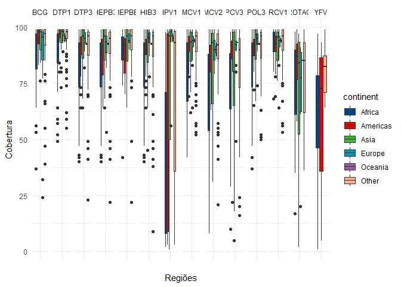<!-- -->

## Múltiplos gráficos


```r
# Múltiplos gráficos ----
#Todas as linhas
data_long_standardized %>%
 filter(year >= 2012& year <= 2022) %>%
 filter(region %in% "LACR") %>%
 ggplot() +
  aes(x = year, y = coverage, color = name) +
  geom_line() +
  theme_minimal() + 
  facet_wrap(vars(vaccine), scales = "free_x") 
```

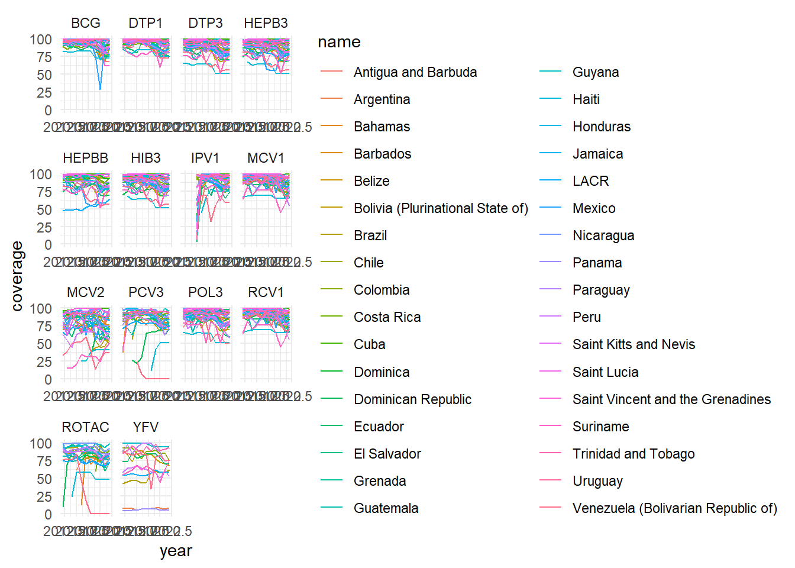<!-- -->

```r
#Fica muito poluído
```

### Isolando linhas com filter()


```r
#Highlight linhas específicas

#Método 1
br_cov = data_long_standardized %>%
 filter(year >= 2012 & year <= 2022,
        name %in% c("Brazil", "Colombia")) %>%
 ggplot() +
  aes(x = year, 
      y = coverage,
      colour = name) +
  
  geom_line(linewidth = 2) +

  theme_minimal() +
  
  facet_wrap(vars(vaccine)) + 
  
  labs(title = "Cobertura vacinal, por vacina",
       x = "Ano",
       y = "Cobertura (%)")  +
  
  scale_color_npg() 

br_cov 
```

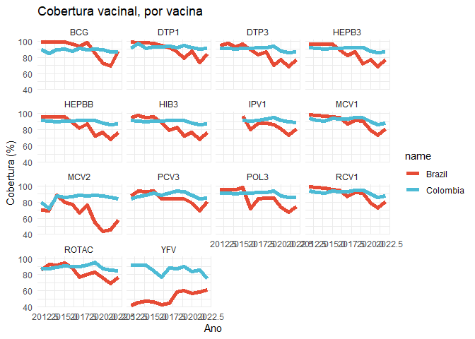<!-- -->

### Isolando linhas com gghighlight()


```r
#Método 2
br_cov = data_long_standardized %>%
 filter(year >= 2012 & year <= 2022,
        region %in% c("LACR")) %>%
 ggplot() +
  
  geom_line(aes(x = year, 
      y = coverage,
      colour = name),
      linewidth = 2) +

  theme_minimal() +
  
  theme(axis.text.x = element_text(angle = 90)) +
  
  facet_wrap(vars(vaccine)) + 
  
  labs(title = "Cobertura vacinal, por vacina",
       x = "Ano",
       y = "Cobertura (%)") +
  
  gghighlight(name %in% c("Brazil", "Colombia"), 
              calculate_per_facet = T, #Add quando tiver facets
              unhighlighted_params = list(linewidth = 1, 
                                          colour = "gray90", 
                                          alpha = 0.3)) +
  scale_color_npg() 
```

```
## Warning: Tried to calculate with group_by(), but the calculation failed.
## Falling back to ungrouped filter operation...
```

```
## label_key: name
```

```r
br_cov
```

```
## Warning: Removed 175 rows containing missing values or values outside the scale range
## (`geom_line()`).
```

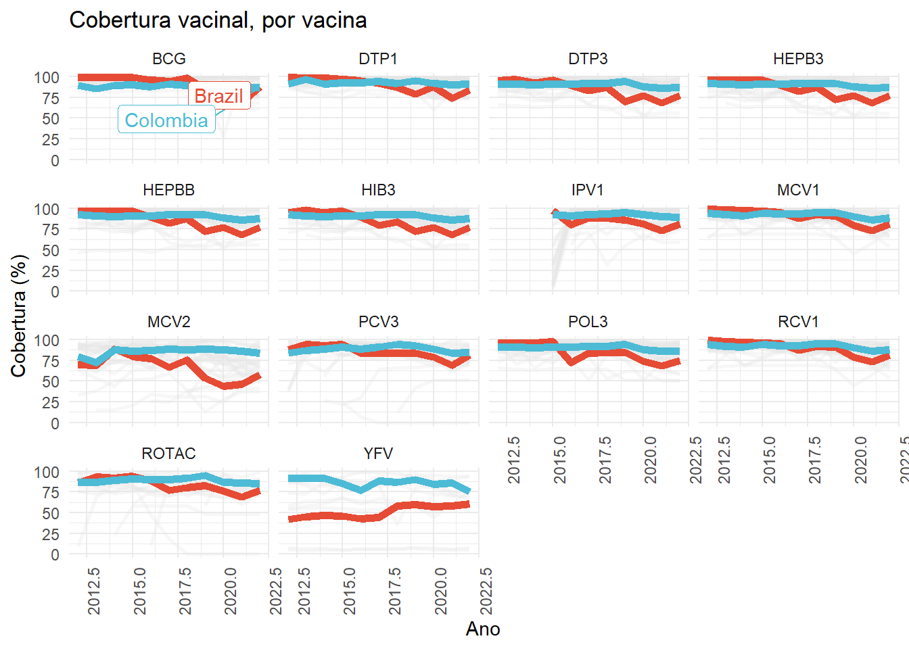<!-- -->


```r
#Mortes
br_mortes = data_long_annotated %>%
 filter(year >= 2012 & year <= 2022,
        region %in% c("LACR")) %>% 
  select(name, year, total_deaths, death_rate_100thousand, disease_vac) %>% 
  distinct() %>%
  drop_na(total_deaths) %>% 
 ggplot() +
  geom_line(aes(x = round(year, 0), 
      y = total_deaths,
      colour = name),
      linewidth = 2) +

  theme_minimal() +
  
  facet_wrap(vars(disease_vac), 
             scales = "free", 
             nrow = 3) + 
  
  labs(title = "Mortes por doença imunoprevenível",
       x = "Ano",
       y = "Mortes") +
  
  #highlight
  gghighlight(name %in% c("Brazil", "Colombia"), #Linhas somente com name == "Brazil'
              
              calculate_per_facet = T, #Add quando tiver facets
              
              unhighlighted_params = list(linewidth = 1, #Opções para linhas não marcadas
                                          colour = "gray90", 
                                          alpha = 0.5)) + 
  scale_color_npg() 
```

```
## Warning: Tried to calculate with group_by(), but the calculation failed.
## Falling back to ungrouped filter operation...
```

```
## label_key: name
```

```r
br_mortes 
```

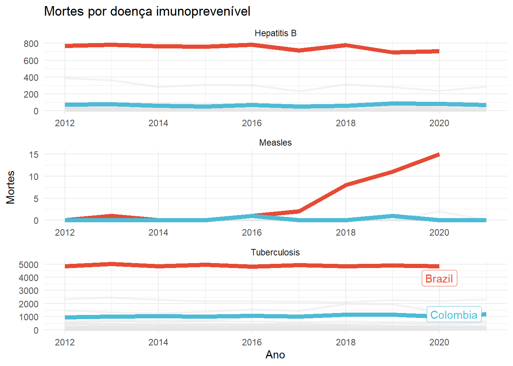<!-- -->


```r
# Unir gráficos
ggsave(br_cov + br_mortes, file = "br_cov_mortes.png") 
```

```
## Saving 7 x 5 in image
```

```
## Warning: Removed 175 rows containing missing values or values outside the scale range
## (`geom_line()`).
```

# 6. Modelo

Este modelo é útil para você criar gráficos de forma mais fácil, considerando as layers, funções e argumentos mais utilizados no ggplot. Caso queira gerar outros tipos de gráficos, use diferentes geometrias e consulte o (R graph gallery)[<https://r-graph-gallery.com/>].


# Analisando a distribuição

**Quantos países por continente registraram os dados na UNICEF?**


```r
#Quantos países por continente registraram os dados na UNICEF?

#Todos os continentes juntos
data_long_annotated %>%
 filter(type == "country",
        continent != "Other") %>% 
 select(coverage, year, continent, vaccine) %>% 
 drop_na(coverage) %>% 
 ggplot() +
  aes(x = year, fill = continent) +
  geom_histogram(bins = 43L) +
  theme_minimal() +
  facet_wrap(vars(vaccine)) +
  scale_fill_npg()
```

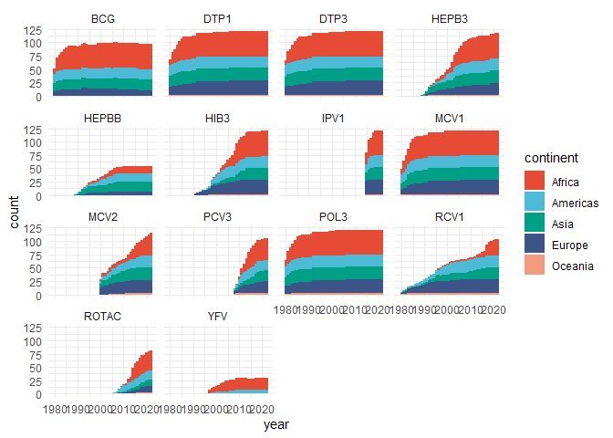<!-- -->

**Continentes separados**


```r
# Continentes separados
data_long_annotated %>%
 filter(type == "country",
        continent != "Other") %>% 
 select(coverage, year, continent, vaccine) %>% 
 drop_na(coverage) %>% 
 ggplot() +
  aes(x = year, fill = continent) +
  geom_histogram(bins = 43L) +
  scale_fill_hue(direction = 1) +
  theme_minimal() +
  facet_grid(continent ~ vaccine, scales = "free")
```

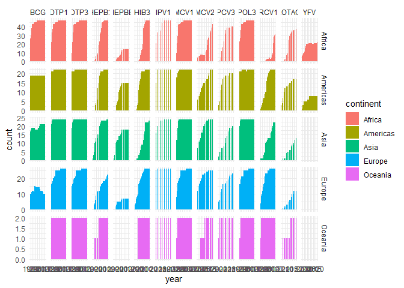<!-- -->

**Quantos países aumentaram sua cobertura vacinal em cada decada?**


```r
#Quantos países aumentaram sua cobertura vacinal em cada decada?

data_long_annotated %>%
 filter(type == "country",
        continent != "Other",
        year %in% c(1990, 2000, 2010, 2019)) %>%
 ggplot() +
  aes(x = coverage, fill = continent) +
  geom_histogram(bins = 10L) +
  theme_minimal() +
  theme(plot.caption = element_text(size = 13L),
        legend.position = "top",
        strip.text.y = element_text(angle = 0, 
                                    hjust = 0)) +
  facet_grid(~disease_vac~year, scales = "free") +
  facet_grid(continent ~ vaccine, scales = "free")
```

```
## Warning: Removed 1913 rows containing non-finite outside the scale range
## (`stat_bin()`).
```

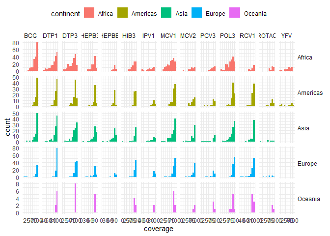<!-- -->

# Avançado: Dados demográficos e economicos com o Gapminder

O gapminder é um site e um pacote que apresenta diferentes dados sobre países ao longo dos anos. O pacote do R traz uma tabela dos anos 50 até 2007, com dados sobre expectativa de vida, PIB percapita e tamanho da população.


```r
install.packages("gapminder")
```

```
## Installing package into 'C:/Users/Wasim/AppData/Local/R/win-library/4.3'
## (as 'lib' is unspecified)
```

```
## package 'gapminder' successfully unpacked and MD5 sums checked
## 
## The downloaded binary packages are in
## 	C:\Users\Wasim\AppData\Local\Temp\RtmpykQJhj\downloaded_packages
```

```r
library(gapminder)
```

```
## Warning: package 'gapminder' was built under R version 4.3.3
```

```r
gapminder %>% 
  filter(year %in% c(1952, 1982, 2002)) %>% 
ggplot() +
  aes(
    x = gdpPercap,
    y = lifeExp,
    colour = continent,
    size = pop,
    group = country
  ) +
  geom_point(shape = "circle") +
  scale_x_continuous(trans = "log10") +
  theme_minimal() +
  facet_wrap(vars(year), scales = "free_x") +
  gghighlight(country == "China") +
  scale_color_npg()
```

```
## Warning: Tried to calculate with group_by(), but the calculation failed.
## Falling back to ungrouped filter operation...
```

```
## label_key: country
```

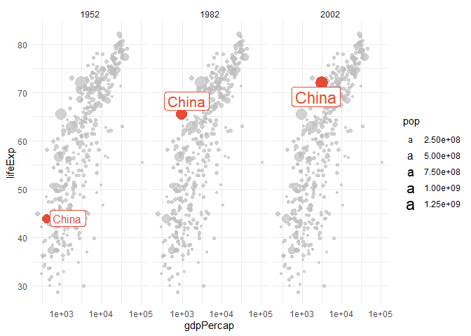<!-- -->
